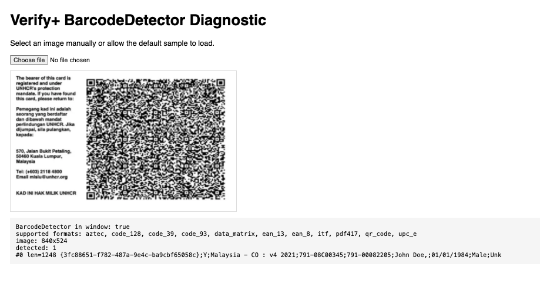

# ADR 003: Verify+ QR Decoder — Adopt zxing-wasm over pure-JS ZXing and native BarcodeDetector

**Date:** 2026-07-20
**Status:** Accepted

## Context

The candidate portal Verify+ scanner (Epic 1 - #3578) decodes a refugee's UNHCR
Verify+ QR code locally in the browser and posts only the resulting payload string
to the backend. The scanner built in 1.1 (#3588) uses `@zxing/ngx-scanner` backed
by the pure-JavaScript `@zxing/library` decoder.

Testing with a real, high-density UNHCR Verify+ code (a public specimen from the
UNHCR Malaysia site) revealed that the current decoder cannot read real codes.
Investigation was tracked in 1.5 (#3641). Real codes are dense, high-version QR
symbols; the sample carries a ~1,248-character payload, versus ~39 characters for
our synthetic mock codes.

Findings:

- **Live camera scan (pure-JS `@zxing/library`)** — fails on both laptop (front
  camera) and phone, even after raising camera resolution (640x480 -> ~1760x1328)
  and enabling `tryHarder` / `autofocusEnabled`. Camera tuning alone did not help.
- **Direct clean-PNG decode (pure-JS `@zxing/library`)** — fails on the pristine
  840x524 sample (`NotFoundException` / `FormatException`) across HybridBinarizer
  and GlobalHistogramBinarizer with `tryHarder` and `PURE_BARCODE` hints, while the
  low-density mock codes decode fine. This isolates the failure to decoder
  capability, not camera capture.
- **Direct clean-PNG decode (native `BarcodeDetector`, desktop Chrome/macOS)** —
  succeeds (`detected: 1`, `len=1248`; supported formats include `qr_code`). See
  evidence below.
- **Direct clean-PNG decode (`zxing-wasm`, the C++ ZXing compiled to WebAssembly)**
  — succeeds, returning the full ~1,248-character payload on both default and
  aggressive option sets, in Node.

The candidate portal must work for refugees on a wide range of devices and
browsers, explicitly including Safari on iOS. The native `BarcodeDetector` API is
not available there (nor in Firefox), so although it reads the code on Chrome, it
cannot be the portal's decoder.

Diagnostics used for this investigation (kept in-tree as verification tools):

- [`ui/candidate-portal/scripts/verify-plus/decode-qr.js`](../../ui/candidate-portal/scripts/verify-plus/decode-qr.js)
  — pure-JS `@zxing/library` decode (negative result).
- [`ui/candidate-portal/scripts/verify-plus/barcode-detector.html`](../../ui/candidate-portal/scripts/verify-plus/barcode-detector.html)
  — native `BarcodeDetector` decode, run manually in desktop Chrome.
- [`ui/candidate-portal/scripts/verify-plus/decode-qr-wasm.mjs`](../../ui/candidate-portal/scripts/verify-plus/decode-qr-wasm.mjs)
  — `zxing-wasm` decode (positive result).

Sample fixture: [`ui/candidate-portal/docs/verify-plus/unhcr-sample.png`](../../ui/candidate-portal/docs/verify-plus/unhcr-sample.png)
(public specimen; dummy payload data).

Native `BarcodeDetector` evidence (not reproducible in Node/CI, hence captured):

## Decision

Adopt **`zxing-wasm`** as the QR decoder for the candidate portal Verify+ scanner,
replacing pure-JS `@zxing/library` decoding for the scan path.

Do **not** rely on the native `BarcodeDetector` API, and do not adopt a
`BarcodeDetector`-with-`zxing-wasm`-fallback hybrid. A single `zxing-wasm` decode
path will be used across all browsers.

## Reasoning

### Pure-JS ZXing cannot decode real codes
`@zxing/library` fails to decode the dense UNHCR symbol even from a pristine image
under aggressive settings, while decoding low-density mocks. Maxing out camera
settings does not address a decoder-capability limit. It is therefore unsuitable
for real Verify+ codes.

### zxing-wasm is capable and universally available
The WebAssembly build of the C++ ZXing engine decodes the dense sample reliably.
Critically, WebAssembly is supported by all modern browsers the portal targets,
**including Safari on iOS**, giving a single decode path with consistent behaviour
everywhere. This must be validated on multiple devices and browsers, but the underlying 
technology is available and sound.

### BarcodeDetector works but is not cross-browser
Native `BarcodeDetector` read the sample on Chrome, but the API is absent on Safari
(iOS) and Firefox. Because the portal serves refugees on heterogeneous devices —
iOS being a major platform — a decoder that only works on some browsers is not
viable as the primary or sole mechanism.

### Prefer one decode path over a hybrid
A `BarcodeDetector`-primary / `zxing-wasm`-fallback design would add branching,
two code paths to test, and platform-dependent behaviour, for no capability gain:
`zxing-wasm` already works everywhere we need. A single path is simpler to build,
test, and reason about.

## Consequences

- Add `zxing-wasm` as a runtime dependency of `ui/candidate-portal` (promoted from
  the throwaway `--no-save` install used during investigation).
- The scanner
  ([`verify-plus-scanner.component.ts`](../../ui/candidate-portal/src/app/components/common/verify-plus-scanner/verify-plus-scanner.component.ts))
  will be reworked to feed camera frames to `zxing-wasm` rather than relying on
  `@zxing/ngx-scanner`'s built-in `@zxing/library` decoding. Scope tracked as a
  follow-up to this ADR in 1.5 (#3641).
- The `.wasm` reader binary must be served/bundled by the Angular build (asset
  configuration), and its load/initialisation handled in the scanner lifecycle.
- Bundle/runtime cost: a one-time WASM download and instantiation. Acceptable given
  it is the only decoder that reads real codes on all target browsers.
- Live camera scanning with the new decoder must still be validated on desktop and
  on a phone (back camera) on staging; a clean-image PASS proves decodability only.
- Diagnostic scripts and the sample PNG are retained in-tree as verification/
  regression tools and referenced from this ADR; the `BarcodeDetector` result is
  preserved as `docs/decisions/assets/003-barcode-detector-chrome.png`.

## Alternatives Considered

| Option | Outcome |
|---|---|
| Keep pure-JS `@zxing/library` (status quo) | Rejected: cannot decode dense real codes even from a clean image. |
| Max out `@zxing/ngx-scanner` camera/decoder settings | Rejected: insufficient; live scan still fails — the limit is the decoder, not capture. |
| Native `BarcodeDetector` as the decoder | Rejected: not available on Safari (iOS) or Firefox; portal must support iOS. |
| `BarcodeDetector` primary + `zxing-wasm` fallback | Rejected: added complexity and dual code paths for no capability gain; `zxing-wasm` already works everywhere. |
| `zxing-wasm` (chosen) | Accepted: decodes real codes and is supported across all target browsers including iOS Safari. |
