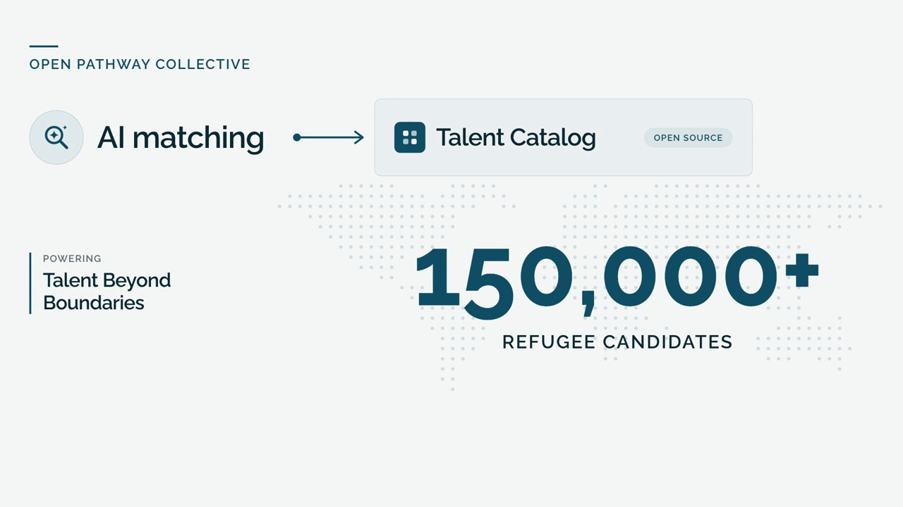

# Introduction to AI Matching — video script

**Status:** Final ([#3733](https://github.com/Talent-Catalog/talentcatalog/issues/3733))  
**Branding:** Global Refugee Network (GRN)  
**Developed by:** [Open Pathway Collective](https://openpathwaycollective.org)  
**Format:** 1920×1080, 2:29, narrated (Andrew Walsh voice, HeyGen) with music bed  
**Video:** _link to the hosted video to be added here once published_

The video is fully animated. Talent Catalog screens are recreated as stylised mock-ups
with generic, anonymised data — no real candidate names or photos appear.

| # | On screen | Voice-over |
|---|---|---|
| 1 | GRN logo; "Skills · Experience · Ambition" builds and connects to "the right opportunity" | Refugees bring skills, experience and ambition. The challenge is connecting that talent with the right opportunity. |
| 2 | Open Pathway Collective → AI matching → Talent Catalog; 150,000+ count-up over a world dot-map | That's why Open Pathway Collective has built AI matching into Talent Catalog, the open-source platform that Talent Beyond Boundaries uses to connect more than 150,000 refugee candidates with jobs around the world. |
| 3 | A job card; one click opens AI matching and the key skills fly into the search | It starts with the job. With one click, Talent Catalog reads the job description, picks out the key skills, and sets up the search. Or simply describe the experience you need, in your own words. |
| 4 | The example requirement is typed into the AI matching box | For example: 'Control revenue and expenses. Good Microsoft Excel skills.' |
| 5 | The query splits into keyword search and AI semantic search; a bookkeeper in Kabul and a finance clerk in Amman both connect to the accounts role | It then searches in two ways at once: for the specific skills you've asked for, and, using AI, for candidates whose past work is similar in meaning to the role, even when they describe it differently. A bookkeeper in Kabul or a finance clerk in Amman can surface for an accounts role, whatever words they used. |
| 6 | The slider (Broader Experience · Balanced · Specific Skills) re-orders the matches live | You decide the balance. Favour specific skills for specialist roles, or broader experience to discover talent you might otherwise miss. |
| 7 | Ranked shortlist of the 30 best matches; "Save all to list" | The result is a ranked shortlist, best matches first, ready to save and share. |
| 8 | Location, language and test-score filters narrow the shortlist | And every familiar search filter still works alongside it: location, languages, test scores and more. |
| 9 | "Show match explanation": summary, relevant experience and limitations, labelled AI-generated | Wondering why someone made the list? Ask for a match explanation: a clear, plain-English summary of how each candidate's experience fits the role, and where it doesn't. |
| 10 | Hovering an experience shows the candidate's own words, linked to the explanation | Every explanation is grounded in the candidate's own words, so you can check it for yourself. |
| 11 | **Built responsibly** — people make the decisions; skills and experience only; no names or contact details sent; explanations only on request; always labelled AI-generated | AI matching has been built responsibly. AI helps you find and understand candidates, but people make the decisions. Matching looks only at skills and work experience. When an explanation is generated, the AI sees just the job requirements and the candidate's work history, never their name, contact details or personal information. Explanations are only created when you ask for one, and are clearly labelled as AI-generated, because AI can make mistakes. It's a guide, never a substitute for human judgement. |
| 12 | The GRN mark becomes a hub: Jobs, then Education, Training, Pathways and Services | Job matching is just the beginning. The same technology will power the Global Refugee Network, matching refugee talent with opportunities beyond jobs, connecting people with the pathways and services that help them build their futures. |
| 13 | End card: GRN logo · Developed by Open Pathway Collective · openpathwaycollective.org | _(music only)_ |

## Notes

- The 150,000 figure refers to Talent Beyond Boundaries' candidates on Talent Catalog.
- The slider labels follow the renaming in
  [#3876](https://github.com/Talent-Catalog/talentcatalog/issues/3876).
- The video source (HyperFrames project) is kept outside this repository; only the
  script and a poster image live here.
