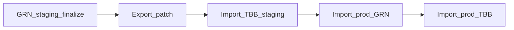

# Translation Patch Import/Export Runbook

## Purpose

Use this runbook to move a scoped set of translation changes between environments without
overwriting unrelated translation keys in each environment's language files.

This process applies to both GRN and TBB instances.

## Scope and Safety Rules

- Import/export is **prefix/key scoped**. It never exports a full language file unless you ask
  for every key.
- Import uses deep merge:
  - object nodes merge recursively
  - leaf strings overwrite the same leaf in target
  - keys not present in the patch remain untouched
- Missing or `null` values in patch entries are skipped (not treated as delete).
- Do not use `migrate-translations` for scoped translation releases; it is a broader copy tool.

## Access

- API endpoints and Admin UI controls are available to `SYSTEMADMIN` users only.
- Read-only users cannot import or export patches.

## Patch Format (Canonical)

```json
{
  "version": 1,
  "description": "Verify+ 1.4 localization (#3618)",
  "languages": ["en", "ar", "fa", "ps", "es", "fr", "tr", "ru", "uk", "nl", "pt"],
  "entries": [
    {
      "key": "SERVICES.VERIFY_PLUS.TAG",
      "values": {
        "en": "Verify+",
        "ar": "Verify+"
      }
    }
  ]
}
```

## API Endpoints

- Import:
  - `POST /api/admin/translation/patch/import?dryRun=true|false&strictLanguages=true|false`
  - Body: patch JSON
- Export:
  - `POST /api/admin/translation/patch/export`
  - Body:
    - `prefixes`: list of dotted prefixes
    - `keys`: list of exact dotted keys
    - `languages`: list of languages

### Export Scoping

Export does not detect "recently changed" keys automatically.
You must explicitly provide:

- one or more `prefixes`
- and/or one or more exact `keys`
- one or more `languages`

## Admin UI Flow

Location: `Settings -> Translations`

- Import patch:
  1. Click `Import patch`.
  2. Select patch `.json`.
  3. System runs dry-run import and shows summary.
  4. Confirm apply to execute real import.
- Export patch:
  1. Click `Export patch`.
  2. Enter prefixes and/or exact keys (one per line).
  3. Select languages.
  4. Download the generated patch file.

## Release Flow (GRN -> TBB, staging -> prod)



1. Finalize translation updates on GRN staging.
2. Export scoped patch for the feature subtree/keys.
3. Dry-run and import on TBB staging.
4. At release go-live:
   - dry-run + import on prod GRN
   - dry-run + import on prod TBB
5. Spot-check candidate portal translation surfaces on each host.

## Verify+ 1.4 Artifact

The Verify+ patch artifact is versioned at:

- `docs/ops/patches/verify-plus-1.4-translations.patch.json`

