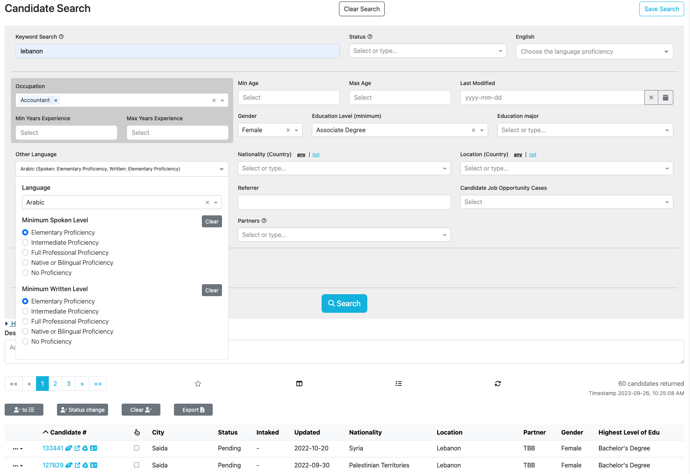
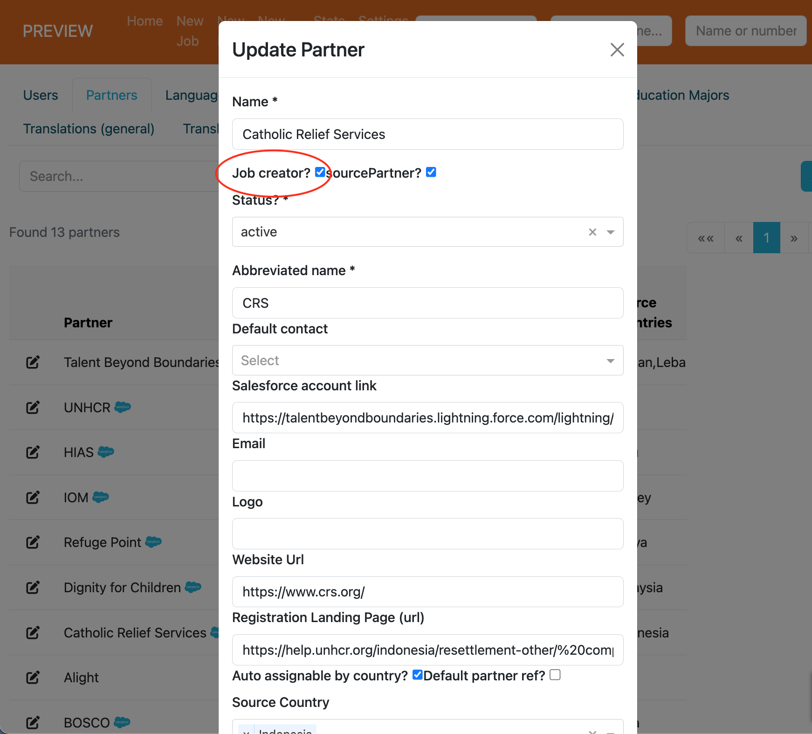

# Release Notes

### Version 2.1.0 (September 29, 2023)

## New Features

  <a href="./v210/candidate_opportunities" class="card">
    
    
Integrated Support for Candidate Opportunities

  </a>
  
  <a href="./v210/enhanced_search" class="card">
    
    
Enhanced Search

  </a>

  <a href="./v210/visa_eligibility_details" class="card">
    
    
Canada Visa Eligibility Checks

  </a>

  <a href="./v210/recruiter_access_related_enhancements" class="card">
    
    
Recruiter Access Related Enhancements

  </a>

  
## UX / UI Enhancements

- Introduced a dedicated candidate opportunities page, providing users with an interface for viewing individual 
opportunities.
- Revamped job icons and introduced the term 'Cases' to refer to Candidate Opportunities, making the terminology more 
intuitive and aligned with admin user expectations.
- Enlarged candidate sidebar profiles for improved readability and ease of use within candidate lists view.
- Fixed side column overlap issues in specific screens, ensuring a consistent and visually appealing user experience.
- Mapped job stage codes to their corresponding full stage names in job view, providing clearer context for users.
- Implemented scrollable list sidebars, enhancing navigation and usability in lists with extensive content.

## General Improvements

- Streamlined job creation by removing unnecessary Red Alert notifications.
- Enhanced Salesforce integration, allowing for automatic updates without manual intervention.
- Dedicated separate elastic search and Salesforce environments for staging, ensuring a controlled and optimised
  user testing environment.

## Security Fixes

- Implemented strong visual indicators to clearly distinguish between production, staging, and local environments, 
reducing the risk of accidental actions in the wrong environment.
- Established dedicated Google storage credentials, ensuring secure access and authentication for storage operations.
- Addressed an issue where candidate profile audit fields were not updating correctly, ensuring accurate audit tracking
  of profile changes.

## Bug Fixes

- Resolved an issue where deleting a referrer in a new search would not properly clear and reset the search field, 
improving search functionality.
- Conducted data cleanup in Salesforce to handle opportunities with country names abbreviated as 'CA' (instead of 
'Canada') correctly.
- Enabled deletion of published lists, providing users with required control over list management.
- Fixed a bug where deleting work experience would incorrectly redirect users to the login screen.
- Corrected HTTP login failed status codes, ensuring accurate error reporting and Api handling.
- Fixed a bug where deleting a candidate's language from their profile would log the user out.

## Developer Notes

### Test Coverage

- Expanded unit test coverage across various components, including AuthAdminApi, BrandingAdminApi, CandidateAdminApi, 
and more, ensuring more robust test coverage and code quality.

### Code Refactoring
- Refactored common code elements shared between job and candidate opportunities, reducing redundancy and improving
  code maintainability.
- Flattened partner classes to accommodate partners that serve as both source partners and job creators, streamlining
  future recruiter partner integration.

### Continuous Integration & Deployment
- Successfully transitioned the GitHub repository to an organisation account, aligning with the need for multiple
  administrator accounts.
- Enforced protection rules for master and staging branches, enhancing code integrity and preventing unauthorised or 
accidental changes.
- Decoupled Jib deployment in Gradle build steps, improving build efficiency, safety and flexibility.

### Cloud Enhancements
- Increased AWS cloud CPU allocation to 0.5 per task, optimising resource allocation for improved performance and system
  stability.
- Enabled AWS application load balancer logs for Amazon support team, facilitating easier troubleshooting and support.
- Migrated to the talent-catalog image repository on AWS, ensuring secure and reliable image storage and access.

---

Thank you for using Talent Catalog! Your feedback and support are invaluable to us. If you encounter any issues or have 
suggestions for improvement, please don't hesitate to [contact us](mailto:support@talentcatalog.org) or 
[open an issue on GitHub](https://github.com/Talent-Catalog/talentcatalog/issues).

*[Access the latest version](https://tctalent.org/admin-portal/login)*
