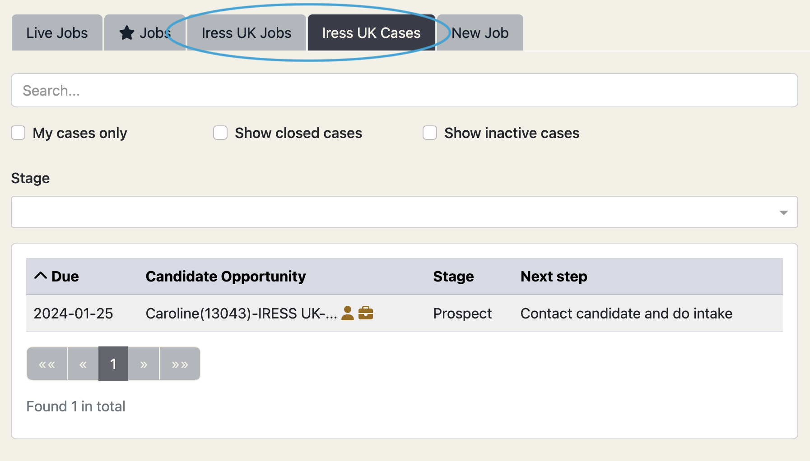
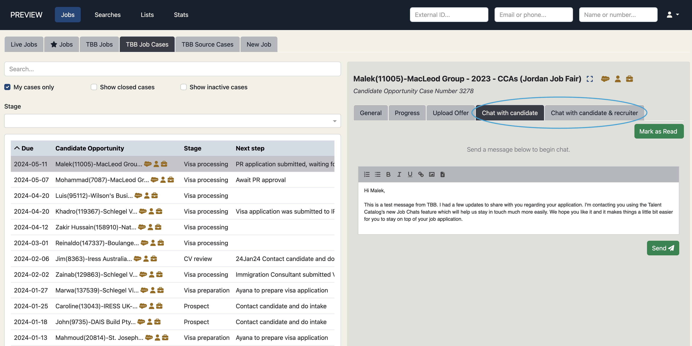
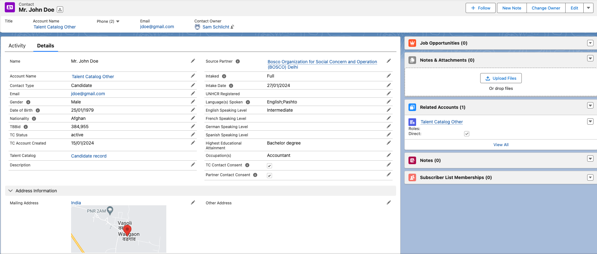
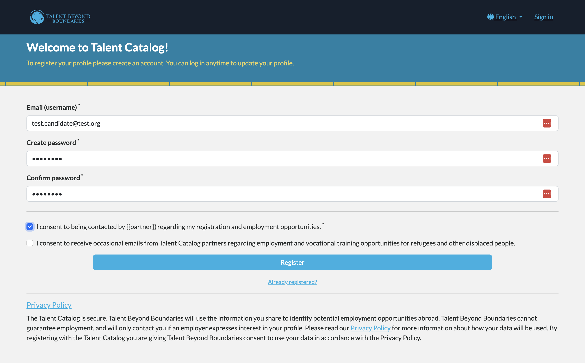
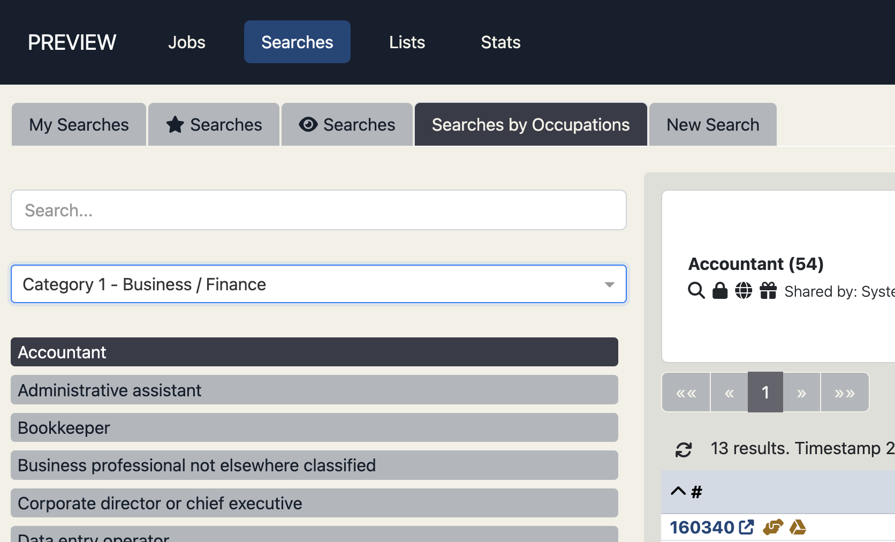
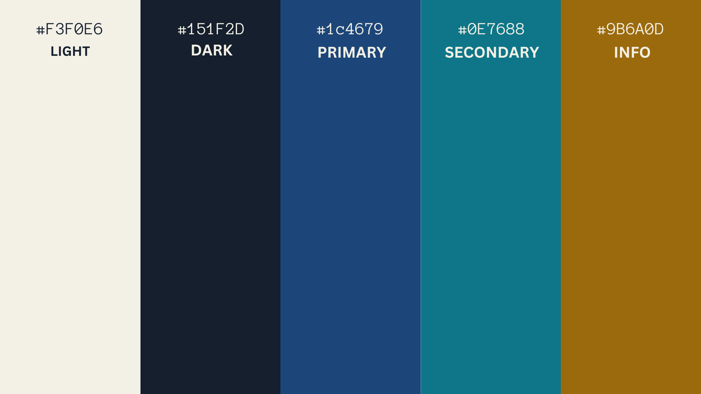

## Version 2.2.0 (January 31, 2024)

Check out the newest features and enhancements.

# New Features

  <a href="./v220/employer_access" class="card">
    
    
Employer Access

  </a>

  <a href="./v220/job_chats" class="card">
    
    
Job Chats

  </a>

  <a href="./v220/candidate_data_in_salesforce" class="card">
    
    
Nightly Candidate Data Sync

  </a>

  <a href="./v220/candidate_registration_and_consents" class="card">
    
    
Candidate Accounts And Consents

  </a>

## General Improvements

- Interview guidance from employers can now be maintained directly in the Talent Catalog, giving 
administrators quick and convenient access without the need to sift through emails, Slack threads, 
or Trengo conversations.
- Administrators can upload written job offers from recruiters and employers directly to the Talent
Catalog, allowing candidates to easily view and consider their offers within the platform.
- Jobs related tabs now support filtering of jobs based on destination country, so users can 
quickly narrow down listings according to preferred employment locations.
- Candidate intake will now support the collection of consents from candidates interested in 
participating in World Bank surveys.

## Data Improvements

- Reports for viewing candidate registration data based on source locations are now available in TC
stats.
- Salesforce opportunity records have been tidied up so that occupation categories adhere with the 
<a href="https://www.ilo.org/public/english/bureau/stat/isco/index.htm">International Standard 
Classification of Occupations (ISCO)</a>.
- Full candidate searches are now optimised giving up to 15x faster database search performance.
- Candidates relocating through Canada’s no job offer pathway may now be tagged, so they can be 
reported on with the appropriate status.
- Obsolete TC data fields that were replaced with new fields in previous releases have been 
cleaned from the database.

# UI / UX Enhancements

  

    
    

      
Employer-ready Navigation

      

        We've reorganised the TC main menu and sub-menus to make it easier for new and existing 
users to navigate. The main menu is now simply: <em>Jobs</em>, <em>Searches</em>, <em>Lists</em>, 
and <em>Stats</em>. Clicking on Jobs navigates to all things jobs related, Searches for all things 
search related, and so on.
      

    

  

  

    
    

      
Widened Colour Palette

      

        With this release we bid farewell to the old bright blue and teal colour scheme, which did
not contrast terribly well against the white background. In some cases leading to eye strain over 
prolonged periods of use. We hope the new muted yet strongly contrasted colours will be 
significantly more accessible for all.
      

    

  

## Other UI / UX Enhancements

- The user role previously known as "Source Partner Admin" has been updated to "Partner Admin", 
- avoiding any naming confusion for destination partner users.
- For convenience, source partners may now view and update the progress of a selected case directly 
from the right-hand case detail panel.
- Candidate work experience input fields accept rich-text formatting, which contributes to the 
generation of more visually appealing and well-formatted Talent Catalog CVs downstream.

# Security Fixes

- Updated Cross-Origin Request Sharing (CORS) URL handling: CORS, a security feature governing web
page interactions across different domains, has been updated in this release. The update 
tightens the permitted CORS URLs.
- TC login security has been standardised on Multi-factor authentication (MFA). As a result, the
need for Recaptcha has been eliminated and retired from the web portals.

# Bug Fixes

- Shareable attachments were intermittently not displaying as expected, now resolved.
- Watched searches built on other watched searches were not functioning as expected. We anticipate
that employers partners will benefit from using these kinds of searches for daily email alerts on 
potential candidates - now resolved.
- An issue where opportunities in Salesforce were incorrectly updating the country to "USA" instead
of our standard country name, "United States," is resolved.
- "Description," a required field when creating a job experience, is now consistently validated
to ensure it is populated.
- Scheduled tasks were firing multiple times in the AWS cloud services, whereas only one instance 
of a task should fire regardless of how many services are deployed. This is now resolved with the
introduction of Shedlock.
- An issue where published fields could not be removed by dragging them away from the "select fields
to publish" modal, is resolved.
- "Unreachable" candidate statuses were incorrectly reporting as "incomplete" registrations in the 
candidate portal, now resolved.
- User reports of discrepancies where some search results did not match the total stats for that 
search, are now resolved.

# Developer Notes

## Test Coverage

- This release expands our unit test coverage by ~30% across various components, including 
JobAdminApi, PartnerAdminApi, UserAdminApi, CandidateStatAdminApi, and more, with incremental 
effects on code quality and system robustness.
- The introduction of Gatling/Scala performance testing harnesses to the TC build lifecycle, will 
now execute routine system and database performance tests, for the early detection of any 
performance issues or bottlenecks. Forthcoming releases will build further on this.

## Code Refactoring
- In this release we've implemented server and client support for two-way network conversations 
using websockets, with multicast capabilities to subscribers. Chat API endpoints can use websockets 
on the server side with Stomp API integrated on the client side (admin-portal and candidate-portal).
- The SourcePartnerAdmin role has been refactored to the PartnerAdmin role, as the former no longer 
made sense in the context of destination partners.
- To ensure consistency and readability of our codebase going forward, TC developers will adhere to 
Google Code styles as the coding standard for all contributors.

## Continuous Integration & Deployment
- Pushing changes to developer branches will now trigger a full build and a complete cycle of unit 
testing and performance testing - failure alerts will be notified to contributors for the early 
detection and resolution of breaking code.
- We've documented our agreed [hot-fix branching](https://github.com/Talent-Catalog/talentcatalog/wiki/Release#hotfix-branches)
process that is to be used for any and all out-of-band quick fixing of production issues.

## Cloud Enhancements
- The Elasticsearch version is upgraded from the end-of-life v7.12 to v7.17.11. The elasticsearch index must be rebuilt following the previous release v2.1.0 and the old 7.12 clusters are to be safely decommissioned.
- Move the Elasticsearch production cluster to the US for proximity to the TC cloud hosting, which is also resident in the US. 
Having both services relatively co-located alleviates trans-atlantic network hops when performing elastic searches, thus improving network search performance.
- Postgres version 11 reaches end of life on AWS in February. Upgrade to version 14 before this happens.
- Upgraded to AWS provisioned storage. This is AWS's recommended data storage type for the Talent Catalog.
- Upgraded to 4 Cpu RDS database to scale with peak system usage.

---

Thank you for using Talent Catalog! Your feedback and support are invaluable to us. If you encounter any issues or have
suggestions for improvement, please don't hesitate to [contact us](mailto:support@talentcatalog.net) or
[open an issue on GitHub](https://github.com/Talent-Catalog/talentcatalog/issues).

*[Access the latest version](https://tctalent.org/admin-portal/login)*
