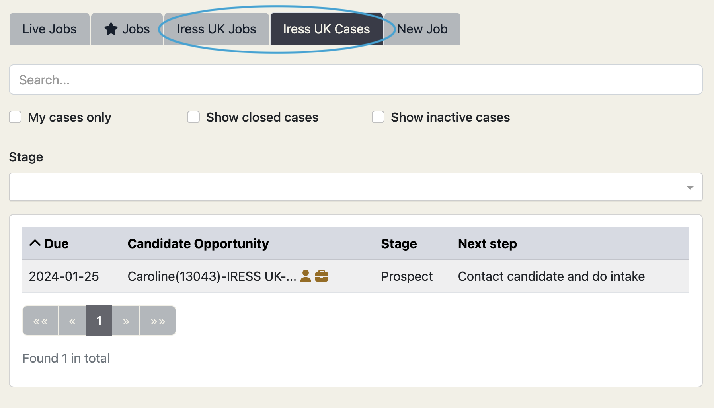

## Version 2.2.0 (January 31, 2024)

Check out the newest features and enhancements.

# New Features

  <a href="./v220/employer_access" class="card">
    
    
Employer Access

  </a>

  <a href="./v220/job_chats" class="card">
    
    
Job Chats

  </a>

  <a href="./v220/candidate_data_in_salesforce" class="card">
    
    
Nightly Candidate Data Sync

  </a>

  <a href="./v220/candidate_registration_and_consents" class="card">
    
    
Candidate Accounts And Consents

  </a>

## General Improvements

- Interview guidance from employers can now be saved directly in the Talent Catalog, giving 
administrators quick and convenient access without the need to sift through emails, Slack threads, 
or Trengo conversations.
- Administrators can upload written job offers from recruiters and employers directly to the Talent
Catalog, allowing candidates to easily view and consider their offers within the platform.
- Jobs related tabs now support filtering of jobs based on destination country, so users can 
quickly narrow down listings according to preferred employment locations.
- Candidate intake now supports the collection of consents from candidates interested in 
participating in World Bank surveys.

## Data Improvements

- New TC stats reports have been added for viewing registration data based on source locations.
- Salesforce opportunity records have been tidied up so that occupation categories adhere with the 
<a href="https://www.ilo.org/public/english/bureau/stat/isco/index.htm">International Standard 
Classification of Occupations (ISCO)</a>.
- Full candidate searches are now optimised giving up to 15x faster database search performance.
- Candidates relocating through Canada’s no job offer pathway can now be tagged, so they can be 
reported on with the appropriate status.
- Obsolete TC data fields that have been replaced with new fields in previous releases have been 
removed.

# UI / UX Enhancements

  

    
    

      
Employer-ready Navigation

      

        The TC main menu and sub-menus have been restructured in alignment with user feedback to make
the TC easier for new and existing users to navigate. The main menu has been simplified to these items: 
Jobs, Searches, Lists, and Stats; each of which opens to all related tabs. For example click on Jobs for all things
jobs related, Searches for all things search related, and so on.
      

    

  

  

    
    

      
Widened Color Palette

      

        The new version supports greater colour contrast for easier visual navigation. This is an important 
update that addresses reports from some users for whom the old bright blue and teal colour scheme did not contrast 
well on the white background, leading to eye strain and difficulty to read during prolonged periods 
of use by some users. We hope the new muted yet strongly contrasted colour scheme is an improvement.
      

    

  

## Other UI / UX Enhancements

- Renamed user role "Source Partner Admin" to "Partner Admin".
- Allow source partners to easily see and modify the progress of a selected case from the right hand case detail panel.
- Support rich text data entry for well-formatted input of candidate work experience - this will enrich downstream CV generation.

# Security Fixes

- Update Cross-Origin Request Sharing (CORS) Urls - CORS is a security feature that controls how web 
pages in one domain can request and interact with resources from another domain. It allows or 
restricts web applications to make requests for resources from a different origin. This release 
tightens permitted CORS Urls.
- TC login security has been standardised on multi-factor authentication (MFA) and will therefore 
no longer require Recaptcha, which has thus been retired from the web portals

# Bug Fixes

- SF opportunities are incorrectly updating the country to “USA”. Our standard country name is “United States”. Fix the underlying issue causing this and fix the incorrect data entries.
- There is an issue where shareable attachments are sometimes not displaying - fix this.
- Description is a required field when creating a job experience - add consistent validation for this field.
- Watched searches built on other watched searches are not working - fix this. (We expect that employers will benefit from using these kinds of searches for daily alerts on potential candidates).
- Scheduled tasks are currently fired multiple times - once for each TC service in the AWS cloud - fix this. Only one instance of a task should fire regardless of how many services are running.
- Published fields cannot be removed by dragging them away from the “select fields to publish” modal - fix this.
- Unreachable candidate statuses are incorrectly reporting as “incomplete” registrations in the candidate portal - correct this.
- There is a reported issue with some search results not matching with the stats totals for that search - investigate and fix this.

# Developer Notes

## Test Coverage

- Expanded unit test coverage by ~30% across various components, including JobAdminApi, PartnerAdminApi, UserAdminApi, CandidateStatAdminApi, 
and more, ensuring more robust test coverage and code quality.
- Implemented Gatling/Scala performance testing harnesses to be able to routinely run system and 
database performance tests in the TC build lifecycle, for early alerting of performance issues and 
bottlenecks. Forthcoming releases will build further on this.

## Code Refactoring
- Server and client support for 2-way network conversations (with multicast to subscribers) via 
websockets. Chat API endpoints will use websockets on the server + stomp API on the client (i.e. 
admin-portal and candidate-portal)..
- SourcePartnerAdmin role to be refactored to PartnerAdmin role - the former no longer makes sense for destination partner.
- TC developers will use Google Code styles as the coding style standard for all contributors.

## Continuous Integration & Deployment
- Pushing changes to developer branches will trigger a build with a complete cycle of unit testing and performance testing - triggering failure alerts for early detection of bugs.
- Agree and document a hot-fix branching process to enable quick fixes of production issues without deviating the staging branch.

## Cloud Enhancements
- The Elasticsearch version is upgraded from the end-of-life v7.12 to v7.17.11. The elasticsearch index must be rebuilt following the previous release v2.1.0 and the old 7.12 clusters are to be safely decommissioned.
- Move the Elasticsearch production cluster to the US for proximity to the TC cloud hosting, which is also resident in the US. 
Having both services relatively co-located alleviates trans-atlantic network hops when performing elastic searches, thus improving network search performance.
- Postgres version 11 reaches end of life on AWS in February. Upgrade to version 14 before this happens.
- Upgraded to AWS provisioned storage. This is AWS's recommended data storage type for the Talent Catalog.
- Upgraded to 4 Cpu RDS database to scale with peak system usage.

---

Thank you for using Talent Catalog! Your feedback and support are invaluable to us. If you encounter any issues or have
suggestions for improvement, please don't hesitate to [contact us](mailto:support@talentcatalog.net) or
[open an issue on GitHub](https://github.com/Talent-Catalog/talentcatalog/issues).

*[Access the latest version](https://tctalent.org/admin-portal/login)*
