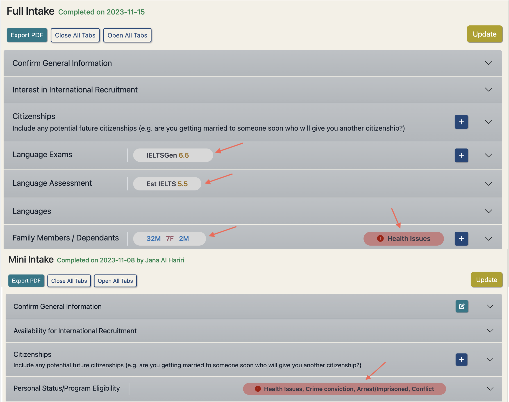

## Version 2.2.2

Check out the newest features and enhancements.

# New Features

  <a href="./v220/employer_access" class="card">
    
    

      
New way of running stats on saved searches

      

        New more efficient 'Run Stats' button, able to run stats for > 30,200 candidates.
      

    

 </a>

  <a href="./v220/job_chats" class="card">
    
    

      
Automated Messages

      

        Automatically update partners, candidates and employers throughout the recruitment process.
      

    

  </a>

  <a href="./v220/candidate_data_in_salesforce" class="card">
    
    

      
Candidate Chats

      

        Manage all active chats with candidates in one location with the new Candidate Chats tab.
      

    

  </a>

## General Improvements
- Update and sync relocating dependants to SF on the candidate case or on the candidate's visa check
- New UK visa check, containing the relocating dependants update & SF sync.
- Create a new job using a previous job as a template, this will copy over any job data that can be duplicated
- Upload a signed MOU document to a candidate case
- All fields now available to be used with 'Keyword Search' (which utilises elasticsearch functionality) in candidate search, which also increases the utility of its 'Base Search' functionality (NB: I'll add a video for this one - SS)
- Email validation improved and fully aligned across components and portals
- 'UNHCR Status' added as filter in candidate search
- Translation added to Admin Portal for improved code-sharing with Candidate Portal and to facilitate future non-English TC admin
- The "read only" for any user has been reviewed and now should work well for any kind of user. Read only users can create and modify their own lists and searches - but they can't change anything else.
- Salesforce errors appearing on admin portal to confirm if a Salesforce update has or hasn't been successful
- Destination preferences moved from Mini Intake and added to the candidate's registration process on the candidate portal. On the admin portal this data appears and is editable under the General tab of the candidate's profile.
- Added 'IETLS Score' to default columns, replacing 'Updated Date'. 
- The updated date can be now viewed in the candidate profile card on the General tab under Additional Information.

## Data Improvements

- Salesforce Candidate Opportunity relocating dependants stats now auto-updated at 'Relocated' stage
- Support added for new Salesforce 'MOU' and 'Training' stages
- Elasticsearch index updated in all data interactions with candidates
- Candidates' managing partner can now be reassigned in bulk from Settings > System Admin API, improving efficiency and data integrity
- Consolidate UNHCR Registered and UNHCR Status fields, now stored in a single UNHCR Status field which provides most informative and up to date data.

# UI / UX Enhancements

  

    
    

      
Highlight Intake Data

      

        Preview key intake information in the intake headers to allow easy access 
        when intake panels are closed.
      

    

  

  

    
    

      
Larger more mobile friendly tab navigation on candidate portal profile

      

        Focusing on mobile friendly design first, we've created some simple navigation buttons using
 space saving but distinctive icons to modernise and simplify the navigation.
      

    

  

## Other UI / UX Enhancements

- Fix overlapping navbar when scrolling on candidate portal
- Better alignment of content under tabs in candidate portal
- AU visa check has updated style consistent with other visa checks
- Added subtle box shadow to buttons to provide extra dimension on admin portal
- Proper hover-over link behaviour added to Candidate Portal
- Tooltip added to help users in updating candidate lists
- Candidate search profile card restores previous scrollbar position for new candidate selections
- 'Copy list' and 'save selection to list' pop ups have improved layout
- Job Chat notification * now appears as a red dot consistent with notification UI on other apps
- Neatened the filter checkboxes for job and opportunity searches
- Updated the mark as read button and removed if a chat is already read
- Disabled buttons appear greyed out to help active buttons stand out on the page
- Candidate search card fills the window height

# Security Fixes

- Added MFA to the AWS Production environment for an additional layer of security

# Bug Fixes

- Visa job checks can now only be created for the job destination's visa check
- Candidate fields no longer being overwritten by older cached candidate - this resolves candidate fields such as intake data, partner and status reverting back to an older cached value
- Weekly candidate syncing to Salesforce now fully operational
- Performance issues arising from looped processing of large result sets resolved using Entity Manager's clear() method
- Fixed translation display issues in Candidate Portal registration
- CVs now downloading successfully from the candidate search results dropdown menu and clickable icon
- Candidate Prospect chats no longer being unnecessarily auto-created on candidate profile view, instead created via a button in the tab with help text; viewable by all appropriate admins
- Search tips no longer erroneously opened on 'Enter' keydown in candidate search inputs
- Candidate search correctly handling default saved search for new TC users
- Validation tightened and informative error-handling added to Job publishing from Salesforce URL
- IELTS scores of 0 now displayed in candidate search results
- Help text clarified on Admin Portal date picker component
- Potential password exposure in server logs removed
- Pop-ups with a 'select list' dropdown made larger to avoid list names being cut off

# Developer Notes

## Test Coverage

## Code Refactoring
- Deprecated candidate visa job check fields removed from code
- Emoji picker code refactored for better readability

## Continuous Integration & Deployment

## Cloud Enhancements

---

Thank you for using Talent Catalog! Your feedback and support are invaluable to us. If you encounter
any issues or have suggestions for improvement, please don't hesitate to [contact us](mailto:support@talentcatalog.net) or
[open an issue on GitHub](https://github.com/Talent-Catalog/talentcatalog/issues).

*[Access the latest version](https://tctalent.org/admin-portal/login)*
