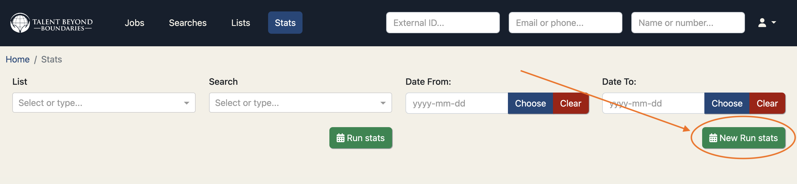
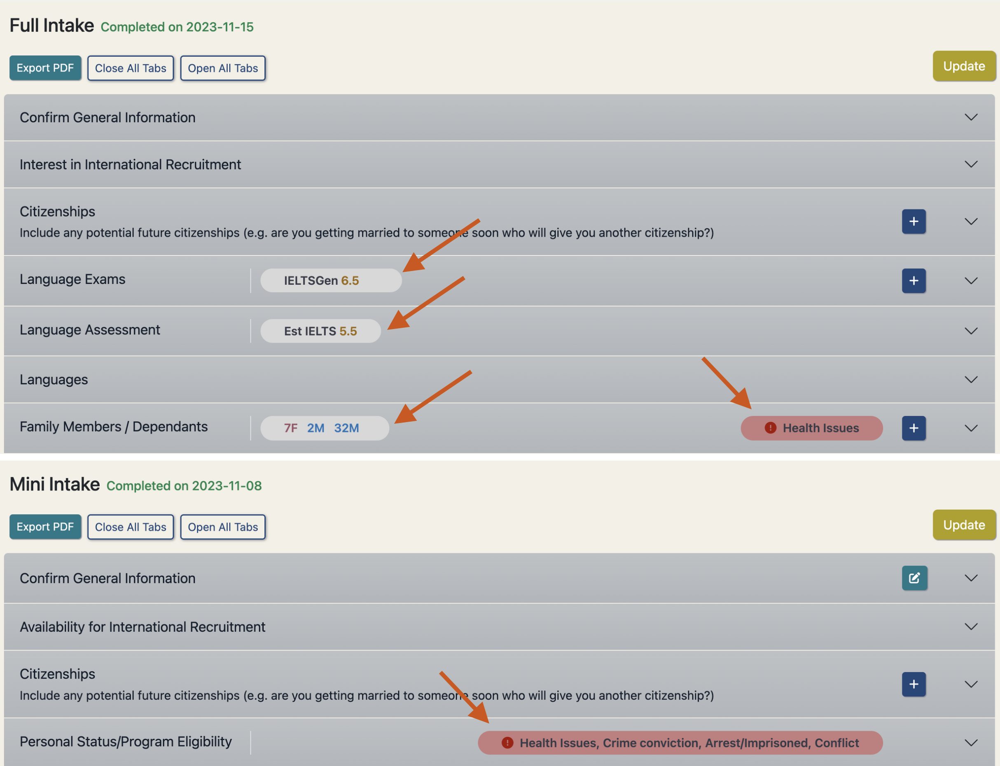
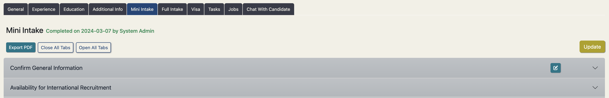

## Version 2.2.2

Check out the newest features and enhancements.

# New Features

  <a href="./v222/employer_access_beta_testing" class="card-full-width">
    
    

      
Employer Access Beta Testing

      

        Employer Access to the Talent Catalog moves to beta testing with a real employer.
      

      

        Learn more
      

    

  </a>

  <a href="./v222/automated_messages" class="card">
    
    

      
Automated Messages

      

        Automatically update partners, candidates and employers throughout the recruitment process.
      

      

        Learn more
      

    

  </a>

  

    
    

      
Candidate Chats

      

        Admins belonging to a source partner organisation can now manage all their active chats with candidates from 
        the 'Candidate Chats' tab on the 'Jobs' screen. Candidate results are searchable and sortable by name and 
        candidate number, and can be filtered to show only candidates whose chats have unread posts.
      

    

  

  

    
    

      
Stats Reporting on Large Saved Searches

      

        We’ve introduced an improved method for running stats on saved searches, allowing you to 
        generate reports on search results of any size, without limitations. This resolves issues 
        previously experienced with larger searches, such as the inability to run stats on searches 
        with more than 32,000 candidates.
        

        For a short time, you will see two options: "Run Stats" and "New Run Stats." Both methods 
        should produce the same results, but the new version overcomes the limitations of the old one, 
        such as those encountered with larger candidate pools in regions like Lebanon and Jordan.
        

        Once we have confirmed that the new way of running stats produces the same results as the old 
        way, we will remove the old way altogether.
      

    

 

  

    
    

      
Evergreen Jobs

      

        Evergreen Jobs are positions that are continuously open because they are regularly needed by 
        the company. 
        Companies like Iress and Atlassian are examples of organisations that utilise this type of 
        job posting.
        

        When a job has been tagged as being evergreen, a new copy of the job is automatically 
        created when the job moves to the "Recruitment process" stage.
        

        The copied job will have the same name except with a suffix R2 - standing for "Revision 2" - 
        and will automatically be set to the "Candidate search" stage. 
        So now there will be two copies of the job: the original job - continuing in the 
        "Recruitment process" stage - and a new one starting back in the "Candidate search" stage.
        

        When the R2 copy of the job gets to the "Recruitment process" stage itself, another copy of 
        the job is created in the "Candidate search" stage - the R3 copy - and so on.
      

    

 

  

    
    

      
Distinguished Submission Lists from General Lists

      

        We’ve refined how lists relate to jobs to improve clarity and reduce confusion. Going forward,
        each job will continue to have a dedicated "submission list," automatically created when the 
        job is generated, with its behavior remaining unchanged.
        

        Previously, users could manually associate a job with any other list, which sometimes caused 
        unintended behavior, such as automatically creating candidate opportunities. This functionality 
        was rarely used and led to confusion and occasional issues, so we’ve streamlined the process 
        by removing the ability to manually link jobs to other lists.
        

        Submission lists and general lists are now clearly defined and visually distinct, helping to 
        prevent unexpected actions and making candidate submissions management more intuitive. If you 
        have specific needs that were addressed by manually associating jobs with other lists, please 
        reach out, and we’d be happy to explore alternatives.
      

    

 

# User Guides

Bookmark these user guides for details on TC Chats and Employer Access:

  <a href="https://docs.google.com/document/d/1h5QaUNOSPP-pjJsMCDwXS_SQUrurvLfnBKPX87orgbE/edit?usp=sharing" class="card">
    
    

      
TC Chats Explainer

      

        An explainer doc to help users understand TC chats.
      

      

        Learn more
      

    

  </a>

  

    
    

      
Employer Access User Guide

      

        Coming soon - User guide for employers directly accessing the TC.
      

    

  

## General Improvements
- Update and sync relocating dependants to SF on the candidate case or on the candidate's visa check
- New UK visa check, containing the relocating dependants update & SF sync.
- Create a new job using a previous job as a template, this will copy over any job data that can be duplicated
- Upload a signed MOU document to a candidate case
- All fields now available to be used with 'Keyword Search' (which utilises elasticsearch functionality) in candidate search, which also increases the utility of its 'Base Search' functionality (NB: I'll add a video for this one - SS)
- Email validation improved and fully aligned across components and portals
- 'UNHCR Status' added as filter in candidate search
- Translation added to Admin Portal for improved code-sharing with Candidate Portal and to facilitate future non-English TC admin
- The "read only" for any user has been reviewed and now should work well for any kind of user. Read only users can create and modify their own lists and searches - but they can't change anything else.
- Salesforce errors appearing on admin portal to confirm if a Salesforce update has or hasn't been successful
- Destination preferences moved from Mini Intake and added to the candidate's registration process on the candidate portal. On the admin portal this data appears and is editable under the General tab of the candidate's profile.
- Added 'IETLS Score' to default columns, replacing 'Updated Date'. 
- The updated date can be now viewed in the candidate profile card on the General tab under Additional Information.

## Data Improvements

- Salesforce Candidate Opportunity relocating dependants stats now auto-updated at 'Relocated' stage
- Support added for new Salesforce 'MOU' and 'Training' stages
- Elasticsearch index updated in all data interactions with candidates
- Candidates' managing partner can now be reassigned in bulk from Settings > System Admin API, improving efficiency and data integrity
- Consolidate UNHCR Registered and UNHCR Status fields, now stored in a single UNHCR Status field which provides most informative and up to date data.
- Handle invisible LSEP characters in some candidates' job experience descriptions that were preventing CV downloads

# UI / UX Enhancements

  

    
    

      
Highlight Intake Data

      

        Preview key intake information in the intake headers to allow easy access 
        when intake panels are closed.
      

    

  

  

    
    

      
Improved candidate portal navigation

      

        Focusing on mobile friendly design first, we've created some simple navigation buttons using
 space saving but distinctive icons to modernise and simplify the navigation.
      

    

  

  

    <a href="./v222/intake_revisions" class="card-full-width">
      
      

        
Mini Intake Process Revisions

        

          We have made a number of enhancements led by the TBB Source team that further streamline the 
          mini-intake process, particularly the sections on availability and interest in international 
          recruitment, destination preferences, and exams, also adding support for multiple candidate 
          nationalities.
        

        

          Learn more
        

      

    </a>
  

## Other UI / UX Enhancements

- Fix overlapping navbar when scrolling on candidate portal
- Better alignment of content under tabs in candidate portal
- AU visa check has updated style consistent with other visa checks
- Added subtle box shadow to buttons to provide extra dimension on admin portal
- Proper hover-over link behaviour added to Candidate Portal
- Tooltip added to help users in updating candidate lists
- Candidate search profile card restores previous scrollbar position for new candidate selections
- 'Copy list' and 'save selection to list' pop ups have improved layout
- Job Chat notification * now appears as a red dot consistent with notification UI on other apps
- Neatened the filter checkboxes for job and opportunity searches
- Updated the mark as read button and removed if a chat is already read
- Disabled buttons appear greyed out to help active buttons stand out on the page
- Candidate search card fills the window height
- Switch off Stats menu access for employer users
- Display TC splash image on reset password screens
- Add custom partner logos for Map India and IRC
- Allow all columns to be selectable in list and search browse and full screen views
- Fixed an issue where the column select modal resulted in an error when closed with the Escape key

# Performance Improvements

- Introduced Redis caching layer in AWS cloud environments to improve general system performance
- Faster search results for name, number, email, and phone lookups in quick search bar
- Introduced enhanced TC loggers for improved user action visibility in local and cloud logs which will help diagnose future performance (and other) issues
- Implemented mechanisms for Redis cache evictions to avoid stale data in the cache
- Implemented system API to manually trigger Redis cache evictions if required
- Added auto-detection of high cloud resource utilisation with auto-redeployment of TC cloud services
- Update database indexes in key tables to improve general performance of job tabs
- Configured max time to live values for cached entries to prevent cache pollution
- Implemented mechanism to transfer minimum required data only between TC services and web clients for candidate name and number search
- Extended mechanism for minimum data transfer to include candidate and candidate source previews for list and search browsing and full screen views

# Security Fixes

- Added MFA to the AWS Production environment for an additional layer of security
- Rotated, deactivated, and removed unused and quarantined AWS access keys for security breach mitigation
- Restricted visibility of candidate contact fields in list and search column selectors

# Bug Fixes

- Visa job checks can now only be created for the job destination's visa check
- Candidate fields no longer being overwritten by older cached candidate - this resolves candidate fields such as intake data, partner and status reverting back to an older cached value
- Weekly candidate syncing to Salesforce now fully operational
- Performance issues arising from looped processing of large result sets resolved using Entity Manager's clear() method
- Fixed translation display issues in Candidate Portal registration
- CVs now downloading successfully from the candidate search results dropdown menu and clickable icon
- Candidate Prospect chats no longer being unnecessarily auto-created on candidate profile view, instead created via a button in the tab with help text; viewable by all appropriate admins
- Search tips no longer erroneously opened on 'Enter' keydown in candidate search inputs
- Candidate search correctly handling default saved search for new TC users
- Validation tightened and informative error-handling added to Job publishing from Salesforce URL
- IELTS scores of 0 now displayed in candidate search results
- Help text clarified on Admin Portal date picker component
- Potential password exposure in server logs removed
- Pop-ups with a 'select list' dropdown made larger to avoid list names being cut off

# Developer Notes

## Test Coverage

- Implemented full suite of web portal unit tests for all Angular components and services
- Fixed Gatling performance test database connection issues
- Paused automatic execution of Gatling performance tests in cloud environments to avoid unnecessary system load

## Code Refactoring

- Deprecated candidate visa job check fields removed from code
- Emoji picker code refactored for better readability
- Factored out a common base for list and search view components

## Continuous Integration & Deployment

- Elasticsearch starter scripts for new devs
- Updated terraform directory structure and git actions for better control over auto deployments
- Deactivated automatic builds in tc-build git action to avoid duplicate builds when pushing to staging and master branches

## Cloud Enhancements

- Deployed AWS Elasticache Redis clusters to reduce DB user lookups and improve general system performance
- Renewed RDS database SSL certificates on AWS production and staging cloud environments

## Logging and Monitoring

- Implemented new log builders for improved local and cloud logging and diagnostic capability
- Fixed repetitive expired JWT token errors by properly handling the first occurrence of an expired token; requiring a fresh user login in this scenario
- Introduced AWS Cloudwatch alerts with AWS Lambdas to auto-restart TC services on detection of high cloud resource utilisation

---

Thank you for using Talent Catalog! Your feedback and support are invaluable to us. If you encounter
any issues or have suggestions for improvement, please don't hesitate to [contact us](mailto:support@talentcatalog.net) or
[open an issue on GitHub](https://github.com/Talent-Catalog/talentcatalog/issues).

*[Access the latest version](https://tctalent.org/admin-portal/login)*
