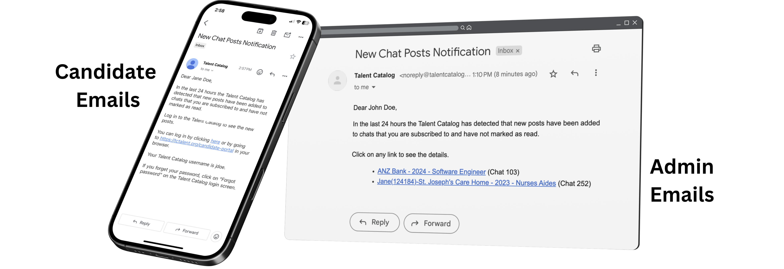
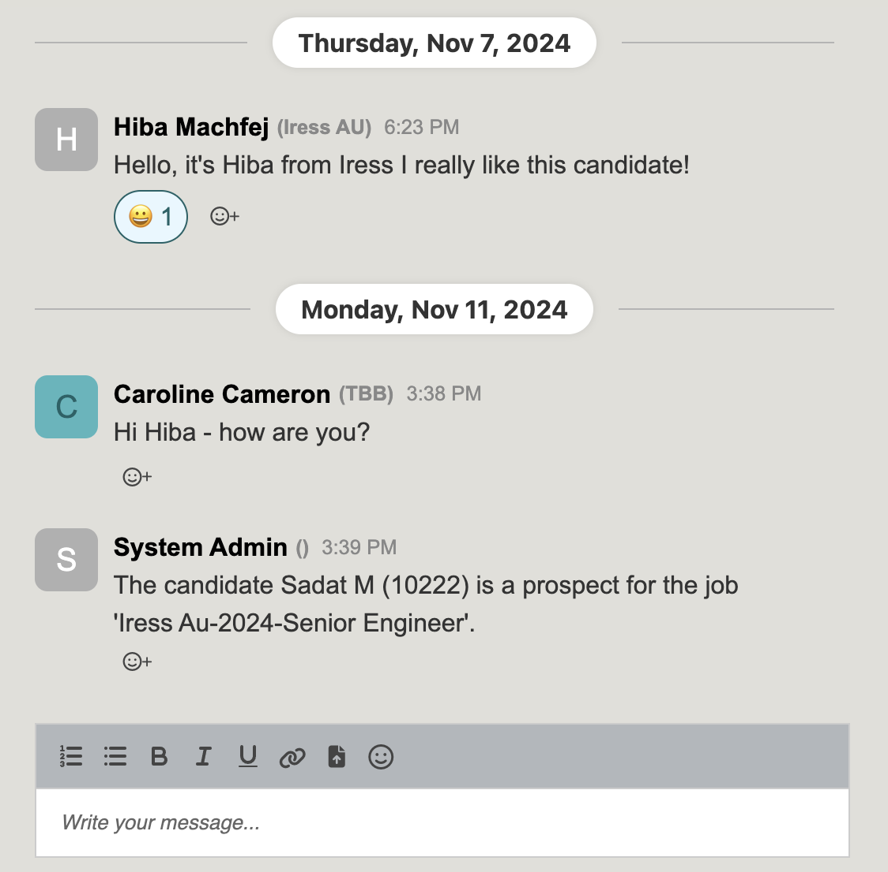

## Version 2.2.3

Check out the newest features and enhancements.

# New Features

  <a href="./v223/search_functionality" class="card-full-width">
    
    

      
Search Improvements

      

        We have made the search functionality more transparent to users so it is 
        easier to keep track of the status of their selections and searches. This helps to avoid any unintended 
        actions such as extra candidates being added to lists or search filters being replaced.
      

      

        Learn more
      

    

  </a>

  

    
    

      
Email Notifications

      

        Each day all users get an email notification about chats that they are involved with which have had new posts 
        over the last 24 hours, and which they have not marked as read. Candidates also receive email notifications.
      

    

  

# User Guides
Helpful TC user guides:
<ul>
    <li>
        <a href="https://docs.google.com/document/d/1h5QaUNOSPP-pjJsMCDwXS_SQUrurvLfnBKPX87orgbE/edit?usp=sharing" 
        target="_blank">Employer Access User Guide (Coming Soon)</a>
    </li>
    <li>
        <a href="https://docs.google.com/document/d/1h5QaUNOSPP-pjJsMCDwXS_SQUrurvLfnBKPX87orgbE/edit?usp=sharing" 
        target="_blank">TC Chats Explainer Doc</a>
    </li>
</ul>

## General Improvements
- Don't create candidate chat until a candidate is past prospect stage
- Hide chat tab from candidates with ineligible statuses
- Addition of ability to search based on logical combination of candidates in lists (treating lists as tags)
- Converted Indonesian partner from CRS to YCWS on TC
- When saving selection to new list from unsaved search, no longer automating creation of search with same name as list

## Data Improvements

# UI / UX Enhancements

  

    
    

      
Updated Chats UI

      

        The Chat's UI has been updated with date separation, poster distinction using initials and colour, 
        and overall cleaner appearance.
      

    

  

## Other UI / UX Enhancements

- Added <em>Clear Format</em> option to text editor in Job Opportunity Intake section
- Saved Searches have a <em>New Search</em> button to navigate user to the unsaved search screen, this replaces 
the <em>Clear Search</em> button.
- Search button disabled unless the search form is changed
- Clear selections button disabled if no selections are present

# Performance Improvements

- Add protection against publishing very long lists which kills our performance
- Support for background processing of long tasks

# Security Fixes

# Bug Fixes

- Language selection persisting on page refresh
- Candidate selections being picked from correct selection list, instead of the unsaved search selection list

# Developer Notes

## Test Coverage

- Unit Test documentation here?

## Code Refactoring

## Continuous Integration & Deployment

## Cloud Enhancements

## Logging and Monitoring

- Implemented ZenDesk for support requests

---

Thank you for using Talent Catalog! Your feedback and support are invaluable to us. If you encounter
any issues or have suggestions for improvement, please don't hesitate to [contact us](mailto:support@talentcatalog.net) or
[open an issue on GitHub](https://github.com/Talent-Catalog/talentcatalog/issues).

*[Access the latest version](https://tctalent.org/admin-portal/login)*
