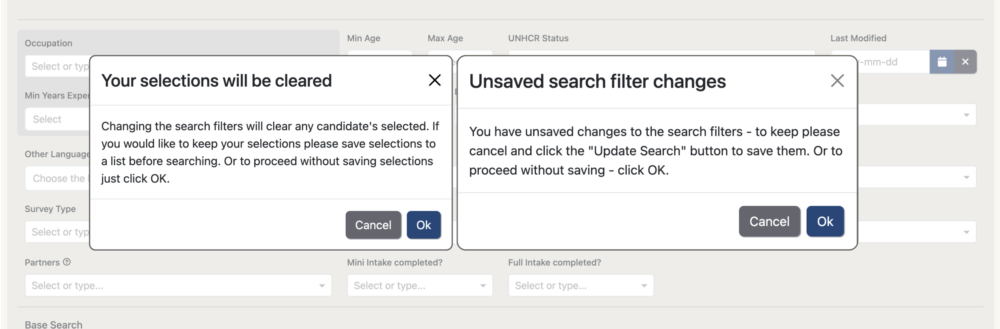
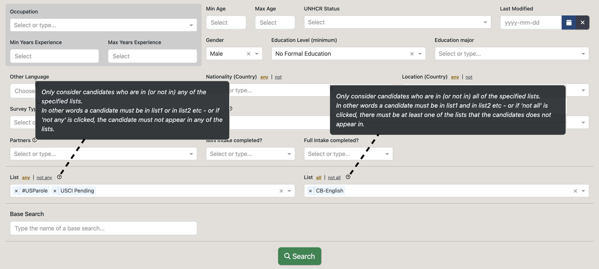

## Version 2.2.3

Check out the newest features and enhancements.

# New Features

  <a href="./v223/search_functionality" class="card-full-width">
    
    

      
Anonymized Open API

      

        We have made the search functionality more transparent to users so it is 
        easier to keep track of the status of your selections and searches. This helps to avoid any unintended 
        actions such as extra candidates being added to lists or search filters being replaced.
      

      

        Learn more
      

    

  </a>

  <a href="./v223/search_functionality" class="card-full-width">
    
    

      
TC Intelligence with Preset

      

        The TC has incorporated Preset to take our data analysis to another level. 
        More than just stats, we introduce TC Intelligence!
      

      

        Learn more
      

    

  </a>

  <a href="./v223/search_functionality" class="card-full-width">
    
    

      
Duolingo English Test/TC Integration

      

        Duolingo is providing candidates with free Duolingo English Tests. These tests are able to be assigned and managed 
        through the Talent Catalog.
      

      

        Learn more
      

    

  </a>

  

    
    

      
Mute Chats

      

        Addition of ability to search based on logical combination of candidates in lists, effectively allowing you to 
        treat lists as tags for search purposes. Thanks to Mari for this great feature suggestion!
      

    

  

# User Guides

Helpful TC user guides:
<ul>
    <li>
        <a href="https://docs.google.com/document/d/1h5QaUNOSPP-pjJsMCDwXS_SQUrurvLfnBKPX87orgbE/edit?usp=sharing" 
        target="_blank">Employer Access User Guide</a>
    </li>
    <li>
        <a href="https://docs.google.com/document/d/1h5QaUNOSPP-pjJsMCDwXS_SQUrurvLfnBKPX87orgbE/edit?usp=sharing" 
        target="_blank">TC Chats Explainer Doc</a>
    </li>
</ul>

## General Improvements

- Option to 'Skip Candidate Search' on a job, this allows employers to indicate whether they want source partners to search for candidates or prefer to 'skip' and proceed only with candidates they’ve added to the submission list.
- Admins can redirect URLs pointing to inactive partners, this allows for 'hard coded' URLs (e.g QR codes/printed flyers) to inactive partners remain usable and redirect to the replacement partner.
- Candidates in saved search results can be reassigned to a new managing partner
- Capture latest tab via the URL's tab parameter allowing for direct navigation to tab and will allow heat mapping on each tab
- Selection of stats in TC Stats (max 8) allowing stats to be run on the full database without performance issues
- Removed 'Run Old Stats' button from TC Stats as has been improved with the newer 'Run Stats' button
- Tasks have rich text descriptions so that links and formatting can be added to a task description
- Added relocated address fields (address, city, state, country) to candidate. Updatable on the candidate portal once the candidate has a case that is past the job offer stage. Can be updated anytime on the admin portal.
- Relocated country auto-populates with the destination country when a candidate's case is moved to or past the relocated stage.
- When a relocated address field is updated, a candidate note is created for tracking purposes and to help indicate if a relocated address is up to date.

## Data Improvements
- Expose Country ISO codes and Occupation ISCO codes
- New icon identifying potential duplicate candidate profiles, updating daily and in real-time by the resolution modal opened when icon clicked (HOTFIX)
- Housekeeping undertaken to align TC data with Salesforce Employer Opportunities
- Rename tbbShortName to tcShortName
- Rename task field 'helpLink' to 'docLink' as help links can now be linked to in rich text task descriptions (see #1829). Repurposed field to docLink to be used to display documents in iframe in tasks.

# UI / UX Enhancements

## Other UI / UX Enhancements

- Added warning not to enter confidential info into General Notes
- Candidate rows on submission lists now display the full name of the admin who add them
- Make Job Description more visible on Publish Job screen

# Performance Improvements

- Source partner Candidate Chats tab SQL refactored for faster load times
- Improved loading times for candidate profiles (in list/search view and full profile view) by fetching full candidate profile data in single API call.

# Security Fixes
- De-anonymisation of CV downloads restricted by partner type
- Display of Jobs data restricted by partner type

# Bug Fixes

- Fixed bug in NOT ListAll search filter
- Employer direct access does not see other employer jobs
- Removed TBB from non english translations and added missing partner references
- Admin-only DELETE endpoint reauthorised with recommended syntax for Spring Security 6
- Candidate search tooltips rewritten for Angular 16 compatibility
- Next Step column on submission lists displays correct value every time
- Fixed issue with candidate results not appearing on spreadsheet exports of search results
- Removed duplicated text in Opportunity modals
- Candidate email quick search made case-insensitive
- Candidate's associated with deleted or inactive partners are back appearing in searches
- Answers to question tasks are back appearing on admin portal
- Updating a search no longer clears the displayed multi-select selections

# Developer Notes
- Upgraded to Spring Boot 3
- Upgraded Angular to recent version
- MFA Authenticators now show TalentCatalog instead of TBB
- Updated copyright
- Standardized Terraform: 
- <a href="https://drive.google.com/file/d/1JZUenkyr2rtVB7h8eElkRvXfwqbCIPQB/view?usp=drive_link" 
rel="noopener noreferrer nofollow" target="_blank">Terraform video 1</a>, 
<a href="https://drive.google.com/file/d/1kEiK77T8_krmqX-TxVodmNAJhDznbocA/view?usp=drive_link" 
rel="noopener noreferrer nofollow" target="_blank">Terraform video 2</a>, 
<a href="https://drive.google.com/file/d/1wLvXbuIZViKFnqJZd_R5HMsBVQrqhD_4/view?usp=drive_link"
rel="noopener noreferrer nofollow" target="_blank">Terraform video 3</a>.

## Code Refactoring
- Removed unused 'relocating dependants' field from visa job check, this was transferred to candidate opportunity in prior release.
- Removed unused candidate portal component - RegistrationLandingComponent

---

Thank you for using Talent Catalog! Your feedback and support are invaluable to us. If you encounter
any issues or have suggestions for improvement, please don't hesitate to [contact us](mailto:support@talentcatalog.net) or
[open an issue on GitHub](https://github.com/Talent-Catalog/talentcatalog/issues).

*[Access the latest version](https://tctalent.org/admin-portal/login)*
