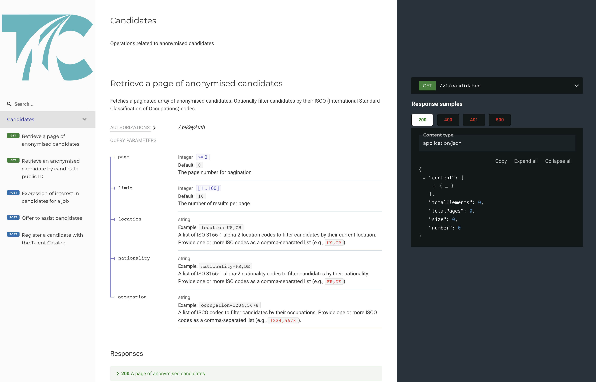
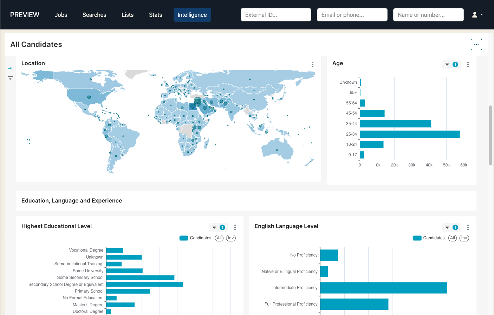
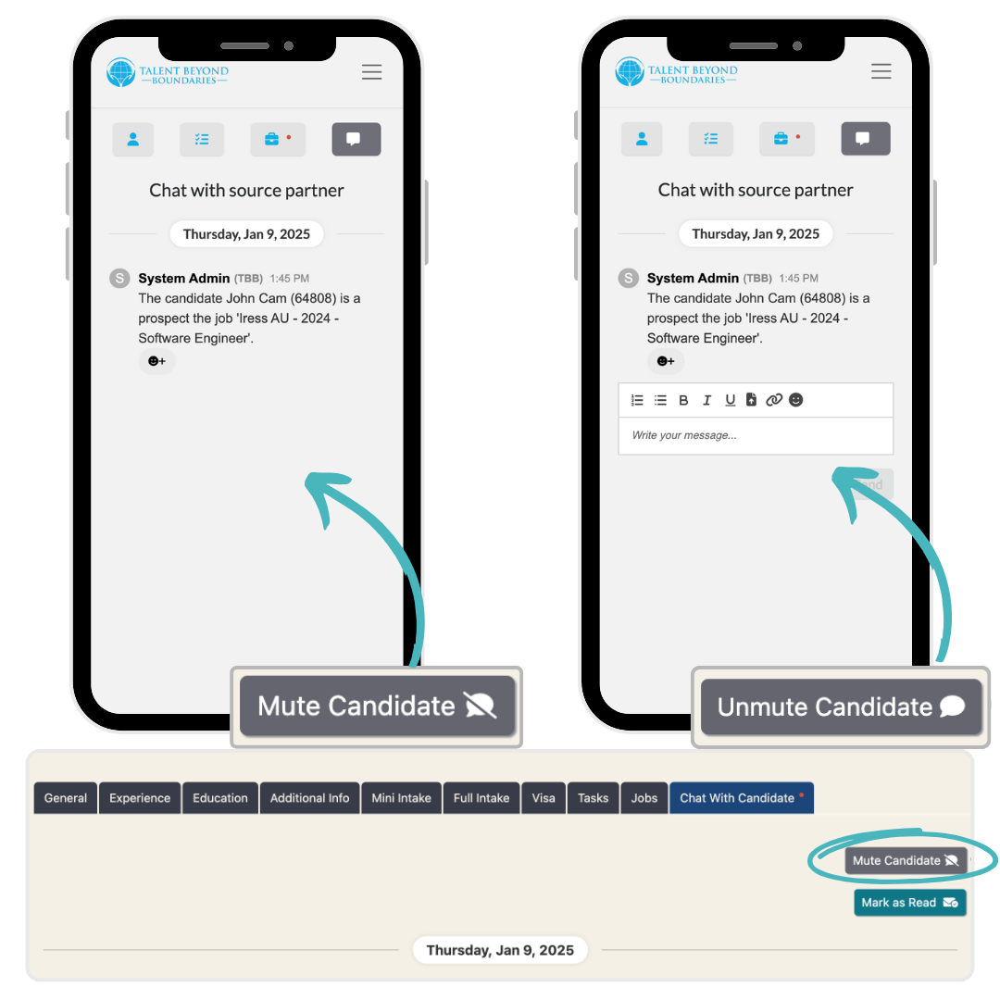
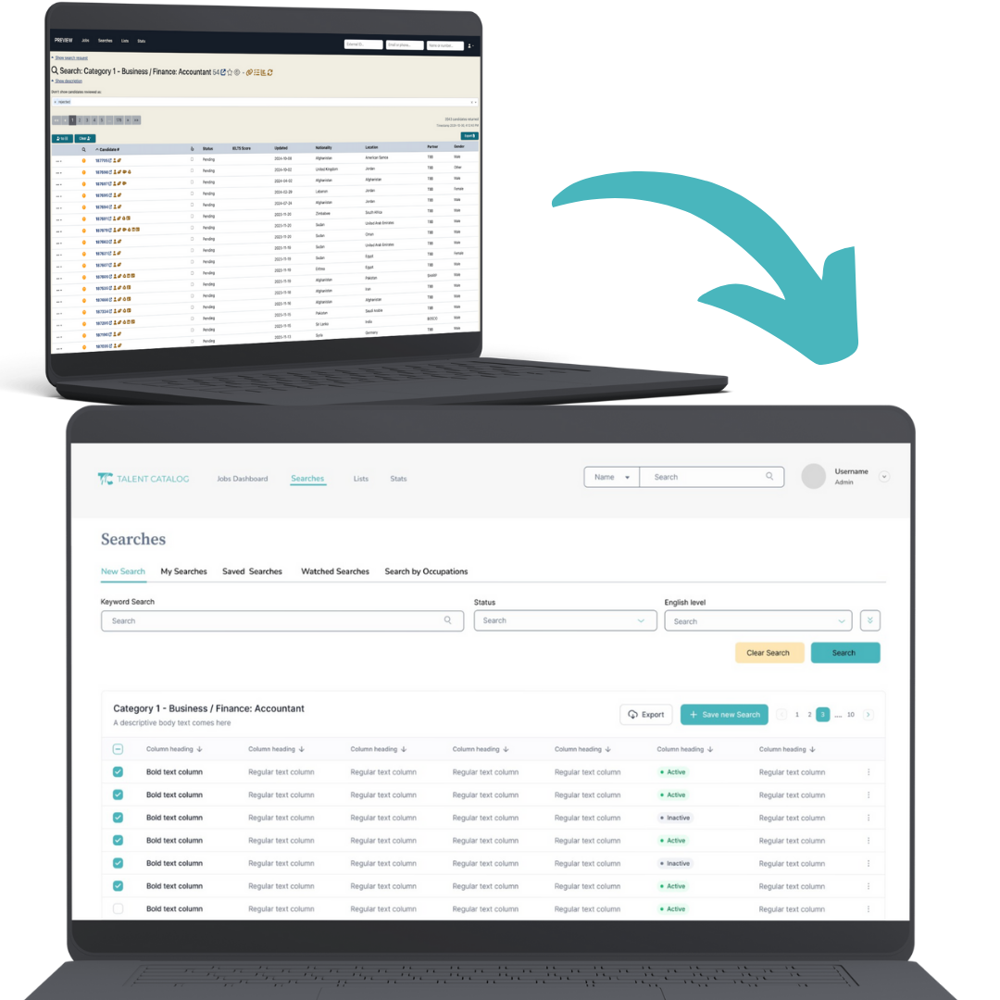

# New Features

  <a href="./v230/tc_anonymized_open_api" class="card">
    
    

      
TC Anonymized Open API

      

        Introducing the Talent Catalog API—our first OpenAPI release on the Talent Catalog platform!
      

      

        <button class="btn btn-sm">Learn more</button>
      

    

  </a>

  <a href="./v230/tc_intelligence" class="card">
    
    

      
TC Intelligence with Preset

      

        TC Intelligence brings the power of Preset to the Talent Catalog: analyse and present 
        advanced, interactive visualisations with real-time TC data!
      

      

        <button class="btn btn-sm">Learn more</button>
      

    

  </a>

  <a href="./v230/duolingo_english_test" class="card">
    
    

      
Duolingo English Test/TC Integration

      

        Duolingo is providing candidates with free Duolingo English Tests. These tests can be assigned and managed 
        through the Talent Catalog.
      

      

        <button class="btn btn-sm">Learn more</button>
      

    

  </a>

  

    
    

      
Mute Chats

      

        TC admins can quietly 'mute' candidate chats, this is useful if a candidate is sending unnecessary chats which spams the chat channel.
      

    

  

# User Guides

Helpful TC user guides:
<ul>
    <li>
        <a href="https://docs.google.com/document/d/1aI7dTq9wwucPmY7UMjpsjn9V5sLf1WWpYnhiA_9q43U/edit?usp=sharing" 
        target="_blank">Employer Access User Guide</a>
    </li>
    <li>
        <a href="https://docs.google.com/document/d/1h5QaUNOSPP-pjJsMCDwXS_SQUrurvLfnBKPX87orgbE/edit?usp=sharing" 
        target="_blank">TC Chats Explainer Doc</a>
    </li>
</ul>

## General Improvements

- Email verification implemented for both candidate and admin users to reduce the number of bad or mistyped emails
- Option to 'Skip Candidate Search' on a job, this allows employers to indicate whether they want source partners to search for candidates or prefer to 'skip' and proceed only with candidates they’ve added to the submission list.
- Capture latest tab via the URL's tab parameter allowing for direct navigation to tab and will allow heat mapping on each tab
- Selection of stats in TC Stats (max 8) allowing stats to be run on the full database without performance issues
- Removed 'Run Old Stats' button from TC Stats as has been improved with the newer 'Run Stats' button
- Tasks have rich text descriptions so that links and formatting can be added to a task description
- Added relocated address fields (address, city, state, country) to candidate. Updatable on the candidate portal once the candidate has a case that is past the job offer stage. Can be updated anytime on the admin portal.
- Relocated country auto-populates with the destination country when a candidate's case is moved to or past the relocated stage.
- When a relocated address field is updated a candidate note is created for tracking purposes
- Candidates are automatically informed about Pathway Club (by email) when they have accepted a job offer
- Job titles now editable by owners and System Admins after publishing
- Option to set inactive partners' referral links to redirect to a nominated replacement
- Reassign candidates to new managing partner based on saved search results
- Submission List view now optionally displays the username and partner org of admin who added each candidate
- Can only replace candidates in a list if the user owns the list through the 'Save selection to list' & 'Copy to another list' pop-ups
- Employer partners can't add candidate's to global lists through the 'Save selection to list' & 'Copy to another list' pop-ups

## Data Improvements
- Expose Country ISO codes and Occupation ISCO codes
- New icon identifying potential duplicate candidate profiles, updating daily and in real-time by the resolution modal opened when icon clicked
- Housekeeping undertaken to align TC data with Salesforce Employer Opportunities
- Renamed tbbShortName to tcShortName
- Renamed task field 'helpLink' to 'docLink' as help links can now be linked to in rich text task descriptions - 'docLink' can now be used to display documents in iframe in tasks.
- Daily scheduled methods keep TC Opportunity data aligned with changes made on Salesforce
- Candidate relocated address replicated in Salesforce, dynamically displayed only if present
- Redundant Candidate Visa Job Check fields removed from DB
- TC API: Implement handling for skippable exceptions arising during the API anonymisation process
- TC API: Implement a process to capture any batch failed items during anonymisation so they can be processed manually
- TC API: Include employed status candidate profiles in anonymised databases

# UI / UX Enhancements

  <a href="./v230/tc_redesign" class="card">
    
    

      
Sneak Peak into the TC redesign!

      

        With the help of Hiba, our resident UI/UX designer, we are beginning a much desired upgrade to the TC user interface. 
        Incorporating Figma into our workflow, we can easily share our plans and early designs with you all.
      

      

         <button class="btn btn-sm">Learn more</button>
      

    

  </a>

  

    
    

      
Implemented heat mapping and screen recording

      

        Part of the redesign process is gathering data on our users, we have implemented Clarity to provide and analyse heatmaps of user behaviour. 
        We look forward to sharing the results and using the results to provide data driven design choices.
      

    

  

## Other UI / UX Enhancements

- Chat UI enhancement by separating chats by date sent and displaying initials of sender in icon
- Added warning not to enter confidential info into General Notes
- Candidate rows on submission lists now display the full name of the admin who add them
- Make Job Description more visible on Publish Job screen
- Enhanced cursor behaviour for clickable links
- More informative tool-tips by clarifying support text and UI simplification to assist employer users in creating jobs and using candidate search
- Support for custom donation fields on SF records
- Updated automated process for Canada Stream A one-month checks
- Compute year of birth for anonymised TC API candidates
- Added additional 'Create/Update Salesforce' button at the end of the full intake
- TC API: Distinguish TC partner from candidate life partner

# Performance Improvements

- Source partner Candidate Chats tab SQL refactored for faster load times
- Improved loading times for candidate profiles, both in list/search view and full profile view
- Resolved system performance issues triggered by AWS Fargate auto-scaling

# Security Fixes
- De-anonymisation of CV downloads restricted by partner type
- Display of Jobs data restricted by partner type
- Implement authentication and authorisation handling for TC API access
- TC API: Implement API Key Auth for TC API endpoints

# Bug Fixes

- Fixed bug in NOT ListAll search filter
- Employer direct access does not see other employer jobs
- Removed TBB from non english translations and added missing partner references
- Admin-only DELETE endpoint reauthorised with recommended syntax for Spring Security 6
- Candidate search tooltips rewritten for Angular 16 compatibility
- Next Step column on submission lists displays correct value every time
- Fixed issue with candidate results not appearing on spreadsheet exports of search results
- Removed duplicated text in Opportunity modals
- Candidate email quick search made case-insensitive
- Candidate's associated with deleted or inactive partners are back appearing in searches
- Answers to question tasks are back appearing on admin portal
- Updating a search no longer clears the displayed multi-select selections
- Accepted offer notification now goes out even if the acceptance stage is skipped
- Next Step audit stamps replicated in Salesforce
- Character limit on Job naming to conform with Salesforce restrictions
- Submission list view infinite loading indicator issue resolved
- Spring Boot Security request matchers pattern change
- Fixed tooltip display issue in candidate search
- Next Step column displaying correctly in Submission List view
- Candidates to only receive new chats notification email if the chats are unread
- Jobs tab on Candidate Portal only appears if there are opportunities past the <em>Prospect</em> stage, except for the closed stage <em>'Candidate was mistakenly proposed as a prospect for the job'.</em>
- Fixed a bug where an uploaded file marked as a CV was not actually marking the attachment as a CV
- Fixed a bug where reactions to posts were not being seen until the post was manually refreshed
- Fixed a bug where a user's non-submission lists were being inadvertently associated with a job
- Fixed broken eligibility links in the candidate portal
- Fixed an issue where the system admin api for partner reassignment was not working in staging and prod
- Fixed a bug where Redis keys were not being correctly configured following the upgrade to Spring 3
- Fixed a bug where minimum spoken and written language levels were all selecting simultaneously following the upgrade to Angular 16
- Fixed a bug where Duolingo CSV import failed due to changing column order in exported Duolingo CSV
- TC API: Fixes a bug where Aurora DB writes could inadvertently fail due to ID clashes with hibernate sequence number generation
- TC API: Fixes a bug where Mongo DB writes could inadvertently duplicate due to no Mongo transaction management in a non-clustered database
- TC API: Fixes a bug where authorisation was failing on partner lookups by API key
- TC API: Fixes a bug to return the correct value in total elements in response to API requests

# Developer Notes
- Upgraded to Spring Boot 3
- Upgraded Angular to version 16
- Upgraded Node to version 18 
- MFA Authenticators now show TalentCatalog instead of TBB
- Updated copyright
- Deprecated Github Actions Upload Artifact version upgraded
- Moved from UA to GA4 tags in admin portal
- Standardized Terraform: <a href="https://drive.google.com/file/d/1JZUenkyr2rtVB7h8eElkRvXfwqbCIPQB/view?usp=drive_link" 
rel="noopener noreferrer nofollow" target="_blank">Terraform video 1</a>, 
<a href="https://drive.google.com/file/d/1kEiK77T8_krmqX-TxVodmNAJhDznbocA/view?usp=drive_link" 
rel="noopener noreferrer nofollow" target="_blank">Terraform video 2</a>, 
<a href="https://drive.google.com/file/d/1wLvXbuIZViKFnqJZd_R5HMsBVQrqhD_4/view?usp=drive_link"
rel="noopener noreferrer nofollow" target="_blank">Terraform video 3</a>.
- TC API: See our new Git repo for the <a href="https://github.com/Talent-Catalog/tc-api" rel="noopener noreferrer nofollow" target="_blank">Talent Catalog API</a>.
- TC API: See our new Git repo for the <a href="https://github.com/Talent-Catalog/tc-api-spec" rel="noopener noreferrer nofollow" target="_blank">Talent Catalog OpenAPI specification</a>.
- TC API: Using OpenAPI code generation for Talent Catalog API models and controllers
- TC API: Using MapStruct to map from OpenAPI models to anonymised JPA entities and Mongo documents
- TC API: Introduces Spring Batch to perform systematic anonymisation of candidate profiles from TC database
- TC API: Support Google naming conventions for API enums

## Code Refactoring
- Removed unused 'relocating dependants' field from visa job check, this was transferred to candidate opportunity in prior release.
- Removed unused candidate portal component - RegistrationLandingComponent

## Continuous Integration & Deployment
- Introduced a process for cherry-picking commits from staging to production to support Hotfixes from committed updates
- Use docker-compose to for local TC services: Postgres, Elasticsearch, Kibana and Redis
- Implements CORS for Amplify PR previews on the candidate portal and admin portal
- TC API: Publish TC API versioned artefacts on Maven Central signed with GPG keys
- TC API: Auto-deploy API artefacts to Maven in the CI pipeline
- TC API: Promote tagged Docker images to TC API cloud registry on AWS
- TC API: Use Terraform to deploy the TC API on to AWS

## Cloud Enhancements
- Deployed AWS Aurora Postgres DB for anonymised candidate data used by TC Intelligence
- Introduce Micrometer and Spring Actuator to TC services for memory and cpu usage metrics
- TC API: Deployed Mongo DB for anonymised candidate data used by TC API
- TC API: Deployed interactive API specification documentation on Redocly cloud
- TC API: Adds support for AWS Elastic Load Balancer health checks for the API service

---

Thank you for using Talent Catalog! Your feedback and support are invaluable to us. If you encounter
any issues or have suggestions for improvement, please don't hesitate to [contact us](mailto:support@talentcatalog.net) or
[open an issue on GitHub](https://github.com/Talent-Catalog/talentcatalog/issues).

*[Access the latest version](https://tctalent.org/admin-portal/login)*
