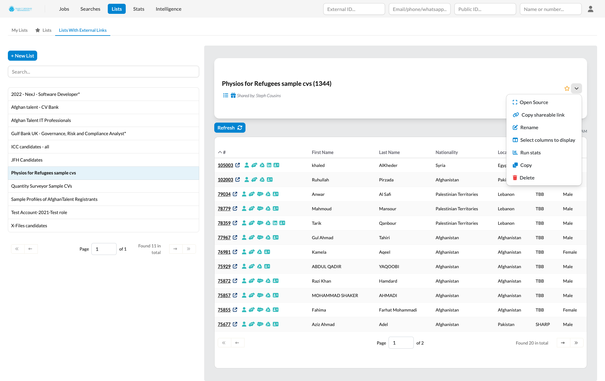

# New Features

  <a href="./v240/tc_ui_redesign" class="card">
    
    

      
Introducing Our New UI: Phase I

      

        The Talent Catalog is getting a fresh new look! In this release we are introducing the first 
        phase of our UI redesign, incorporating the new TC styling across the Admin portals.
      

      

        <button class="btn btn-sm">Learn more</button>
      

    

  </a>

  <a href="./v240/italy_train_to_hire" class="card">
    
    

      
Supporting Italy’s Train-to-Hire Program

      

        This release streamlines refugee document collection and verification for Italian 
        train-to-hire candidates, so that individuals can manage their own data while improving 
        coordination and reducing errors across agencies.
      

      

        <button class="btn btn-sm">Learn more</button>
      

    

  </a>

  <a href="./v240/privacy_agreements" class="card">
    
    

      
Privacy Agreements Review - GDPR compliance

      

        We have updated our privacy agreements for an individual partner's compliance with GDPR 
        regulations. Admins can now track candidate consent status and candidates are prompted to 
        review and accept updated agreements upon login.
      

      

        <button class="btn btn-sm">Learn more</button>
      

    

  </a>

  <a href="./v240/improved_matching" class="card">
    
    

      
Improved Matching

      

        Job match results are now sorted by relevance, helping admins focus on the best-fit 
        candidates and speed up their review process.
      

      

        <button class="btn btn-sm">Learn more</button>
      

    

  </a>

# User Guides

Helpful TC user guides:
<ul>
    <li>
        <a href="https://tc-api.redocly.app/openapi" 
        target="_blank">Talent Catalog API on Redoc</a>
    </li>
    <li>
        <a href="https://docs.google.com/document/d/1aI7dTq9wwucPmY7UMjpsjn9V5sLf1WWpYnhiA_9q43U/edit?usp=sharing" 
        target="_blank">Employer Access User Guide</a>
    </li>
    <li>
        <a href="https://docs.google.com/document/d/1h5QaUNOSPP-pjJsMCDwXS_SQUrurvLfnBKPX87orgbE/edit?usp=sharing" 
        target="_blank">TC Chats Explainer Doc</a>
    </li>
    <li>
        <a href="https://github.com/Talent-Catalog/talentcatalog/blob/staging/server/src/main/java/org/tctalent/server/casi/README.md" 
        target="_blank">CASI (Candidate Assistance Services Interface) -- Developer Guide</a>
    </li>
</ul>

# Framework Updates

  <a href="./v240/forms_tasks.md" class="card">
    
    

      
Form Tasks Framework

      

        This release introduces Form Tasks — a flexible way to collect structured, multi-field data 
        from candidates, enabling more powerful workflows like Italy Train-to-Hire and future 
        self-service intakes.
      

      

        <button class="btn btn-sm">Learn more</button>
      

    

  </a>

  <a href="./v240/casi_framework.md" class="card">
    
    

      
CASI Framework

      

        This release delivers the backend framework for the Candidate Assistance Services Interface 
        (CASI), enabling future partner-led, data-driven support and engagement for Talent Catalog 
        candidates.
      

      

        <button class="btn btn-sm">Learn more</button>
      

    

  </a>

## General Improvements

- Improved use and display of candidate properties
- Support for versioned privacy agreements and automated approval processes. New Candidate 
Registration process to support new agreements. Support for separate candidate agreements with each 
managing source partner (not just TBB)
- New GDPR compatible candidate privacy agreement 
- Display date that privacy terms were accepted by candidate 
- Warning to candidate about CV related content could be made publicly viewable. 
- Hotfix 2.3.0 Added WhatsApp number to the export feature of searches 
- New Candidate Status: RelocatedIndependently 
- Added WhatsApp numbers to candidate quick search by phone 
- Added country code to phone number inputs on admin portal 
- Removal of candidate.migration_nationality from TC database and entities 
- Update CASI header misleading name

## Data Improvements

- Integrates with standard skills from sources including **ESCO** and **ONet**
- Slovakia added to TC countries 
- Email alert for failing scheduled background batch operations

# UI / UX Enhancements

- Implemented phase 1 of the Talent Catalog re-design
- Prioritized Matching: Results of user text searches can be sorted with best matches first
- Automatically extracts standard skills from job description and generates search for candidates 
with those skills.
- Shows search matches found in uploaded CVs
- Functionality to automate travel doc upload and data entry
- Functionality to automate RSD evidence and refugee ID upload and data entry
- Functionality to automate relocating family member RSD evidence and refugee ID upload and data 
entry

## Other UI / UX Enhancements

- New search filter request: max education level
- Additional search filters for campaigns, sources, and mediums
- Manually Update Max Education Level from Admin Panel
- Can now import lists from candidate publicIds as well as candidate numbers.
- Ability of TC admin user to find candidate by public ID
- Display candidate Exam results in admin portal candidate profile

# Performance Improvements

# Security Fixes

- Discontinue TC->SF all-candidates sync

# Bug Fixes

- Possible fix of memory leak as side effect of this issue. Protecting against memory loss due 
to not closing streams. 
- Fixing answers not displaying properly in Candidate Portal profile 
- Candidate Portal registration: English ability and professional certification questions 
marked as required but not actually required to proceed 
- CV Generation Fails Due to Invalid Characters in Contact Info 
- Source partners should not be able to change the opportunity stage of opps they are not 
responsible for 
- Unable to Identify Duolingo Coupon Redemption 
- Hide Send Duolingo Test task from Tasks list
- Search by survey type not working as expected
- Add “HowHeardAboutUs” enum & update candidate source options in Talent Catalog
- Can clear a phone number field when using international phone input on admin portal
- Fix partner and role logic which was hiding certain fields from partners (e.g. UNHCR)
- New search functionality SQL references deleted 'major_id' field
- Clickable tooltip in Update Candidate Opp modal not working
- New search functionality SQL incorrectly references potential duplicates field
- Same-value logging emissions from chat subscriptions
- Publish Job sets Salesforce counterpart to wrong stage
- Candidate TC created date incorrectly translated to SF Contact record
- List publish error
- Erroneous Next Step automated chat post
- environment.staging.ts was not being utilised
- Default Next Step for newly created Candidate Opp not reflected in SF
- Education Level (minimum) filter was not working
- Remove null characters from Link Previews
- Duplicate audit stamp and default Next Step for newly created Job not saving to TC DB
- Job Opp Next Step not updating
- Download of autogenerated CV not working for candidate 289669 on production
- Potential bug: candidate note records change to 'pending' status but status still 'draft
- Candidate Portal registration: English ability and professional certification questions 
marked as required but not actually required to proceed
- Error accessing unknown fields on JPA entity during active session

# Developer Notes

## Test Coverage

- Create DuolingoExamServiceImplTest.java
- Create DuolingoExtraFieldsServiceImplTest.java
- Write Unit Tests for Duolingo Coupon Service
- Enhance Tests for Low-Coverage Components in Admin Portal
- Improve Test Coverage for Admin Portal Directives
- Testing: GoogleFileSystemServiceImpl
- Enhance Test Coverage for org.tctalent.server.api.admin Package
- Extensive per-resource test data
- GDPR process verification
- Testing: DuolingoApiServiceImpl

- // TODO -- capture coverage stats as the coverage % has massively increased

## Code Refactoring

## Continuous Integration & Deployment

- Setup integration tests with Docker Testcontainers 
- Support for integration test DB Dump in CI/CD

## Cloud Enhancements

## New Tools and Standards

- Introduced Candidate Forms and Form Tasks framework
- Simply configured Spring Batch based solution for processing candidates in a list or search
- Spring Batch version of old BackgroundProcessor which adapts batch processing depending on
  how busy system is.
- Additional reporting via Preset dashboard on candidate UTMs and params for TBB comms

---

Thank you for using Talent Catalog! Your feedback and support are invaluable to us. If you encounter
any issues or have suggestions for improvement, please don't hesitate to [contact us](mailto:support@talentcatalog.net) or
[open an issue on GitHub](https://github.com/Talent-Catalog/talentcatalog/issues).

*[Access the latest version](https://tctalent.org/admin-portal/login)*
