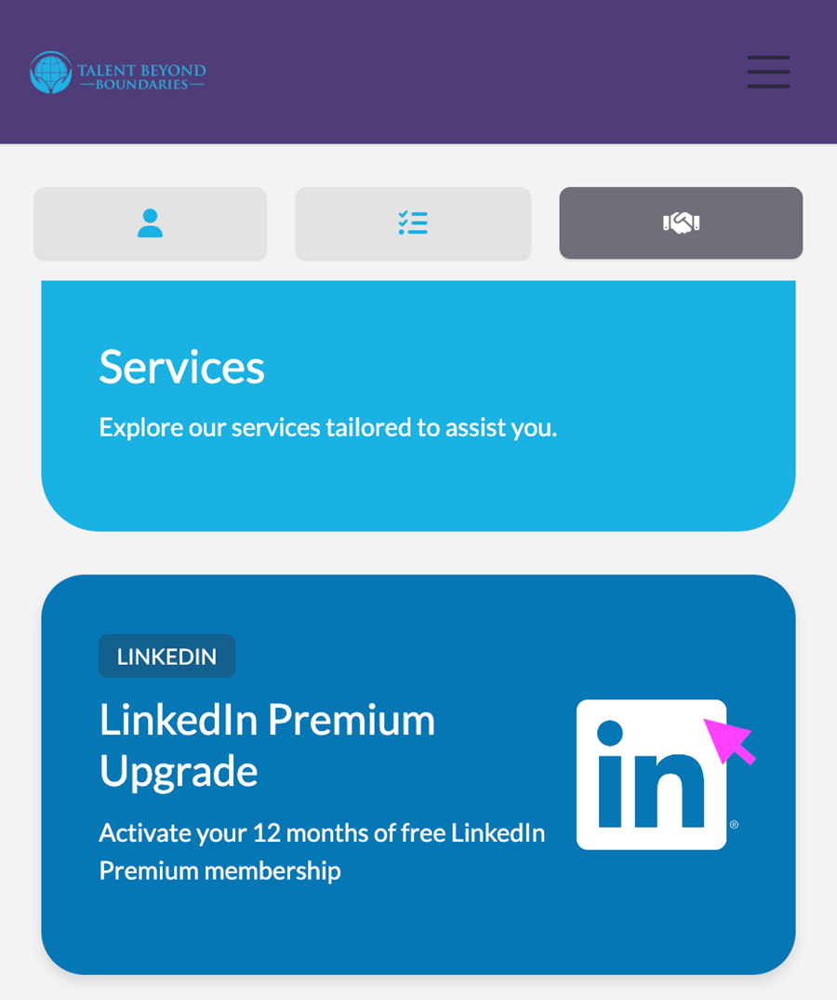
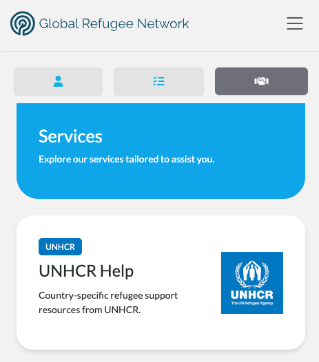
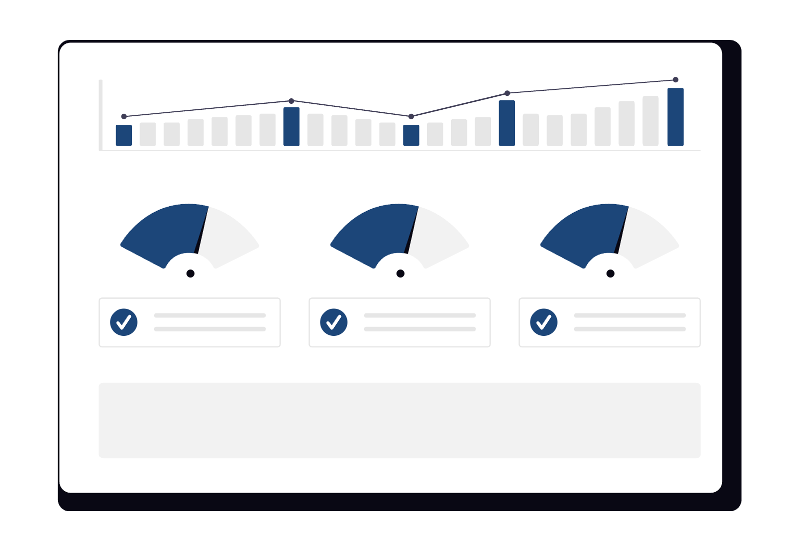
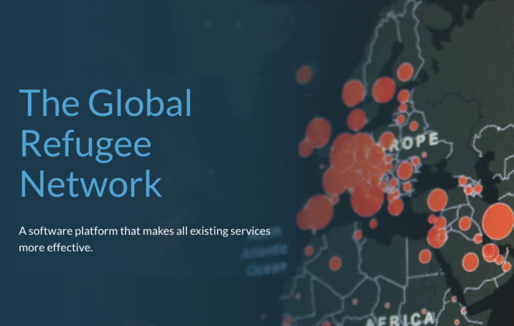
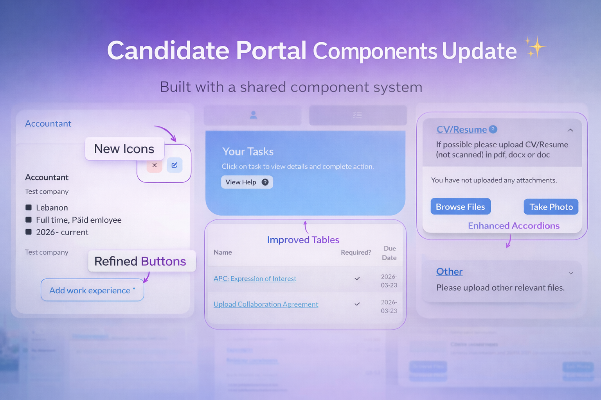
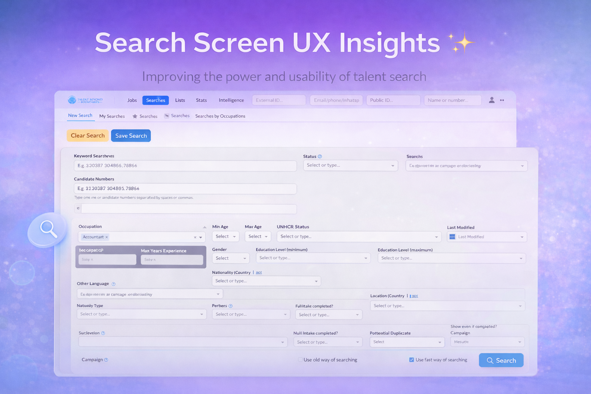

# New Features

## CASI - LinkedIn and UNHCR Services

The <a href="./v240/casi_framework">Candidate Assistance Services Interface (CASI)</a> makes it
easy to deliver targeted support from partner organisations directly to candidates. This release
adds two new services to the growing CASI ecosystem:

  <a href="./v250/linkedin_service" class="card">
    
    

      
LinkedIn Candidate Assistance Service

      

        Eligible candidates can now redeem a free 1-year Premium membership upgrade via 
        Candidate Portal self-service.
      

      

        <button class="btn btn-sm">Learn more</button>
      

    

  </a>

  <a href="./v250/unhcr_help_service" class="card">
    
    

      
UNHCR CASI Help Services

      

        Signposting to relevant UNHCR help pages for eligible registrants. The service is gated
        to GRN but can be easily opened for TC candidates.
      

      

        <button class="btn btn-sm">Learn more</button>
      

    

  </a>

## Performance Tuning and GRN Launch

  <a href="./v250/performance" class="card">
    
    

      
Performance Improvements

      

        v2.5.0's focus on performance delivers meaningful improvements to loading times and overall 
        responsiveness.
      

      

        <button class="btn btn-sm">Learn more</button>
      

    

  </a>

  <a href="https://openpathwaycollective.org/globalrefugeenetwork" target="_blank" class="card">
    
    

      
Global Refugee Network

      

        Our sister platform to the TC launches - the GRN offers all refugees with access to valuable 
        international services.
      

      

        <button class="btn btn-sm">Learn more</button>
      

    

  </a>

# User Guides

Helpful TC user guides:
<ul>
    <li>
        <a href="https://tc-api.redocly.app/openapi" 
        target="_blank">Talent Catalog API on Redoc</a>
    </li>
    <li>
        <a href="https://github.com/Talent-Catalog/talentcatalog/blob/staging/server/src/main/java/org/tctalent/server/casi/README.md" 
        target="_blank">CASI (Candidate Assistance Services Interface) -- Developer Guide</a>
    </li>    
    <li>
        <a href="https://drive.google.com/file/d/1CBBYNjuRrYgOQ0xDRjiegqoznek_i-MB/view?usp=drive_link" 
        target="_blank">Italy Train-to-Hire: Task Management Documentation</a>
    </li>
</ul>

## General Improvements

- Gatling version updated to enable Java-based performance testing
- Performance test folder structure standardised

## Data Improvements

- New candidate status: Ineligible (review) - supports eligibility policy revision
- New Job closed-lost stage: Inadequate pathway provision
- Automated Salesforce update of relocating dependants trigger amended
- Dependant gender and DOB intake questions marked required

# UI / UX Enhancements

**Phase 2 of Talent Catalog Redesign**

  <a href="./v250/candidate_portal_redesign" class="card">
    
    

      
Candidate Portal updated with a new shared component library!

      

        As part of Phase 2 of the TC redesign, we’ve upgraded the Candidate Portal to use the new TC component library. 
        This brings a cleaner, more consistent experience aligned with the Admin Portal, while reducing one-off UI code 
        and improving maintainability. The update also lays the foundation for future UX improvements and the upcoming mobile app, 
        with added test coverage to ensure stability across all updated components.
      

      

         <button class="btn btn-sm">Learn more</button>
      

    

  </a>

  <a href="./v250/search_screen_ux_insights" class="card">
    
    

      
Targeted UX insights for the search redesign

      

        We began the redesign by focusing on the search screen, identifying possible UX improvements and gathering team input through structured voting sessions. By combining Figma collaboration, heatmap analysis, and quantitative feedback, we were able to guide design decisions and better prioritise future UX enhancements.
      

      

         <button class="btn btn-sm">Learn more</button>
      

    

  </a>

## Other UI / UX Enhancements

- Font Awesome icon processing standardised across portals
- Removal of TC Chats pending new UX design and native mobile app development
- Align Candidate Portal SharedModule with TC Components
- Verify TC Components Mobile Responsiveness
- Redesign New Search screen (Figma workflow)
- UX Insights from Microsoft Clarity
- Inline icons not aligned with Job heading
- Display issue in Candidate Portal registration (Step 1)
- Registration “Next” button not always activating
- Radio buttons not clickable via labels on registration form
- Fix logo size on candidate portal
- Fix alignment of chatbot input and send icon
- Tc Button - loading indicator
- Fixing margins around the TC Accordion component
- Fix color mismatches in Candidate Portal
- Add Microsoft Clarity to Candidate Portal
- TC Pagination component needs fixing on the mobile screen

# Security Fixes

- JWT reconnection loop on expired tokens

# Bug Fixes

- Job offer acceptance automations amended to later stage trigger
- Console errors triggered when opening certain candidate profiles
- Candidate uploads not displaying in attachment list
- API key validation intermittent failure
- Clicking candidate icon incorrectly opens candidate card (click event not consumed)
- Won and Closed attributes missing from Opportunity DTOs

# Developer Notes

## Test Coverage

- NewSearchScreenQuery replaced with stable SQL
- Gatling performance tests for Saved List candidate search
- Integration tests for CASI end-to-end
- Unit testing for CASI framework components
- Expanded test coverage by adding unit tests for all components updated during the TC component migration.

## Continuous Integration & Deployment

- Decouple image deployment for GRN and TBB
- Terraform configuration for all service deployments

## Cloud Enhancements

- Migrate candidate files from Google Drive to Amazon S3 cloud infrastructure
- CloudFront configuration for S3 file uploads and Application Load Balancer
- Upgrade Aurora Postgres to V17

## New Tools and Standards

- Angular upgrade from version 16 to 17

---

Thank you for using Talent Catalog! Your feedback and support are invaluable to us. If you encounter
any issues or have suggestions for improvement, please don't hesitate to [contact us](mailto:support@talentcatalog.net) or
[open an issue on GitHub](https://github.com/Talent-Catalog/talentcatalog/issues).

*[Access the latest version](https://tctalent.org/admin-portal/login)*
