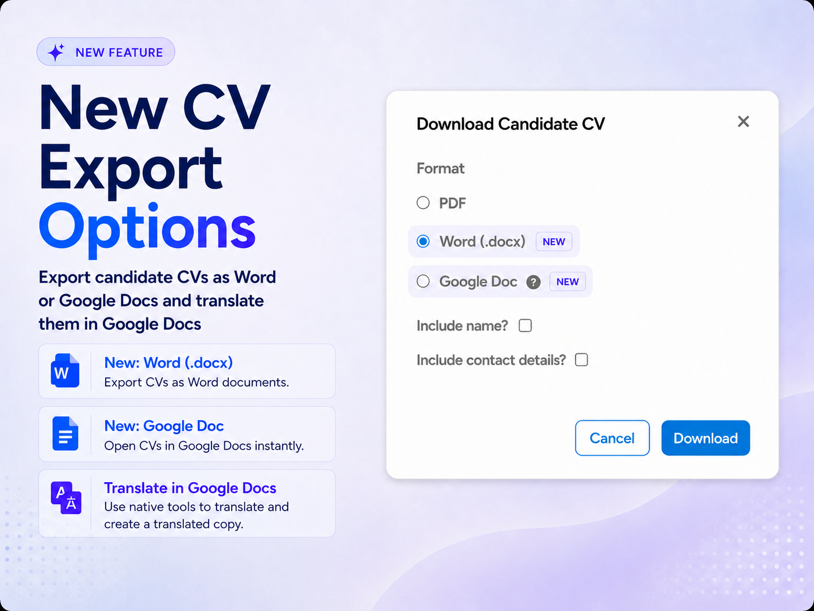
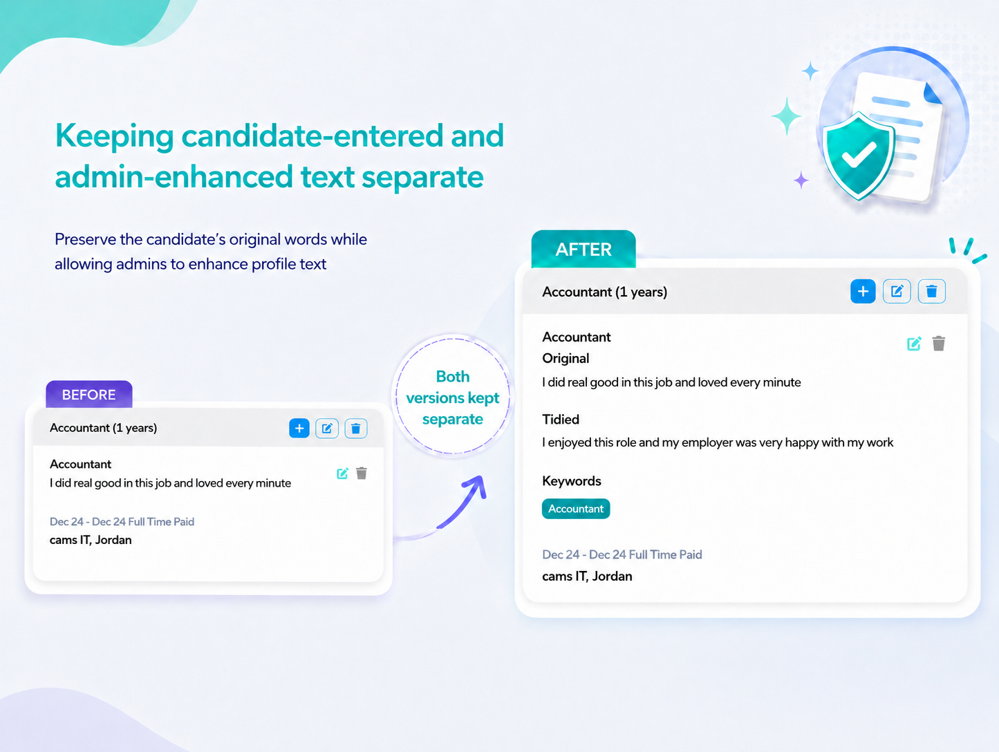
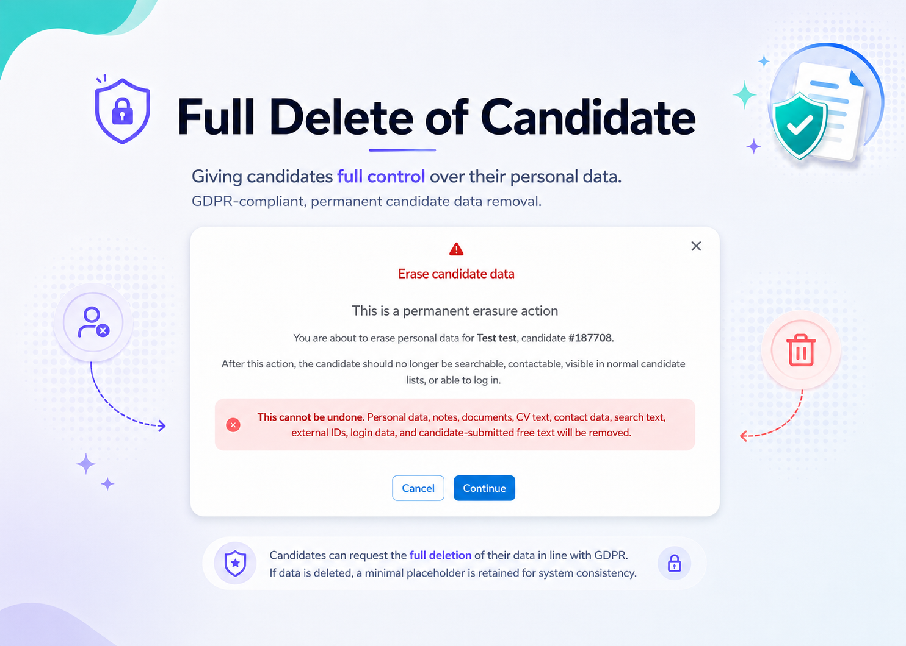
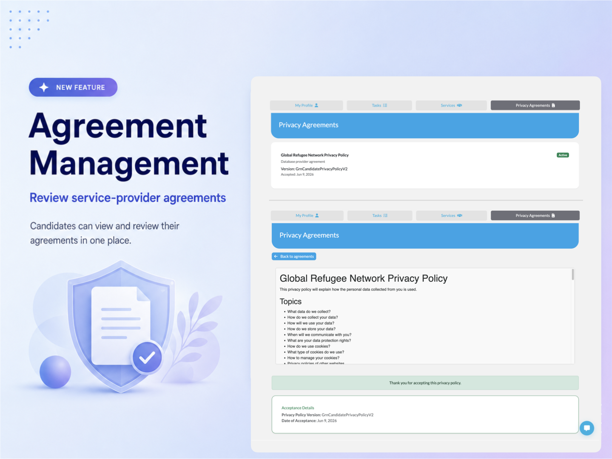
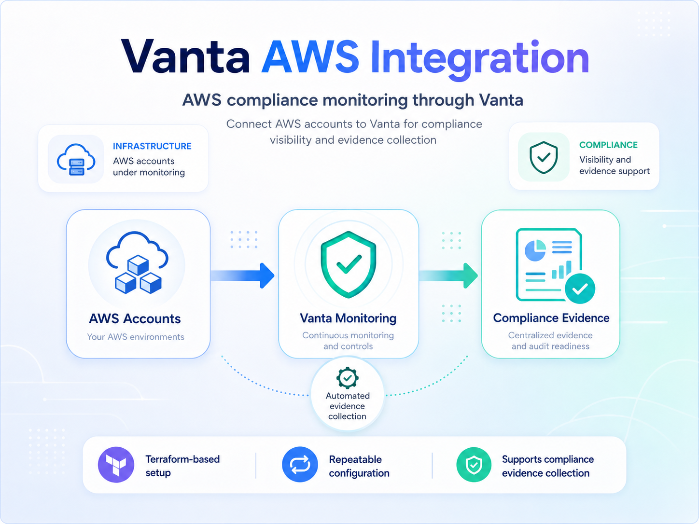

# New Features

  <a href="./v251/cv_export_options" class="card">
    
    

      

        <button class="btn btn-sm">Learn more</button>
      

    

  </a>

  <a href="./v251/job_experience_text_preservation" class="card">
    
    

      

        <button class="btn btn-sm">Learn more</button>
      

    

  </a>

  <a href="./v251/full_candidate_deletion" class="card" style="margin-top: 1rem">
    
    

      

        <button class="btn btn-sm">Learn more</button>
      

    

  </a>

  <a href="./v251/task_email_alerts" class="card" style="margin-top: 1rem">
    
    

      

        <button class="btn btn-sm">Learn more</button>
      

    

  </a>

## Other Enhancements
* Toggle page size for candidate results

  <a href="./v251/agreement_management" class="card">
    
    

      

        <button class="btn btn-sm">Learn more</button>
      

    

  </a>

# User Guides

Helpful TC user guides:
<ul>
    <li>
        <a href="https://tc-api.redocly.app/openapi" 
        target="_blank">Talent Catalog API on Redoc</a>
    </li>
    <li>
        <a href="https://github.com/Talent-Catalog/talentcatalog/blob/staging/server/src/main/java/org/tctalent/server/casi/README.md" 
        target="_blank">CASI (Candidate Assistance Services Interface) -- Developer Guide</a>
    </li>    
    <li>
        <a href="https://drive.google.com/file/d/1CBBYNjuRrYgOQ0xDRjiegqoznek_i-MB/view?usp=drive_link" 
        target="_blank">Italy Train-to-Hire: Task Management Documentation</a>
    </li>
</ul>

# General Improvements

* Elasticsearch can now be decommissioned with an annual saving to TBB.
* Improved citizenship questions in the mini intake
* Updated destination options in Candidate Portal registration
* Saved List capability for TC Intelligence 
* Extend CASI to support service lists

# Data Improvements

# UI / UX Enhancements

*  Display folder name on Candidate profile > Additional Info tab > uploaded files

## Other UI / UX Enhancements

# Performance Improvements

# Security Updates

* Fixed Gradle dependency version warnings
* Explicitly adds missing public paths for Spring Security 6
* Hardcoded JWT Secret, Database Password, and Translation Password (DS-009)
* Added audit fields to candidate-provided data tables
* Remove hardcoded defaults for Bootstrap Users (dead code path but triggers code scan alerts)
* Added an upper and lower bounds to page size of pagination to avoid risk of memory leaks
* Remove remaining files related to old Elasticsearch functionality
* Renamed spring security authority role from 'ReadOnly' to 'Restricted' to more accurately reflect the API end point security authorities
* Protected System Admin endpoints by preauthorising user is System Admin and changed state changing endpoints to PUT requests from GET requests
* Add candidate authguard to LinkedinPortalApi 

# Bug Fixes

* Bug where candidates on GRN are marked as ineligible at the end of the registration process if they are already located in a destination country
* Aspirations do not appear in candidate-portal summary
* Application startup fails on empty database due to duplicate partner primary key insertion
* Fix shared resource assignments unique constraints on CASI
* Fixed citizenship intake panel errors when data is missing
* Resolved migration issue causing some candidates not to be loaded
* Highlighting matches in search results now only highlights matching words

# Developer Notes

* Moved to new open source licence
* Access to s3 attachments (staging only) for GRN devs
* Access to distinct s3 translations for devs running GRN / TBB instances
* Updated README to fix bug where a new user setting up will require a password environment variable

## Test Coverage
* Add tests for candidate-related service classes

## Code Refactoring

## Continuous Integration & Deployment

* Auto restart ECS services after CI image deployments
* Enable GitHub code scanning for the Talent Catalog repositories

## Cloud Enhancements

* Standardise environment variables across all Terraform deployments
* Configure TBB AWS tasks for new translation service

## Logging and Monitoring

## New Tools and Standards

  <a href="./v251/linear_product_roadmap" class="card">
    
    

      

        <button class="btn btn-sm">Learn more</button>
      

    

  </a>

  <a href="./v251/vanta_aws_integration" class="card">
    
    

      

        <button class="btn btn-sm">Learn more</button>
      

    

  </a>

## Other Enhancements 
* Linear product roadmap
*  Linear - Phase 1 - prep + decisions
*  Linear - Phase 2 - setup + developer onboarding

---

Thank you for using Talent Catalog! Your feedback and support are invaluable to us. If you encounter
any issues or have suggestions for improvement, please don't hesitate to [contact us](mailto:support@talentcatalog.net) or
[open an issue on GitHub](https://github.com/Talent-Catalog/talentcatalog/issues).

*[Access the latest version](https://tctalent.org/admin-portal/login)*
