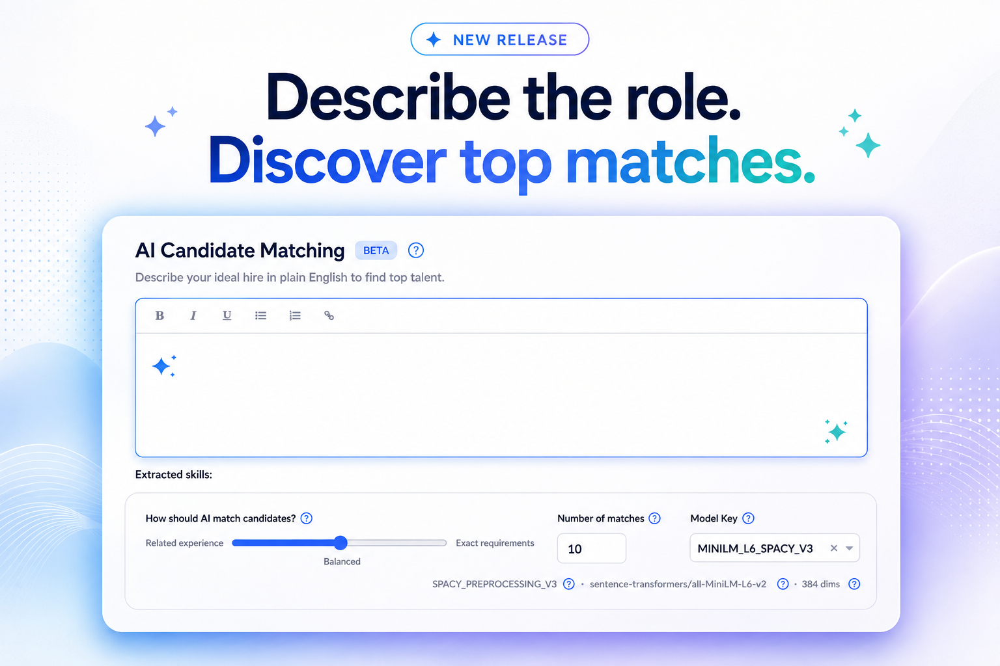
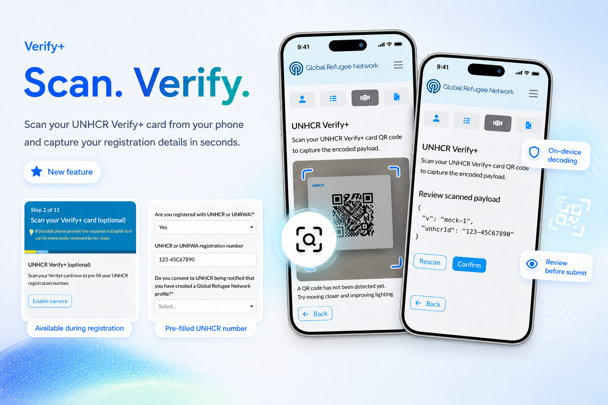
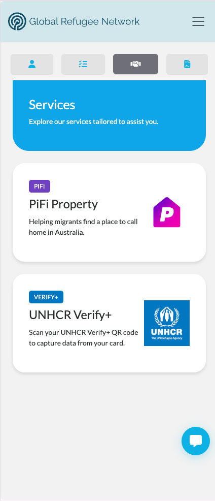
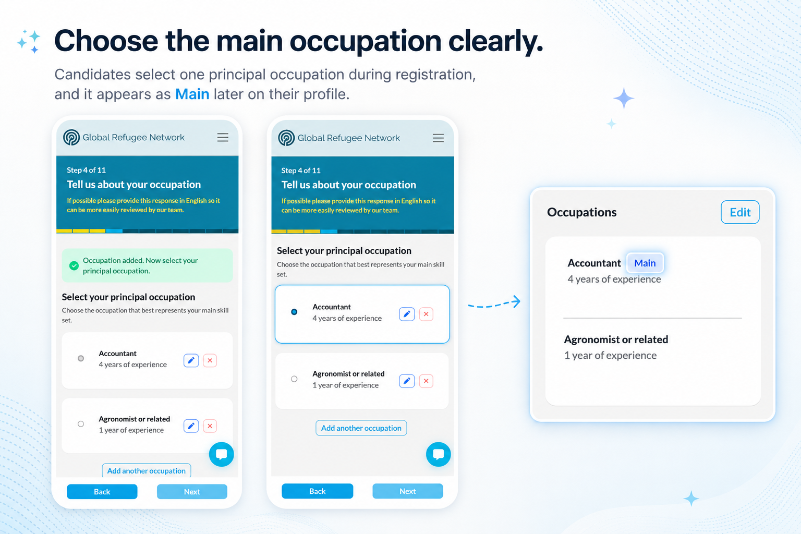

# New Features

## AI Matching

<!-- TODO(images): AiMatching.png does not exist yet. A screenshot of the New Search
     screen's Requirements panel (Requirements field + Lexical vs Semantic slider + Model Key)
     could work well here — it's the clearest single shot of what's new. -->

Talent Catalog now runs a hybrid matching engine behind the scenes, combining traditional
text search with AI-generated vector embeddings. This release brings the first user-facing
pieces of that engine online — skill-aware search from a job description, search scoped to
any list, and keyword filtering alongside AI matches.

  <a href="./v260/ai_job_matching" class="card">
    
    

      
AI Job Matching

      

        The first user-facing pieces of AI-powered candidate matching have landed — skill-aware 
        search from a job description, search scoped to any list, and traditional text search 
        alongside AI matches.
      

      

        <button class="btn btn-sm">Learn more</button>
      

    

  </a>

## UNHCR ID Card Scanning

GRN candidates who hold a UNHCR ID card can now scan its QR code straight from their
phone to capture and verify their UNHCR registration number and personal details — either from the 
Services tab, or as an optional step during registration.

<!-- TODO(images): VerifyPlusServicesCard.png exist but a better front screen image would be 
     great. At your discretion Hiba. -->

  <a href="./v260/verify_plus" class="card">
    
    

      
UNHCR Verify+

      

        Scan your UNHCR ID card QR code to capture and verify your UNHCR registration number and
        personal information.
      

      

        <button class="btn btn-sm">Learn more</button>
      

    

  </a>

## PiFi Casi Integration

GRN candidates now have a new CASI service card signposting them to PiFi Property, helping
them explore rental homes in their new country — starting with Australia.

<!-- TODO(images): PiFiServicesTab.png exists but a better front screen image would be 
     great. At your discretion please Hiba. -->

  <a href="./v260/pifi_signposting" class="card">
    
    

      
PiFi Property

      

        Helping migrants find a place to call home — signposting to PiFi's property search,
        right from the Services tab.
      

      

        <button class="btn btn-sm">Learn more</button>
      

    

  </a>

## Other New Features

  <a href="./v260/principal_occupation" class="card">
    
    

      
Principal Occupation

      

        Candidates can now mark one occupation as their principal one, giving admins and job
        matching a clearer picture of what a candidate is really looking for.
      

      

        <button class="btn btn-sm">Learn more</button>
      

    

  </a>

# General Improvements

* Candidate deletion and erasure permissions have been reworked: only system admins can
  permanently erase a candidate's data, with a new "Delete" action available to other admins
  that simply marks a candidate's status as deleted. The erase option now stays visible even
  after a candidate has been marked deleted, error messages are clearer when a candidate is
  deleted or the candidate number is invalid, deleted candidates no longer wrongly appear in
  name/ID search results, and a status-dropdown bug that showed some statuses as blank has
  been fixed.
* Task email alerts now confirm on-screen when an email has actually been sent, and a broken
  translation key that showed raw placeholder text has been fixed.

# Data Improvements

* Talent Catalog can now hold its own list of TC-identified skills, alongside the standard
  ESCO/ONet skill sets — useful for job-description acronyms and terms (e.g. PLC, SCADA) that
  aren't well covered by the standard lists.

# UI / UX Enhancements

* Fixed inconsistent line-height across dropdown items.
* Removed a duplicated warning triangle icon from the erase-candidate modal.
* Added a "Mark All as Yes" button to speed up the registration destinations step on mobile.
* Aligned a help icon with its text on the CV Google Doc download.
* Fixed the sign-in button not being centered with the language icon on the mobile candidate
  portal.
* Number and range inputs now properly respect their configured minimum, maximum, and step
  values — including a fix so a range slider's endpoints are actually reachable.
* Removed the legacy "Old fetch" checkbox from the candidate search screen.
* Fixed email validation incorrectly failing when an address was pasted in with invisible
  characters attached.

# Performance Improvements

* Rebuilding candidate-experience embeddings skips records that already have one, so a
  restarted or resumed batch run picks up where it left off instead of starting over.
* General tuning and clean-up of the AI matching engine based on early testing.

# Bug Fixes

* Intake PDF export was truncating free-text fields; the "Export PDF" action has been
  replaced with a "Print page" button that renders the full data.
* Fixed the Data Processing Agreement showing a literal "[Your Organization]" placeholder
  instead of the actual counterparty name.
* Hardened JWT authentication against Redis cache failures: a cache outage now falls back to
  the database instead of silently breaking login for every user.
* Migrated (legacy) candidate skills are now correctly included in the text used for search
  and matching.
* Fixed job-experience description validation and display: empty section titles no longer
  appear, and the "Original" description field is now properly required.

# Developer Notes

* Updated the CASI developer README with documentation for agreement management.
* Replaced outdated copyright headers with the standard Talent Catalog
  license across the codebase.
* Upgrade note: this release ships 5 new Flyway migrations (V2_19–V2_23). After deploying,
  run the `build_embeddings` admin action so existing candidates and experience get AI-matching
  embeddings — matching has nothing to work with until that's done.

## Test Coverage

Continued the push toward 80% line coverage: new and expanded unit tests across the admin
portal, candidate portal, and backend service/util/config layers; public-portal test setup
and CI wiring; database specification and query-builder tests; `SystemAdminApi` coverage; CV
and DOCX helper test fixes after the CV-generation refactor; and new Playwright end-to-end
coverage for the Verify+ flow, including reusable candidate-portal authentication for future
E2E suites.

## Code Refactoring

* Modernised deprecated Spring test annotations (`@MockBean` → `@MockitoBean`) across the
  server test suite.
* Removed the unused partner Data Processing Agreement acceptance code — partner DPAs are
  handled manually with partner organisations rather than through an in-app flow.
* Generalised embedding table naming convention so it can support future non-job experience types, 
  not just job experience.
* Switched CV generation to native XHTML templates, removing an unnecessary conversion and
  sanitisation step.

## Continuous Integration & Deployment

* Added a CI workflow to run Candidate Portal Angular tests, mirroring the existing Admin
  Portal test workflow.

## New Tools and Standards

* Added CodeCov test coverage badge to the GitHub README, along with the CI wiring to keep it
  up to date.
* Documented how to install and use Claude Code in the IDE, to get new devs setup and actively using 
  the team Claude subscription.

---

Thank you for using Talent Catalog! Your feedback and support are invaluable to us. If you encounter
any issues or have suggestions for improvement, please don't hesitate to [contact us](mailto:support@talentcatalog.net) or
[open an issue on GitHub](https://github.com/Talent-Catalog/talentcatalog/issues).

*[Access the latest version](https://tctalent.org/admin-portal/login)*
