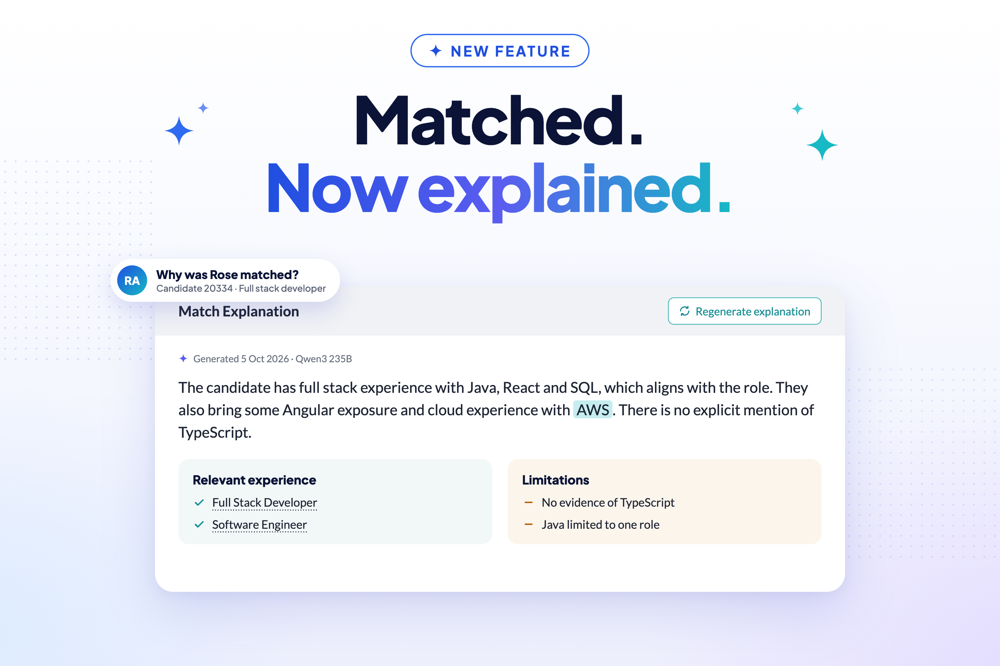
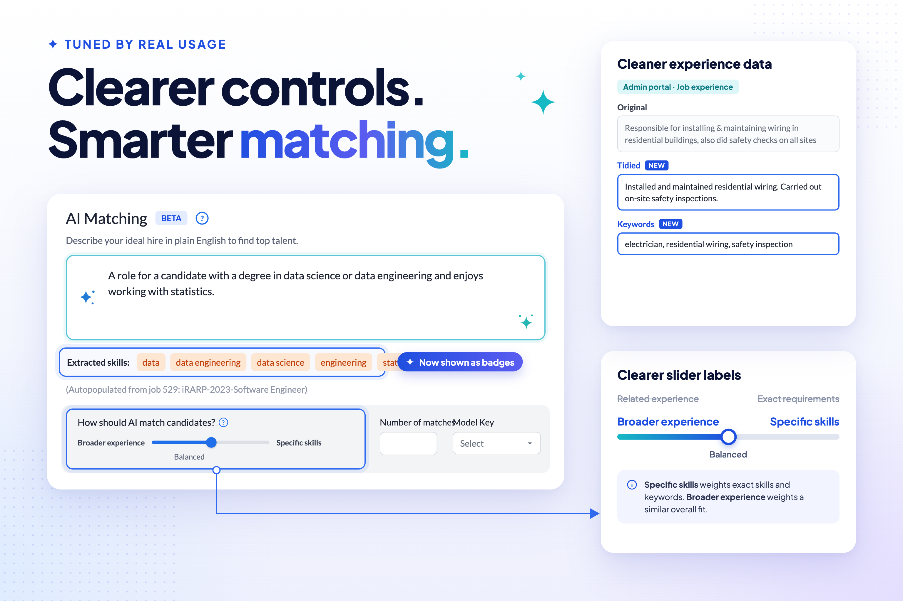
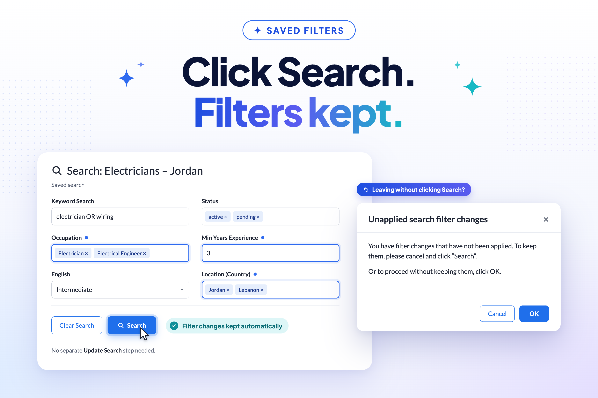

This is a smaller, more focused release than usual, built around tuning the AI matching engine we
introduced in v2.6.0 based on the first few weeks of real usage. We've deliberately kept the cycle
shorter than usual so these improvements reach you sooner, and you can expect more frequent,
targeted releases like this one from the team going forward.

# New Features

  <a href="./v270/match_explanations" class="card">
    
    

      
Match Explanations

      

        See why a candidate was matched. An AI-generated explanation summarises how well the
        candidate fits the job, assesses each of their experiences, and lists what's missing —
        dated, saved against the job, and available from both searches and submission lists.
      

      

        <button class="btn btn-sm">Learn more</button>
      

    

  </a>

  <a href="./v270/ai_matching_refinements" class="card">
    
    

      
Smarter AI Matching

      

        AI matching has been tuned based on real usage since launch. Slider labels are clearer,
        skills extracted from your search now show as badges and are highlighted in candidate
        experience, and job descriptions now give the engine a better picture of what you need.
      

      

        <button class="btn btn-sm">Learn more</button>
      

    

  </a>

  <a href="./v270/saved_search_improvements" class="card">
    
    

      
Saved Searches That Keep Up

      

        Clicking Search now keeps your filter changes on a saved search automatically, with no
        need to click Update Search just to stop them being lost. You'll also get a clearer
        prompt when changes haven't been applied, exports that match what's on screen, and a
        properly labelled default search.
      

      

        <button class="btn btn-sm">Learn more</button>
      

    

  </a>

  <a href="./v270/platform_and_security" class="card">
    
    

      
A Leaner, More Secure Platform

      

        Elasticsearch has been fully retired, and key infrastructure has been consolidated into our
        OPC AWS account, with Amazon Bedrock now powering match explanations. Behind the scenes,
        a Vanta compliance review and a new data inventory map strengthen how we track and
        protect user data.
      

      

        <button class="btn btn-sm">Learn more</button>
      

    

  </a>

# UI / UX Enhancements

* The AI matching slider has been relabelled from "Exact requirements" / "Related experience" to
  **Specific skills** / **Broader experience**, with an updated tooltip explaining how the setting
  balances keyword matching against semantic similarity.
* Skills extracted from the AI match requirements now show as badges, making it easier to see
  exactly which skills the engine is matching on.
* Extracted skills are now highlighted alongside your typed keywords wherever a candidate's
  experience is displayed.
* A loading indicator now shows while job-matching information is being fetched for a search.
* "Elasticsearch" wording in the admin portal has been replaced with "Keyword Search", catching up
  with the underlying technology change made back in v2.4.0.
* Generic "Refugee ID card" wording now replaces partner-specific branding in the card-scanning
  feature.
* CSV export is no longer offered for AI-matching searches, since export didn't properly support
  matching searches. Exporting an ordinary, non-AI-matching search is unaffected.

# General Improvements

* Saved searches now automatically keep filter changes when you click Search — see
  [Saved Searches That Keep Up](./v270/saved_search_improvements) for the full story.
* System administrators can now flush cached candidate data on demand via a new admin action, so a
  correction can take effect immediately rather than waiting for the cache to expire.

# Data Improvements

* Candidate job experiences gain separate **Tidied** and **Keywords** description fields,
  replacing the old combined encoding. These are visible and editable in the admin portal; the
  candidate portal's own experience form looks and works exactly as it did before.
* HTML is now stripped from text before it's used for skills extraction, so formatting no longer
  adds noise to matching.

# Performance Improvements

* Saving search results to a new list no longer times out in test environments for users with many 
  saved lists. The save-to-list dialog now requests lightweight list data instead of loading every 
  saved list in full.

# Security Updates

* Partner and role-based visibility now works as intended in candidate search and list results.
  Admins from non-default partners were previously limited to only the most restricted, publicly
  visible view of a candidate's details in these results, even when
  their partner and role entitled them to see more. They now see exactly what their partner and
  role authorise.
* A Vanta compliance review has been completed, with work planned to remediate any outstanding 
  security gaps.
* A **Data Inventory Map** has been created for Vanta, recording where user data is held across the
  platform, with user-data classification applied to those resources. Supporting this, databases
  and test candidate data are now tagged with data-classification labels in our infrastructure.

# Bug Fixes

* Saved-search CSV export now honours filter changes you haven't explicitly saved yet.
* The default search is now headed **Unsaved**, instead of a system-generated list name.
* Saving a search with no job attached no longer clears its existing job association.
* Candidate experience "full time" and "paid" values now display consistently.
* AI matching now correctly detects when the requirements field is empty, even though it's stored
  as HTML, and candidates with a zero match score are no longer returned.
* Candidates can now remove one occupation and replace it with another in a single update, without
  the error that previously blocked this combination.

# Developer Notes

**Upgrade note:** this release ships 3 new Flyway migrations (V2_26–V2_28): new candidate
experience description fields, a saved-search auto-update flag, and a new table for candidate-job
match explanations. After deploying, run the `convert_text_parts` system-admin action — it
converts existing experience descriptions to the new fields and triggers embedding updates. Match
explanations require the ECS task to have Amazon Bedrock access. If candidate data looks stale
after conversion, the `flush_candidate_cache` admin action is available.

## Test Coverage

This release starts the **Performance Regression Testing** project, which aims to catch performance
problems on staging before they reach production.

Coming in v2.8.0, each staging deployment will confirm the correct commit is live, run Playwright
performance journeys and Gatling smoke tests, and compare the results against recent healthy runs,
reporting **PASS**, **WARNING** or **REGRESSION** so slowdowns are spotted early.

Alongside this, Playwright end-to-end runs in CI have been stabilised.

## Code Refactoring

* Removed all TextParts code across server, admin portal and candidate portal — around 2,200
  lines removed.
* Converted the new standard shared UI components to Angular standalone components, and replaced
  the deprecated `RouterTestingModule` with `provideRouter` in specs.
* Saved-search auto-update is now a system default. The `autoUpdateOnSearch` API flag is kept for
  backward compatibility, but there is deliberately no UI toggle for it.

## Continuous Integration & Deployment

* GitHub Actions updated to Node.js 24-compatible versions across all four repositories:
  talentcatalog, tc-api, tc-api-spec and tc-skills-extraction-service.
* Staging validation now runs as its own step, only after deployment completes.
* Staging Redis (ElastiCache) is rebooted after build-and-deploy restarts so caches start clean.
* Production deployment workflow is now dispatch-only, with fixed target handling.
* Playwright E2E runs stabilised, with new test IDs added for Verify+ UI checks.
* GRN staging CI's IAM user was given the `ecs:DescribeServices` permission it needed.
* Fixed the skills-service production deploy failing on OPC ECR credentials.
* tc-api-spec: fixed the CODEOWNERS catch-all rule and three broken links reported by the Redocly
  link checker.
* GRN staging was building the candidate portal with the incorrect Angular environment; build 
  configuration now selects the correct environment for GRN staging.

## Cloud Enhancements

* Infrastructure support for running AI matching on AWS.
* Terraform support for Amazon Bedrock access via the ECS task role, giving flexible, scalable
  LLM access for match explanations.
* AWS Amplify moved to the OPC AWS account.
* Applied pending Redis ElastiCache service updates and reviewed auto-apply settings.
* Fixed the skills-extraction service on AWS being unable to connect to Amazon Bedrock.
* Elasticsearch fully removed from code, configuration and Terraform.
* Terraform README now covers first-time environment setup.

## New Tools and Standards

* New Architecture Decision Record covering Postgres conventions, including using `IDENTITY`
  rather than `BIGSERIAL` for table IDs. See [ADR 005](decisions/005-postgres.md).

---

Thank you for using Talent Catalog! Your feedback and support are invaluable to us. If you encounter
any issues or have suggestions for improvement, please don't hesitate to [contact us](mailto:support@talentcatalog.net) or
[open an issue on GitHub](https://github.com/Talent-Catalog/talentcatalog/issues).

*[Access the latest version](https://tctalent.org/admin-portal/login)*
