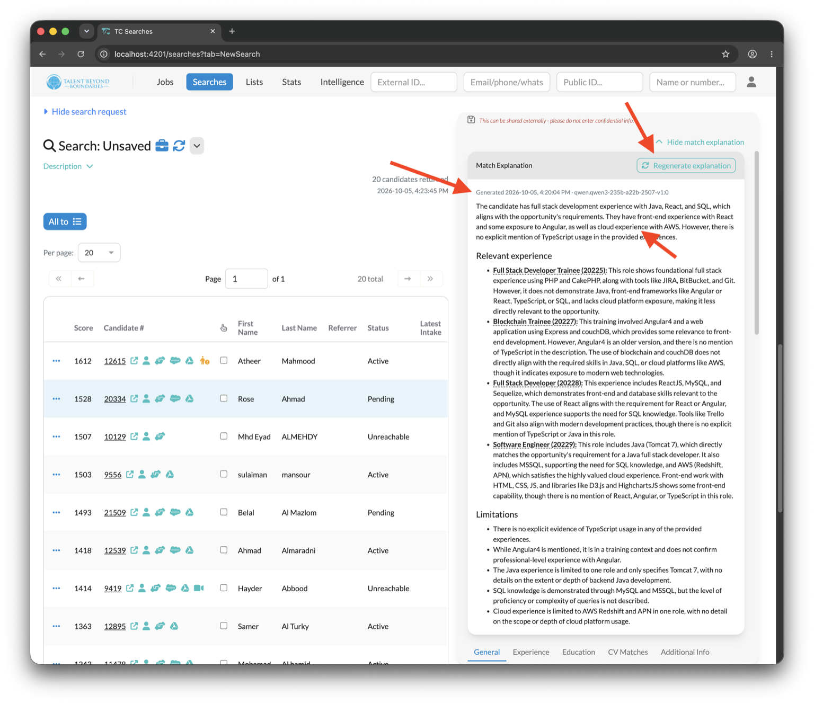

# New Features

  <a href="./v270/match_explanations" class="card">
    
    

      
Match Explanations

      

        See why a candidate was matched. An AI-generated explanation summarises how well the
        candidate fits the job, assesses each of their experiences, and lists what's missing —
        dated, saved against the job, and available from both searches and submission lists.
      

      

        <button class="btn btn-sm">Learn more</button>
      

    

  </a>

---

Thank you for using Talent Catalog! Your feedback and support are invaluable to us. If you encounter
any issues or have suggestions for improvement, please don't hesitate to [contact us](mailto:support@talentcatalog.net) or
[open an issue on GitHub](https://github.com/Talent-Catalog/talentcatalog/issues).

*[Access the latest version](https://tctalent.org/admin-portal/login)*
