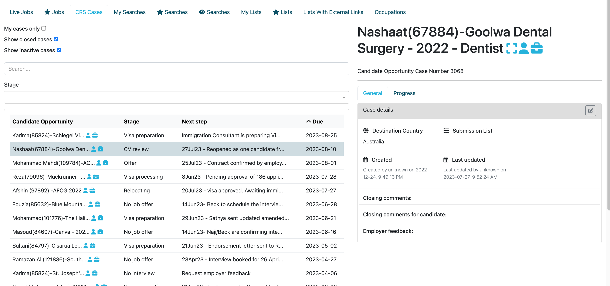
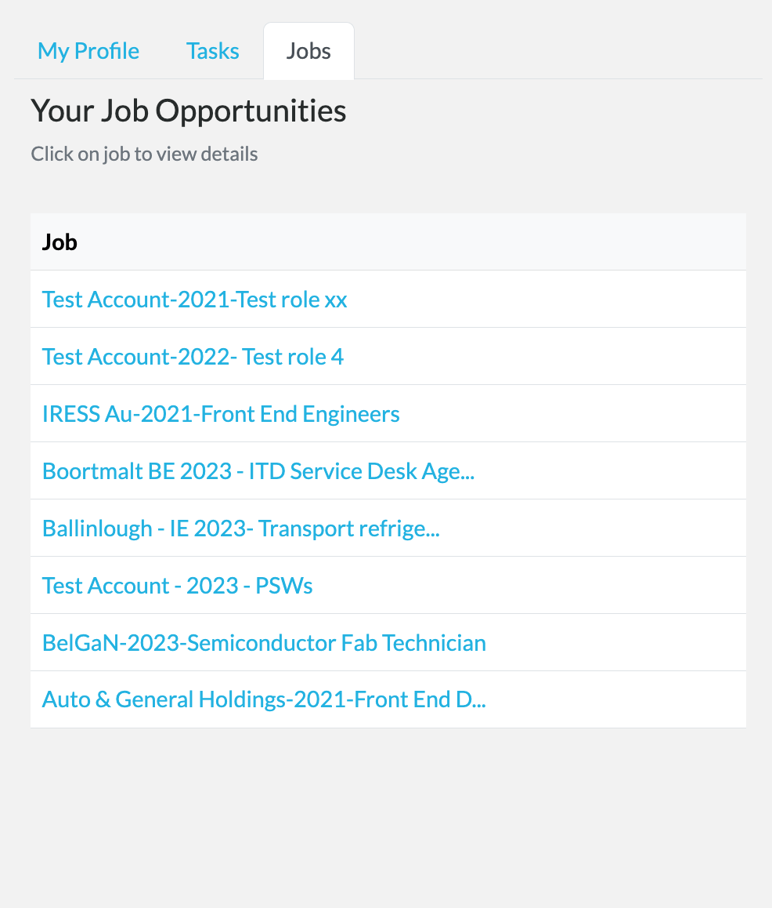
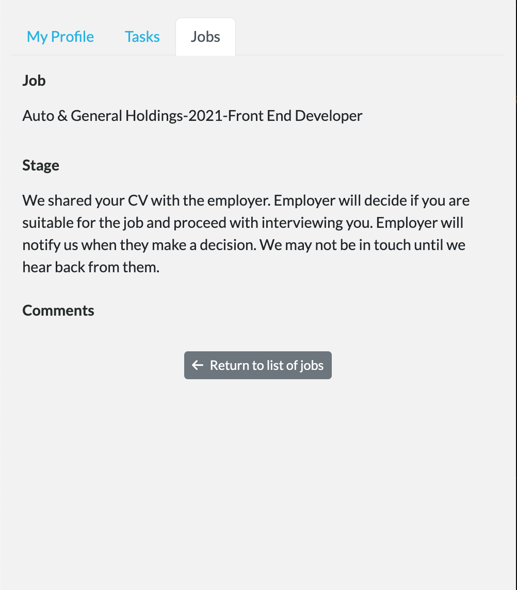

# Case Tracking

Within the admin portal, we have implemented functionality to allow for ease of tracking and management of candidate 
opportunities. This enhancement allows Talent Catalog administrators to easily oversee potential candidate 
opportunities (or "cases") that have been put forward for jobs.

  

# Job Listings

In the Talent Catalog candidate portal, candidates now have the capability to view job listings that they have been 
selected for in line with their qualifications, experience and preferences. This enhancement enables candidates to 
easily navigate through their potential employment opportunities, from the convenience of their device.

  

# Job Updates

The Talent Catalog candidate portal now implements a system to keep candidates informed about the progress of jobs for 
which they have been selected. This automates and enhances communication between administrators and candidates by 
ensuring that candidates receive timely updates about crucial changes that matter to them. 

Our existing Talent Catalog administrators have thoughtfully selected which stage updates will be reported, thus
providing candidates with notifications that are both meaningful and considerate of their circumstances. We are, as
always, deeply appreciative of the ongoing collaboration and support from all our valued users!

  

