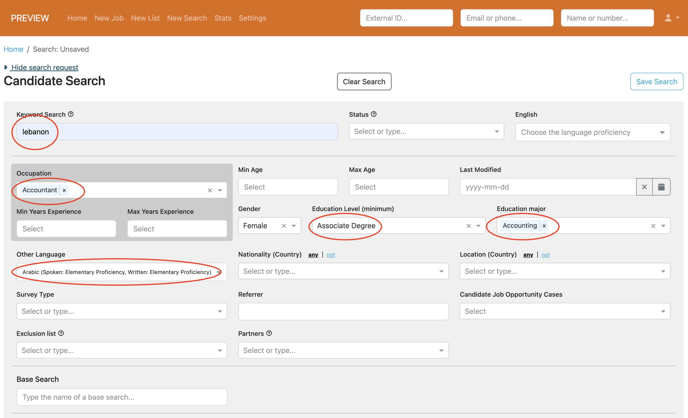
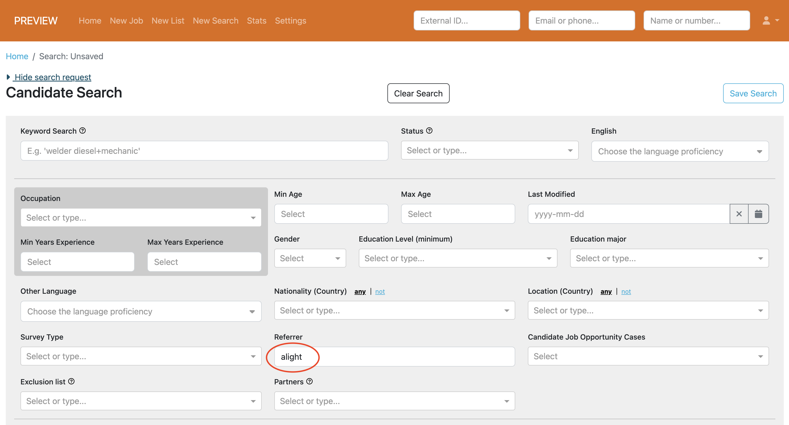
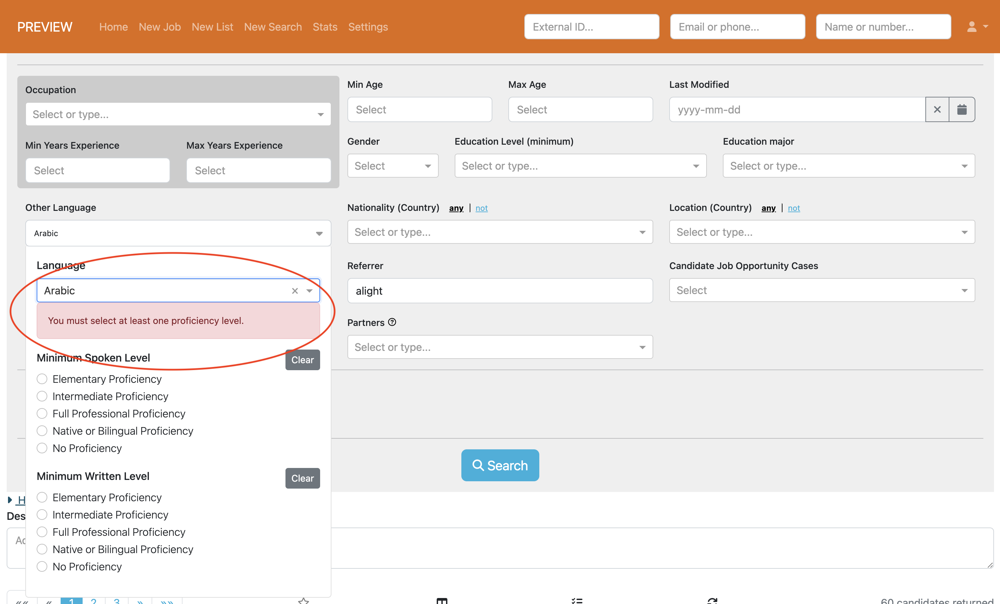
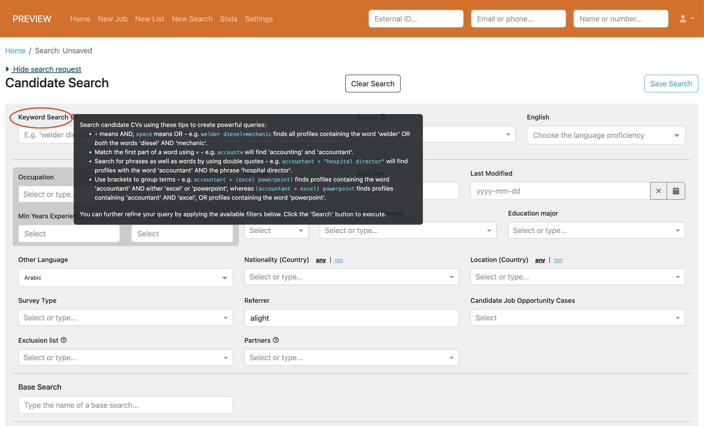
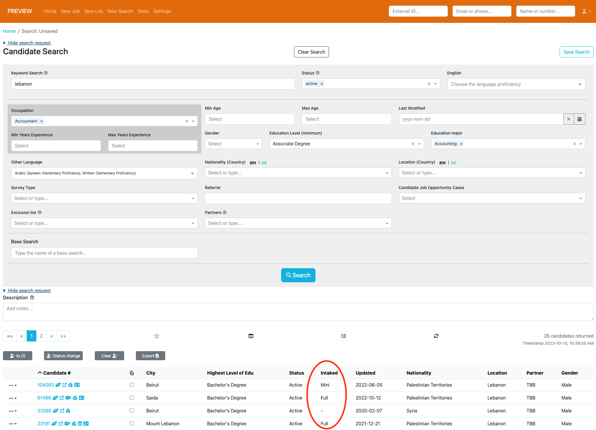
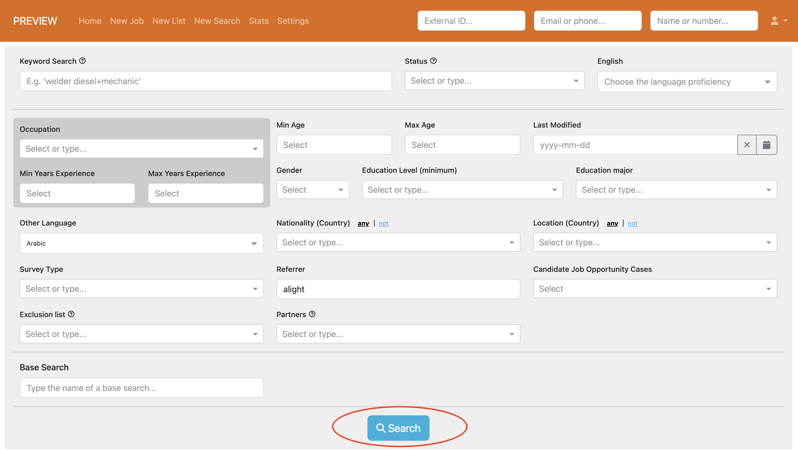

# All Inclusive Searching

We've significantly enhanced the capabilities of our elastic search functionality. Now, users can include an extended 
range of supported elastic search fields, including all the standard ones but also additional parameters such as 
other languages, occupation, education level, and education major. 

This enhancement permits users to conduct searches with even greater versatility and precision, ensuring they are able 
to find exactly the candidates they're looking for.

  

# Case Insensitive Referrer Search

We've implemented a case-insensitive approach in the referrer field for new searches. Now, this field exclusively 
accepts lowercase characters, eliminating any distinction between uppercase and lowercase matches in search results. 
This enhancement guarantees a more complete response for users searching on this field.

  

# Enhanced Other Languages Search

We've made improvements to the "other languages" search field, with a visually improved layout for language proficiency 
options and added reminders to ensure users select at least one proficiency level. This addresses an important 
usability concern where the proficiency level selection might have been easily overlooked, potentially leading to 
incomplete search results. With this update, users' other languages selections will be accurately interpreted and 
included in search results, as they would anticipate.

  

# Keyword Search

We've rebranded the Elasticsearch label to 'Keyword Search' in the new search screen. Incorporating an informative tool 
tip, designed to offer users guidance on how to carry out effective keyword searches. Notably, relocating this guidance 
from the top of the search screen to a tool tip also optimises the screen's real estate, providing users with a cleaner, 
more streamlined search experience.

  

# Intake Status

You'll now find an extra column in your search results, displaying the intake status of each candidate. This enhancement 
provides quick visibility into the current status of candidates in the intake process.

  

# Last but Not Least. . .

Last but not least, we've enhanced the visibility of the search button on the New Search screen, taking into account 
feedback we've received from users. While seemingly small, this adjustment underscores our commitment to crafting a 
Talent Catalog that is accessible but also increasingly user-friendly with an intuitive design. 

  

