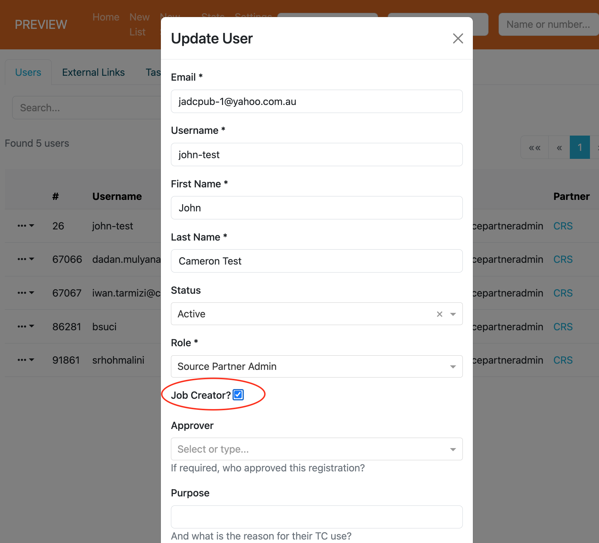

# Recruiter Access Related Enhancements

Recruiter access involves providing approved employers and third party recruiter organizations direct access to
the Talent Catalog. Those new types of user are special in that they have the ability to create 
and publish jobs. 
In this new release not all partners or users will have the ability to create jobs. 
Partners now may be configured as "job creator"s. This is an important step towards recruiter 
access which we hope will be fully operational for employers by the end of the year. 

  

Job creating partners also need to specify which of their staff are authorized to create jobs - 
this is done by adding "job creator" to the relevant user's configuration.  

  

