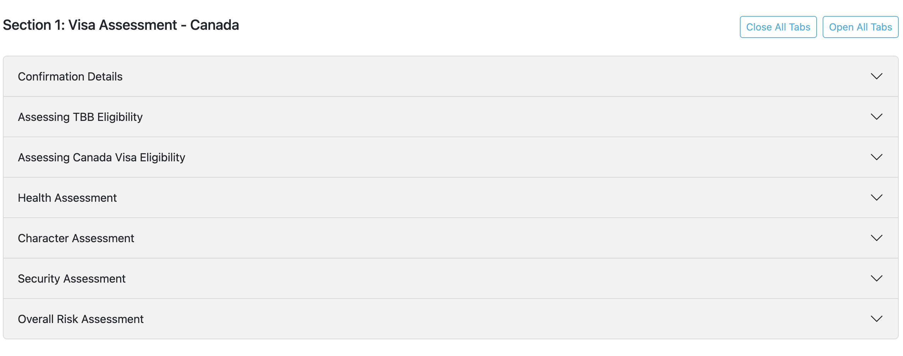
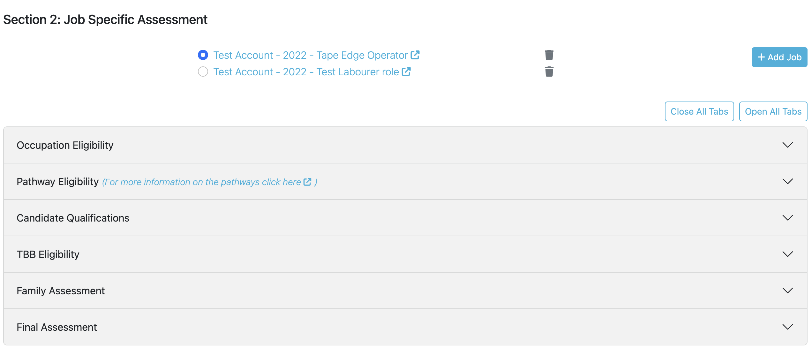

# Canada Visa Eligibility Checks

This release introduces an updated iteration of visa eligibility checks, which was previously designed and used for 
Australian visa checks only. The new functionality has been created to support the comprehensive Canada visa 
eligibility check, but has been designed with all other destinations in mind. This will allow us to perform an 
efficient rollout of this visa eligibility check functionality across all destinations in future releases of the TC.

The functionality allows users to perform visa eligibility checks from within the TC, encompassing initial checks, 
job-specific questions, and standardized final assessment criteria. Conducting visa eligibility checks on the TC allows 
for easy access of the data that is required to effectively perform the check. It displays data from the intakes,
candidate registration, job opportunity intake or any other useful data that exists on the TC. Each destination will 
have their own set of questions and data to be displayed, however the overall design and functionality will be 
standardised (as per what is shown in this release).

# Section 1 - General Visa Assessment Questions

The first section of the visa eligibility check collects data that is relating to the **candidate** and the 
**destination country**. Keeping these questions in their own section allows them to be answered once and avoids 
unnecessary data duplication.

  

# Section 2 - Job Specific Assessment Questions

The second section of the visa eligibility check collects data that will change depending on the particular job 
opportunity. Data collected is job specific, such as relevant candidate experience for the role and 
candidate's interest in the role etc. When adding a job to the candidate's visa eligibility check only that candidate's 
job opportunities are presented for selection.

  

# Notable functionality

Some of the helpful functionality of the visa eligibility check:
- **Auto save:** Data is saved as it is typed (indicated by the icons to the right of the question). 
  - The keyboard icon indicates the data is being entered
  - The loading icon indicates the data is being saved
  - The floppy disk icon indicates the current entered data is saved
- **Useful links:** Links are displayed to help in data collection for example linking to government website listing immigration pathways or to the job's listing on the TC.
- **Collated data:** The data that is needed to perform the visa eligibility checks can be collated from all areas of the TC. This data can then be displayed as is or tailored to provide the most value. 
- **Reusability:** The database architecture allows the data to be reusable throughout the TC, for example to search/filter by candidates who have had visa eligibility checks conducted.
- **User experience:** Using radio buttons and accordions to reduce the total page size to allow easy navigation and nicer experience on smaller screens.

  <iframe src="https://drive.google.com/file/d/1f75pMoL6hgCYKh1gy7DWuzL5FRB8GWf4/preview" width="640" height="480" allow="autoplay"></iframe>

# Next steps
A starting point to getting the visa eligibility checks onto the TC has been to move off the from the data "black hole" 
that is documents/spreadsheets and get the data onto the TC. Along with being able to then track and maintain data, 
we also gain the technical efficiencies listed above. In order to get this process moving at a reasonable pace, 
we've had to keep the answer fields relatively simple mainly using free text fields and standardised dropdowns. 
This isn't a big difference from the previous way of working on docs/spreadsheets, it also allows us to standardise 
fields for when we are rolling out to other destinations and stops us from needing to maintain large external 
data-sources (e.g. Immigration pathways, that may change over time). In saying that the visa eligibility check will 
continue to evolve and improve in future releases, particularly as more users get familiar with the new process and more 
destinations get rolled out.

