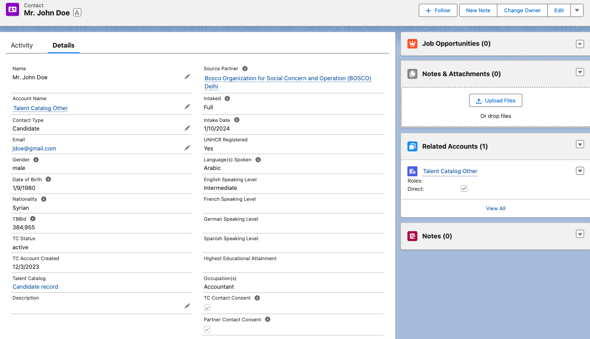

# Candidate Data Synced Weekly to Salesforce

Candidate profiles will now sync from the Talent Catalog to Salesforce, automatically once a
week and by request at any interval.

Previously only candidates in active recruitment had been updated at key steps — and even then, only
a small subset of fields. In consultation with key stakeholders, the dataset has been broadened and 
is presented on Salesforce for inclusion in recruitment workflows and monitoring and evaluation.

  

# Potential Usage

This update provides new capabilities for reporting and analysis, as well as potential to connect 
third party tools for candidate communication, data visualisation and more. 

It also presented an opportunity to partition Salesforce contact records, assigning separate types 
and layouts, with candidate records editable only by system admins and the Talent Catalog. This 
improves the general readability and performance of the platform, using smaller layouts to present 
only the necessary fields and widgets. Most importantly, Salesforce candidate data can be used with 
assurance.

Some specific identified uses for the data will be, for example, to update the Talent Beyond 
Boundaries <a href="https://tbb.sopact.com/superset/dashboard/p/6oA7PE4BRrx/" target="_blank">
impact dashboard</a>; to maintain current contact lists in Campaign Monitor for all consenting 
candidates; and for the efficient updating of the 
<a href="https://www.talentbeyondboundaries.org/talent-snapshot?" target="_blank">Talent Catalog 
snapshot</a>.

