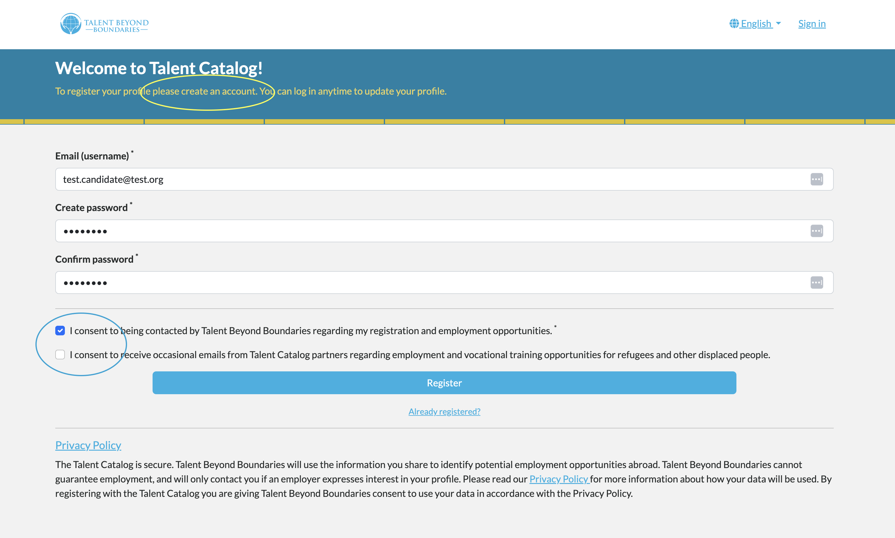

# Candidate Registration

Candidates registering with the Talent Catalog are now prompted to first create an account before
proceeding with creating their candidate profile. They must provide a valid email address, which 
will subsequently become their username, and set a password.

  

# Candidate Consents

Before candidates can complete their registration, they must explicitly consent to being contacted 
by their source partner organization, such as TBB. In instances where candidates have not finished 
their registration, their source partner may use their email address to contact them to prompt for 
completion.

Additionally, candidates may choose to provide consent to be contacted by Talent Catalog partners 
at their discretion.
