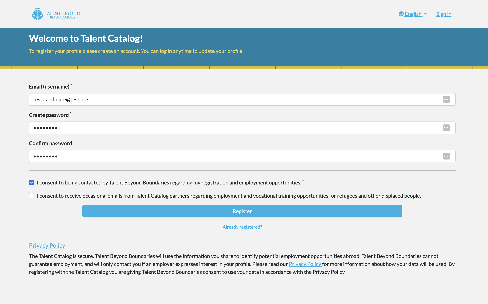

# Candidate Registration

Candidates registering with the Talent Catalog are now prompted to first create an account before
proceeding with creating their candidate profile. They must provide an email address, which will be
used as their username, together with creating a password.

Before the candidate is able to register, they must also explicitly consent to being contactable by
their source partner organisation, for instance TBB. In such cases where for instance the candidate
has not fully completed their registration, TBB will be able to contact them using their email 
contact details to prompt them to complete their registration.

An additional consent to be contactable by Talent Catalog partners may or may not be given at the 
candidates preference and discretion. 

  

