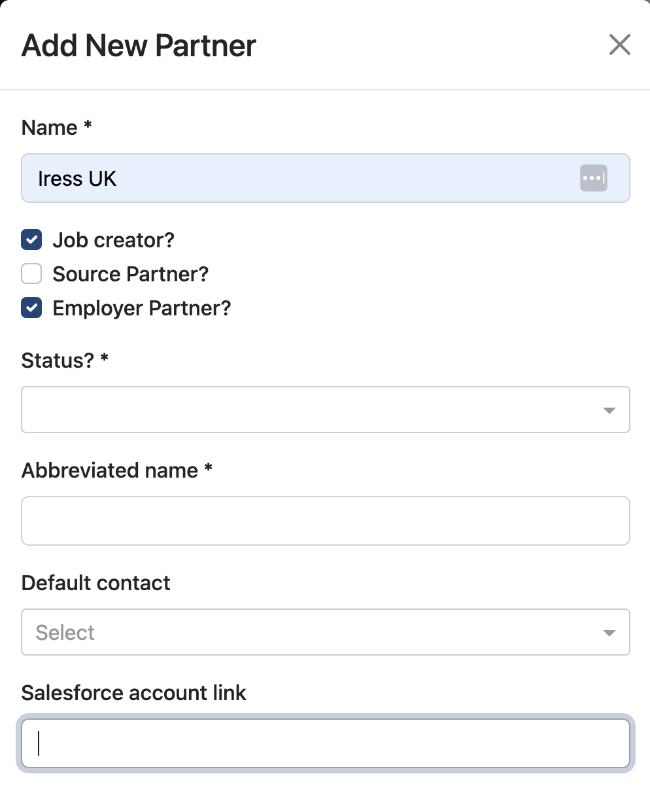

# Employer Access

This long-awaited update allows employers to be able to access the Talent Catalog directly. For
example, Iress, Atlassian or any other employer can now request a login to the Talent Catalog, 
where they can create and submit their own jobs, do their own searches for candidates, and manage 
their own recruitment process.

  

This update allows employers to create jobs without requiring access to Salesforce. 
Employers may also communicate directly regarding the job using the new Talent Catalog 
<a href="./job_chats">Job Chats</a> feature.

# Job Creation

In this update employers can create jobs directly from the Talent Catalog. There is no need to 
manually create the job opportunity in Salesforce. The process is automated so the employer need 
only enter the name of the job, for example "System tester", and simply press enter. In the 
background, the job opportunity is automatically created in Salesforce with the standard opportunity 
name, together with submission lists, document storage folders, and other administrative tasks.

  

Once the job is created, the employer sees the job in the Talent Catalog in the same way as any 
other admin user would see.

  

# New Employer Partners

When a new employer has been approved for Talent Catalog access, System Admins can create the 
employer as a TC partner by navigating to Settings | Partners | Add and filling out the Add New 
Partner details:

  

Admins should remember to select Job Creator and Employer Partner, adding the employer's salesforce 
account link. Once the Employer Partner is created, new users can be created and assigned to the 
new Partner in the usual way.
