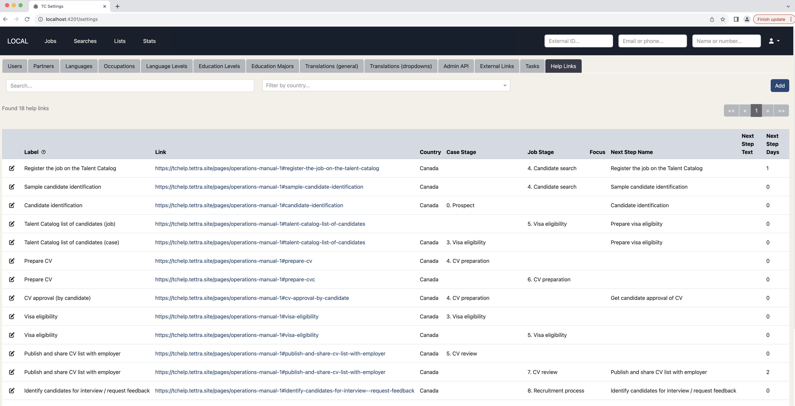

Create context-sensitive help linking directly to existing process documents. This help can be 
country specific and can be updated by TC admin users as new help documentation becomes available.

  

In this release we have introduced a new tab in Settings (Help Links) where you can define new 
help links, with a label and a link to your process documentation. The other fields shown are context 
fields. So for example at the Visa Eligibility job stage, context-sensitive help will be available
relevant to that stage.

In an upcoming release we will add help icons to the Talent Catalog in the appropriate places, so 
that users can click on these icons and see the context-sensitive help right where they need
it, navigating directly to the process documentation they need.

We're going to be asking you to share your country specific process documentation on the TC Slack
channel for us to review and map onto context help links. Thanks to the Canada team for the 
inspiration for this idea! 

