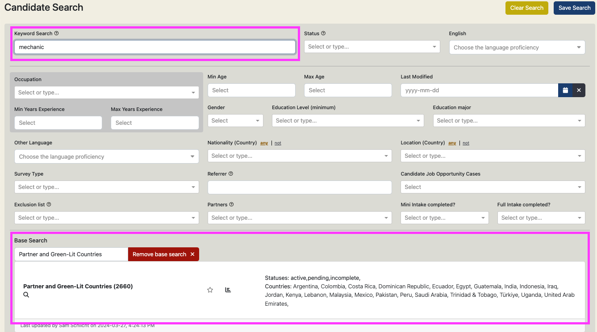

This enhancement makes it possible to use and reuse a saved search as a base, then searching within 
those results with powerful elastic Keyword Search queries. The base search may be used to define TC 
partner or green-lit countries, or pathway requirements laborious to reenter for every new search.

  

