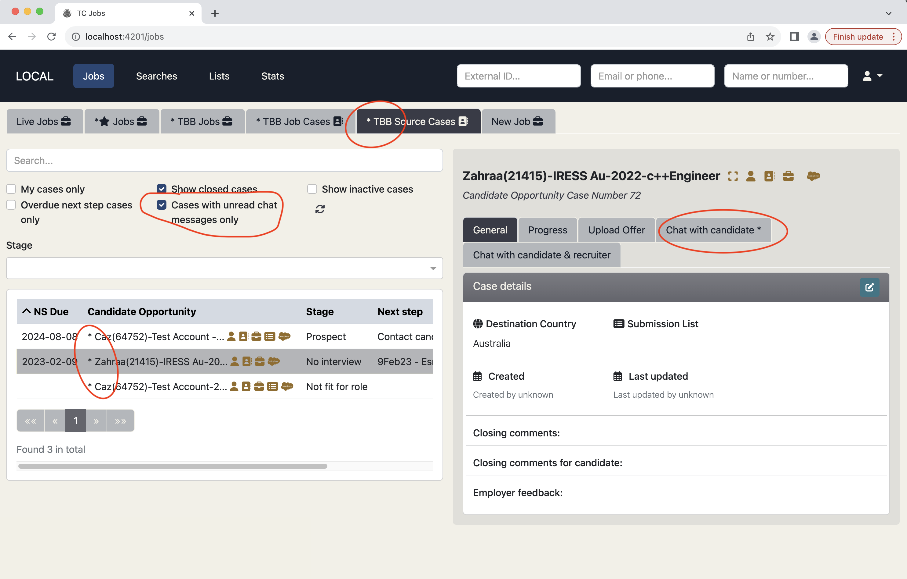
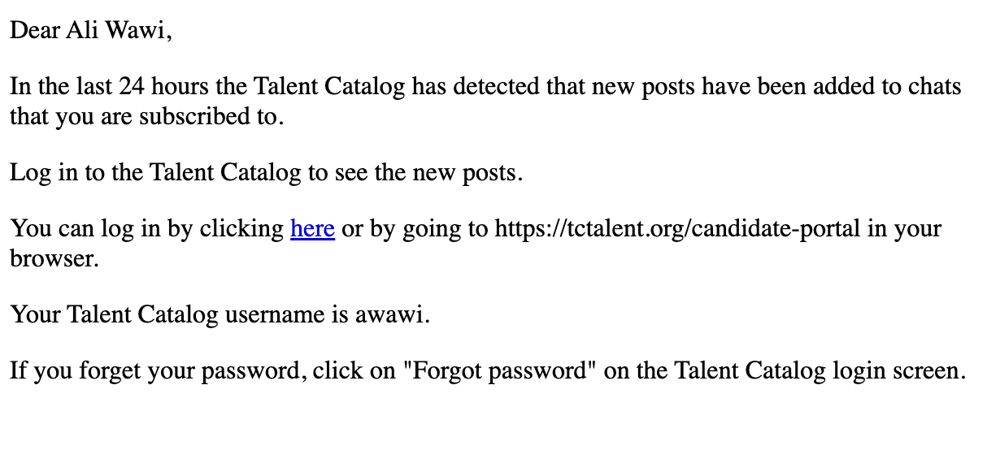

Job chat notifications have been extended so that admins can quickly see if they have any unread
chats and navigate down to jobs and cases with pending unread chats.

  

An asterisk in the relevant tabs indicates an unread chat. With filters to zoom in on Jobs and Cases
with unread chats.

Additionally, candidates will be notified via email about unread chats received in the candidate 
portal within the last 24 hours:

  

