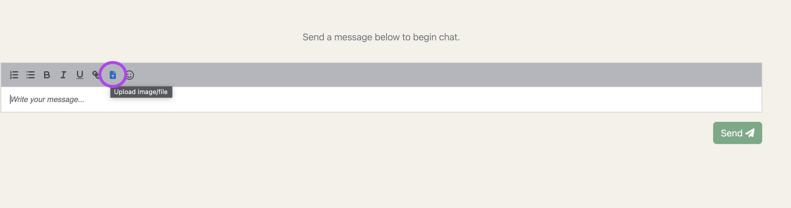
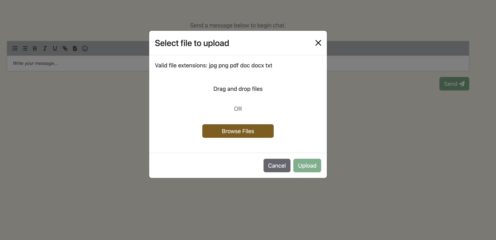
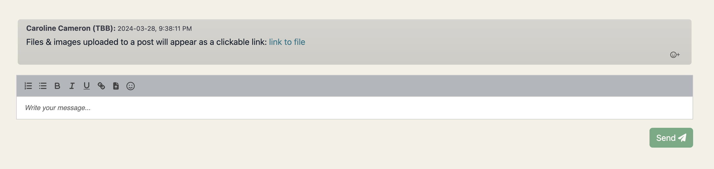

Job chats support file uploads which are a convenient mechanism for sharing documents. For instance, 
candidates, admins, and employers can upload passport images via chat messages, with the uploaded 
file automatically saved in the candidate's Google Drive folder.

1) Click on the file upload icon here:

  

2) Select a file to upload (files accepted are: jpg, png, pdf, doc, docx, txt)

  

3) File will be uploaded to the candidate's google drive (in a Chat Uploads subfolder) and a 
hyperlink to the file will display in the post as 'link to file'.

  

