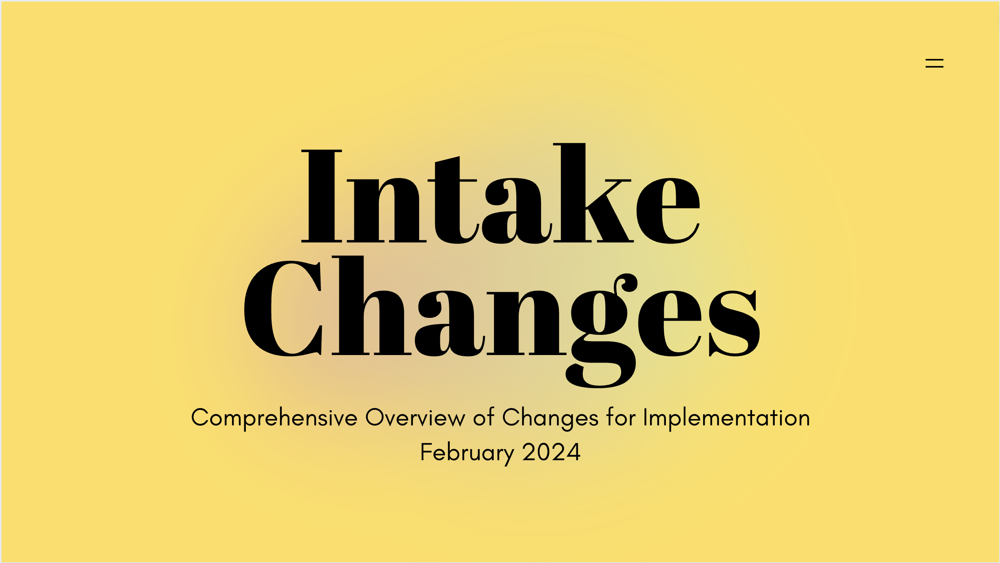
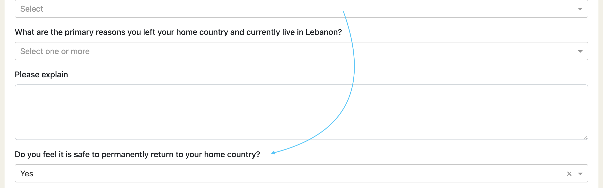
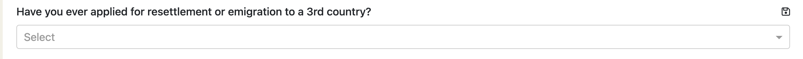
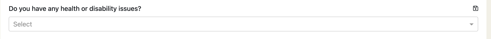

This release contains part one of two in a series of revisions to the intake process. Part two will
follow in an interim release v2.2.2.

  

# Mini Intake

## Confirm General Information

Candidate age, gender and UNRWA registration status is visible in general information. 

  

Edit contact information directly from the mini-intake tab without having to jump back to the 
general tab.

  

## Interest in International Recruitment

The wording of the initial question was misleading some users. It previously said "Are you interested
in international employment opportunities" but the intention for the question is to confirm a candidate's
availability rather than interest in opportunities.

  

## Personal Status/Program Eligibility

An additional question and notes added to this section. 

  

The marital status question has been clarified in this section. And partner citizenship selection has
been expanded to allow multiple citizenships.

  

## Language Assessment

Renamed this section from "English Assessment" with support for French second language ability 
assessment.

  

# Full Intake

## Family Members / Dependants

The Dependants section has been renamed to Family Members / Dependants.

## Host Country Status

Switched the order of the "Do you feel it is safe question" moving it lower as requested.

  

Added a new question:

  

## Additional Eligibility

Moved this question to the mini-intake.

  

