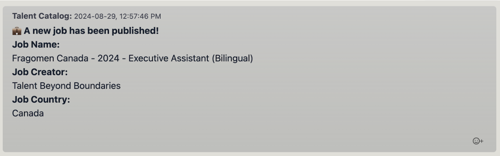
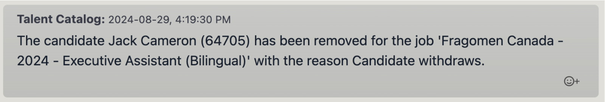
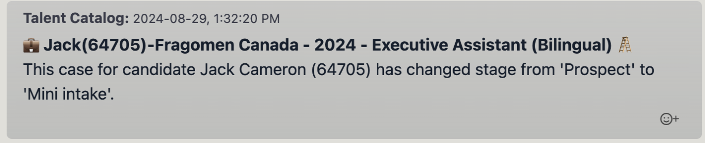
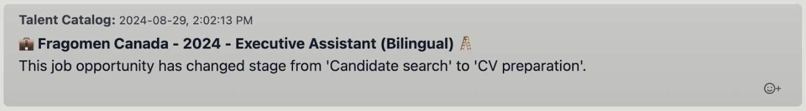
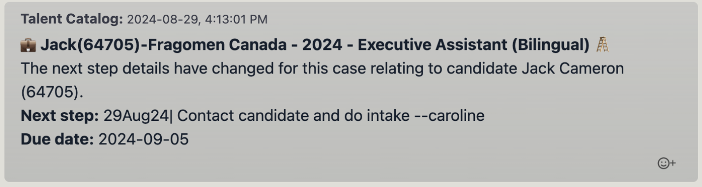
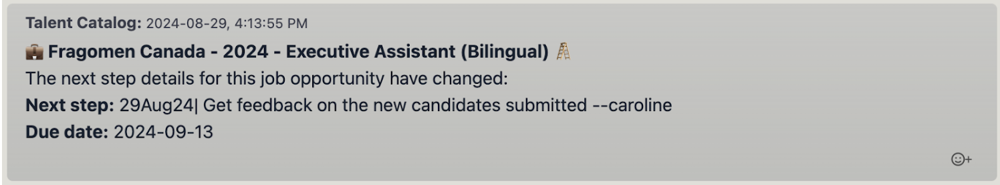
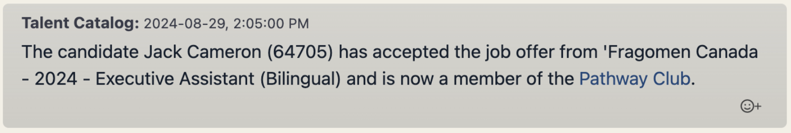

Building on the Job Chats feature in release 2.2 [(see Job Chats release here)](./../v220/job_chats.md) 
we are introducing 'Automated Chats'. This new feature allows the TC to send out 'updates' to all 
relevant parties via job chat channels. The Automated Chats can be broadcast to multiple chats, are triggered by actions
on the TC and are fully customisable. We are starting by introducing some standard automated posts in this release, but 
more can be created as requested. 
See below a summary of the automated posts introduced in the release 2.2.2, or for a more indepth look at Job Chats & 
Automated Posts see the explainer documentation 
[here](https://docs.google.com/document/d/1h5QaUNOSPP-pjJsMCDwXS_SQUrurvLfnBKPX87orgbE/edit?usp=sharing).

# Job published
Sent to: All Source Partners Chat (S+ J)
 
Seen by candidates? 🚫

  

# Candidate removed from submission list
Sent to: Prospective Candidate Chat (S C), Recruiting Candidate Chat (S J C), Source Partner Chat (S J)
 
Seen by candidates? ✅

  

# Stage change - candidate opportunity
Sent to: Source Partner Chat (S J)
 
Seen by candidates? 🚫

  

# Stage change - job opportunity
Sent to: All Source Partners Chat (S+ J)
 
Seen by candidates? 🚫

  

# Step change - candidate opportunity
Sent to: Source Partner Chat (S J)
 
Seen by candidates? 🚫

  

# Step change - job opportunity
Sent to: All Source Partners Chat (S+ J)
 
Seen by candidates? 🚫

  

# Job offer accepted
Sent to: Prospective Candidate Chat (S C), Recruiting Candidate Chat (S J C), Source Partner Chat (S J)
 
Seen by candidates? ✅

  

