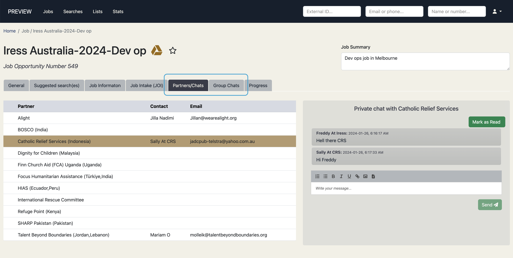
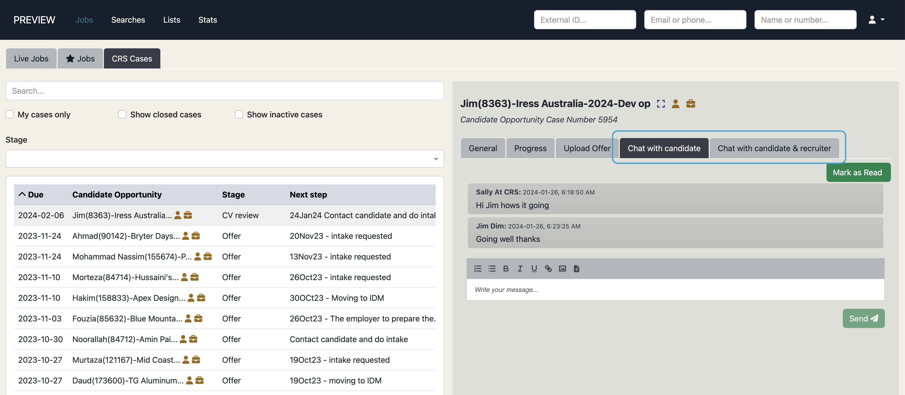
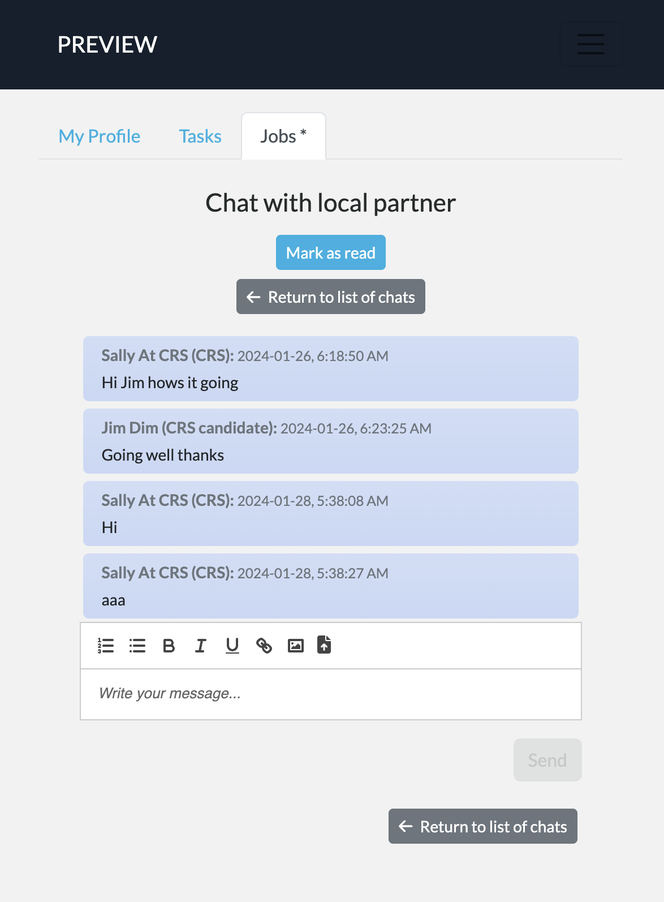

With the advent of direct employer access it means that not all users of the Talent Catalog will be
on Slack. This has been one of the drivers behind the need for Job Chats to be placed directly
within Talent Catalog, allowing all users to communicate with each other. We've also acknowledged
that there are often multiple modes of communication, such as Slack, email, WhatsApp, Trengo; and
that sometimes there can be non-standard ways in which, for instance, Slack communication channels
are created. All of this can lead to a confusing communication landscape and communication fatigue
for users.

The intention behind Job Chats is to provide a unified, automated, centrally-accessible, and secure
way for Talent Catalog users (employers, destinations, source partners, and candidates) to
communicate with each other regarding job opportunities and candidate relocation. The sections
and video demos below introduce Job Chats from the perspective of the different kinds of Talent
Catalog users.

You can of course continue to use Slack and other modes of communication, as you currently use, but
we hope in time you will see the value of using Job Chats directly in the Talent Catalog.

# Employers and Other Destination Partners

Destination partners, including employers such as Iress, can communicate about jobs and candidate
cases with other interested parties, such as source partners and candidates, directly from the
Talent Catalog using Job Chats.

For example, employers (and destination partners) can communicate directly with individual source
partners regarding a job opportunity. They may also communicate in **group chats** with all source
partners at once. For candidates and cohorts who have received and accepted job offers a special
group chat focussed on relocation is also available for the employer and all parties, including
candidates, to communicate.

  

Check out John's [video demo](https://drive.google.com/file/d/1sTVl_ZpytKZZOeM-WDxfbd8VSKRLRHnZ/view)
introducing Job Chats for destination partners.

# Source Partner Job Chats

Source partners like TBB, CRS, and others who are working individual candidate cases can send and
receive communications directly from the Talent Catalog regarding a particular candidate case. They
may communicate one-to-one with the candidate, or with both the candidate and employer together
depending on the nature and need of the communication.

  

Take a look at John's [video demo](https://drive.google.com/file/d/1_vZbVJral4vyTfnTjSNZ40weHtXZyz7Y/view)
introducing Job Chats from the source partner's perspective.

# Candidate Job Chats

Candidates have always been able to see their registration profile in the Talent Catalog candidate
portal. They have tasks in the candidate portal, which are planned to be used more extensively in
the future to help scale through automation. In this release, under the new Jobs tab, candidates
can send and receive job opportunity related communications directly from the Talent Catalog.

Candidates can communicate one-to-one with their local source partner, for example TBB or CRS in
Indonesia. They can communicate with their local partner plus the employer (or destination partner)
when they reach a certain stage in the process - up to at least CV review stage. Lastly, upon
accepting a job offer, they can communicate with the relocating cohort of candidates, their local
support partner and of course the destination partner or employer.

Note that Job chats have been designed to ensure that the source partner will always be a
participant in any candidate chats. Coming soon in the next update to Job Chats, candidates will be
able to select if they would optionally like to be notified about new chat posts by email.

  

This [video demo](https://drive.google.com/file/d/1mJnevOzXKw4LUh3Jwmakt9PH3ArQ0Rvt/view) from John
introduces Job Chats from the perspective of a candidate.

