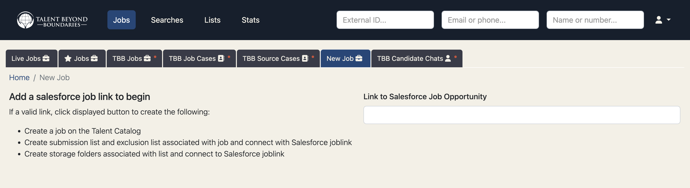

In this release, Employer Access to the Talent Catalog is finally ready for beta testing with a real 
employer.

Here is a [good definition of beta testing](https://www.productplan.com/glossary/beta-test/).

## Background

It has been a long journey to get to this point, largely because employers will not have access to 
products that we have traditionally used alongside the Talent Catalog - in particular our Salesforce 
and Slack. Using those products - which we have done from the very beginning of TBB - allowed us to 
quickly deliver useful functionality without having to write everything ourselves. TBB will continue 
to use Salesforce and Slack - but Employers (and other third parties) need to be able to use the TC 
without needing to share TBB's Salesforce and Slack. 

This has driven fundamental changes to the TC code including the creation of TC Chats (formerly 
known as Job Chats), and changing the user interface so that TBB's Salesforce is hidden from the user, 
and all process updates - such as updating stages and next steps - happen on the TC.

For example, TBB user's currently must provide a Salesforce job link when creating a job in the TC:

  

Whereas employers, like Iress, will not need to provide a Salesforce job link when creating a job 
in the TC:

  

Employer access is also a very major step towards Recruiter access where third party recruitment 
agencies, such as Jumpstart and Talent Lift in Canada can also have direct access to the TC.

## Beta Testing with Iress

Initially we will be testing with just one real employer: Iress. There is no employer that we have 
a closer or longer relationship with than Iress. That is important in beta testing. We expect that 
the process will highlight bugs and shortcomings that have not come up in our own testing. It is 
important to beta test with users who understand that and will not be disappointed when problems 
occur. The fact that Iress develop software themselves is a big advantage. They understand software 
and the whole concept of beta testing.

Once the initial testing with Iress is complete - we will engage with other employers that we have 
a close relationship with to complete the beta testing cycle. We can then open up access for all
employers and provide a mechanism for them to self register for the TC, just like candidates do.

