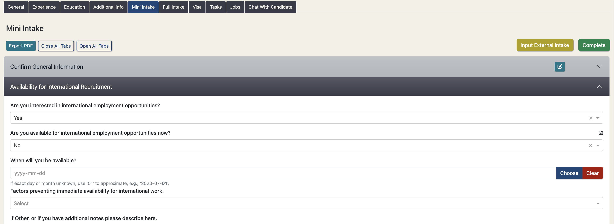
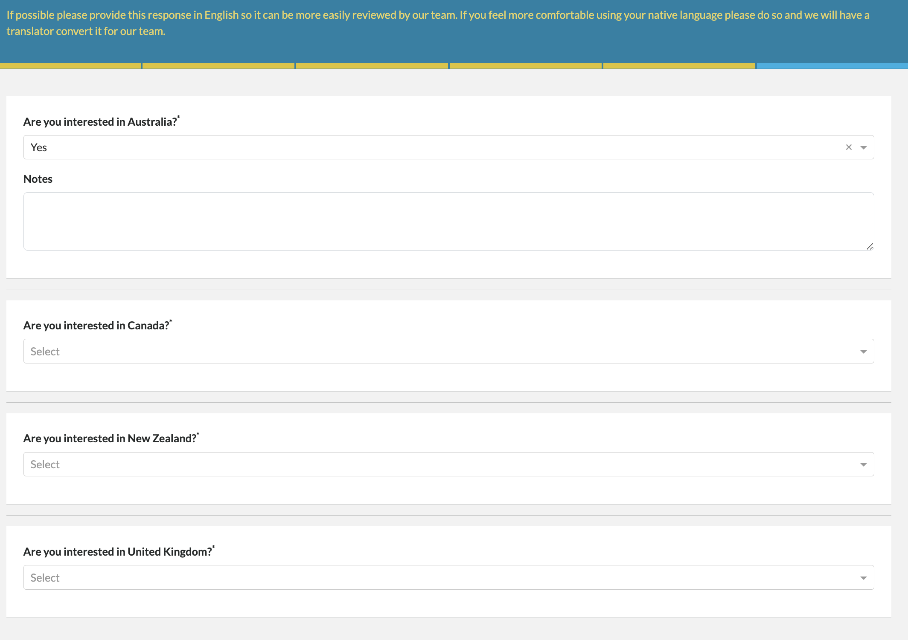

Note the following revisions to the mini-intake process which have been designed in close 
collaboration with the TBB Talent Catalog Source team to streamline the mini-intake process:

## Availability for International Recruitment

  

- Used to be called "Interest in International Recruitment" but has been renamed
to "Availability for International Recruitment" to clarify intent
 
- If a candidate answers "No" to "Are you available for international employment opportunities now?" 
they will be asked a new additional follow-up question: "When will you be available?"
 
- If they answer "Yes", the subsequent question that asked "What type of opportunities are you qualified
for?" has moved out of the mini-intake into the candidate registration process
 
- Candidates can no longer respond "Unsure" to this question - they must answer "Yes" or "No"
 
- For candidates who answered "Unsure" to this question in the past, the information has been 
retained in and will be visible in the availability notes
 
- "Are you interested in international employment opportunities?" appears at the start of this series
of questions; with guidance notes for interviewers depending on the candidate's response

## Destination Preferences

The destination panel has been removed from the mini-intake process. 

The following questions regarding destination preferences have been moved to the candidate registration 
process:

  

The questions regarding relatives, such as "Do you have family in Australia and if so what is the 
closest relative?", have been moved to the relevant country's Visa eligibility checks section:

  

## Register Multiple Nationalities

The candidate registration process now allows candidates to register multiple nationalities:

  

## Language Exams

The section on language exams has been moved out of the mini-intake process and into the candidate
registration process:

  

