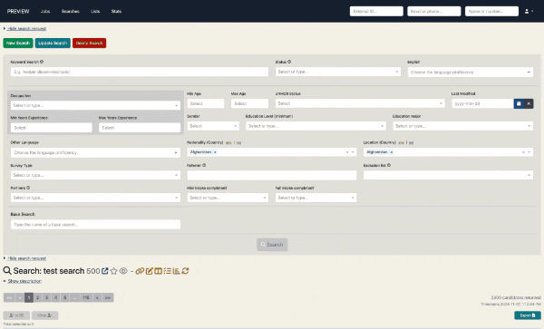

# Saving Filters
For <strong>unsaved searches</strong>, the filter changes are autosaved upon each 'Search' click. This allows for a search 'playground' 
where you can search, leave the page and come back to your filters.

For <strong>saved searches</strong>, as those filters have been specifically chosen and saved we don't autosave filter 
changes upon each 'Search'. Instead, those filter changes have to be manually saved via the 'Update Search' button. If 
there are unsaved filter changes made to the saved search filters and the user navigates away from the search page, a pop-up
will appear to get confirmation to proceed and allow the user to save the changes if desired.

    

    
      
      
Changing search filters then moving page triggering pop up

    

    

        
        
The pop-up for unsaved search filters

    

# Candidate Selections
It is important to have selections cleared prior before searching as it avoids selected candidates disappearing from the 
search but still being selected. Basically this causes ‘ghost’ selections that have been filtered out of the search 
however will appear in a list when the selections are copied over.

      
      
Searching will prompt you to clear selections prior

    
    
The pop-up for clearing selections upon search

