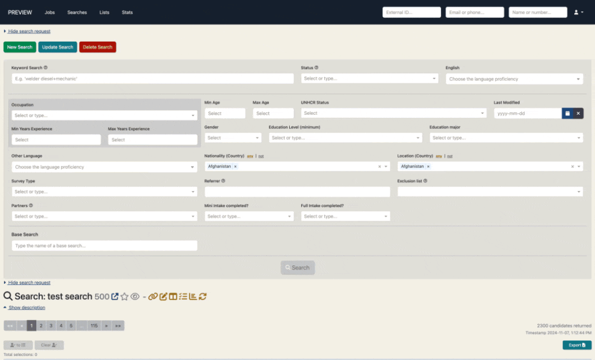

We are implementing some search safeguards in this release to help combat some problems of:
1. Candidate's being unintentionally added to lists
2. Search filters being overwritten

Part of fixing these issues is distinguishing the subtle differences between two types of searches:
<strong>Unsaved Search: </strong>
This is a single search that appears when you click on the New Search tab and exists at the URL 
<a href="">tc-talent.org/admin-portal/search</a>. This search is the 'playground' where filters are autosaved upon 
each 'Search' click so that user's can narrow down the optimal filters for the results required. When the search filters 
are returning the desired candidates we suggest saving the search so that it becomes a 'Saved Search'. See below for 
why Saved Searches are different to the unsaved search.

<strong>Saved Searches:</strong>
Once an unsaved search has been saved, it becomes a Saved Search. Having a saved search has the following key 
benefits:
- <em>Sharable</em> - Can be shared with other users via the unique link, and they can 'star' them for easy access under the 
'Starred Searches' tab.
- <em>Watchable</em> - Can be 'watched', watching a search will notify watchers via email of new candidates that will meet the search filters of that saved search.
- <em>Analyzable</em> - Statistics can be run on the candidates that meet the search filters of that saved search.
- <em>Irreplaceable</em> - Saving a search means your filters are saved and won't be replaced unless explicitly updated.
Following on from the last point, one of the big differences when filtering a saved search vs. an unsaved search is that
unsaved searches autosave filter changes whereas saved searches require manual saving of filter changes. Below will run 
over how to save changes to filters and how we are safeguarding filter changes from being lost.

# Saving Filters
For <strong>unsaved searches</strong>, the filter changes are autosaved upon each 'Search' click. This allows for a search 'playground' 
where you can search, leave the page and come back to your filters.

For <strong>saved searches</strong>, as those filters have been specifically chosen and saved, we don't autosave filter 
changes upon each 'Search'. Instead, those filter changes have to be manually saved via the 'Update Search' button. If 
there are unsaved filter changes made to the saved search filters and the user navigates away from the search page, a pop up
will appear to get confirmation to proceed and allow the user to save the changes if desired.

    <figure>
      
        <figcaption>Changing search filters and changing page triggering pop up</figcaption>
    </figure>

    

# Candidate Selections
It is important to have selections cleared prior before searching as it avoids selected candidates disappearing from the 
search but still being selected. Basically this causes ‘ghost’ selections that have been filtered out of the search 
however will appear in a list when the selections are copied over.

