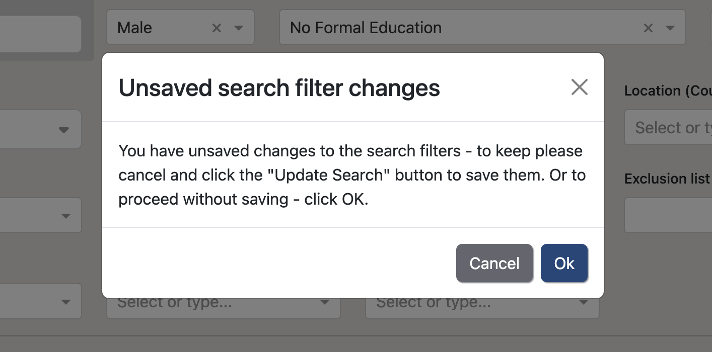
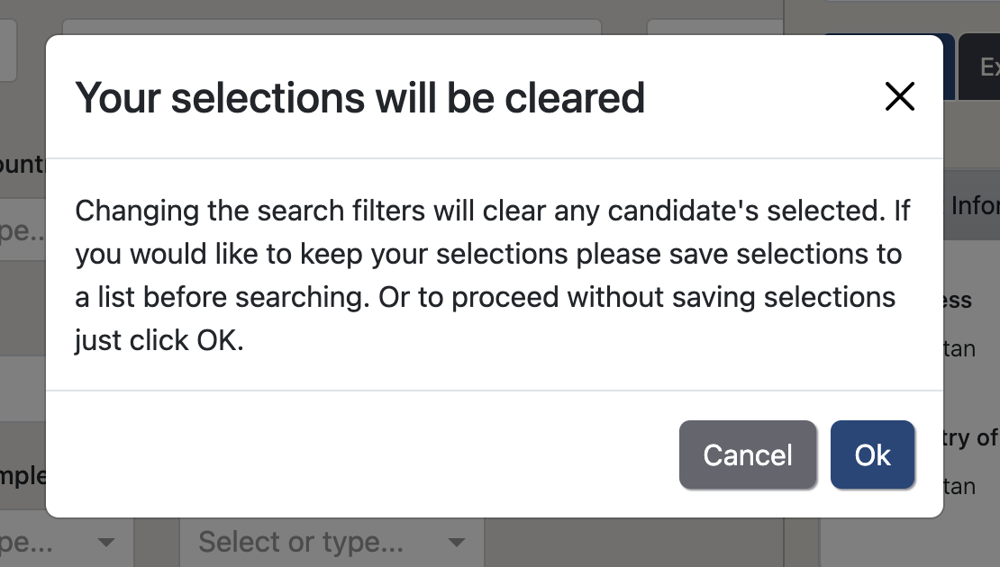

We are implementing some search safeguards in this release to combat the following:
1. Search filters being overwritten
2. Candidate's being unintentionally added to lists

# Saving Filters
For <strong>unsaved searches</strong>, the filter changes are autosaved upon each <em>Search</em> click. This allows for a search 'playground' 
where you can search, leave the page and come back to your filters.

For <strong>saved searches</strong>, as those filters have been specifically chosen and saved we don't autosave filter 
changes upon each <em>Search</em>. Instead, those filter changes have to be manually saved via the <em>Update Search</em> button. If 
there are unsaved filter changes made to the saved search filters and you navigate away from the search page, a pop-up
will appear to get confirmation to proceed and allow you to save the changes if desired.

    

        <video autoplay loop controls class="card-image">
            <source src="./../assets/images/v223/ChangeSearchFiltersOK.webm" type="video/webm">
        </video>
        
Changing search filters then moving page triggers confirmation pop up

    

    

        
        
The pop-up for unsaved search filters

    

# Candidate Selections
It is important to have selections cleared before searching as it avoids selected candidates disappearing from the 
search but still being selected. These ‘ghost’ selections that have been filtered out of the search 
then could appear in a list when the selections are copied over. Now we'll prompt you to save your selections 
prior to running a search. Then the selections will be cleared upon each search to maintain a clear and transparent 
number of selections.

    

        <video autoplay loop controls class="card-image">
            <source src="./../assets/images/v223/ClearSelectionsOk.webm" type="video/webm">
        </video>
        
Searching will prompt user to save selections

    

    

        
        
The pop-up for clearing selections upon search

    

