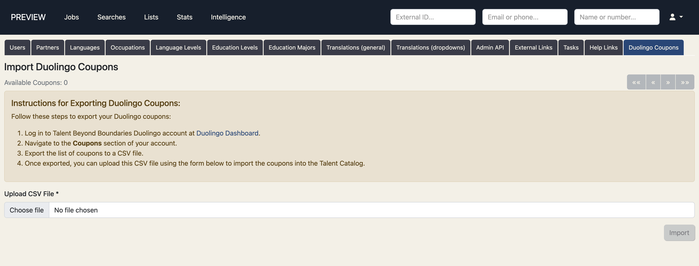
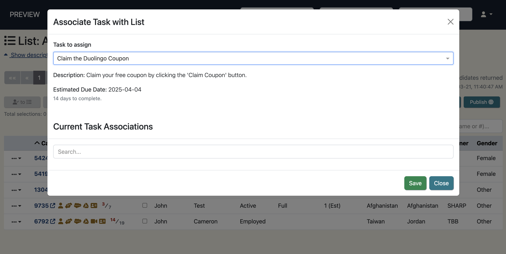
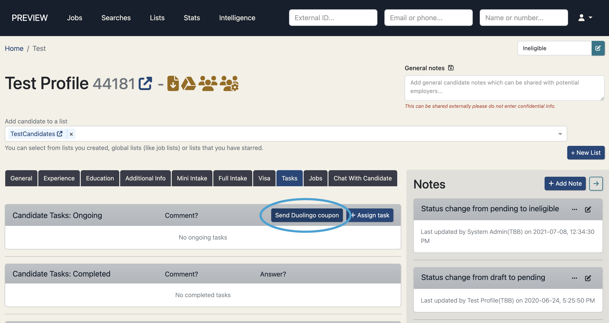

## Duolingo English Test Integration
The Talent Catalog is happy to announce a partnership with Duolingo, allowing selected candidates to access free coupons to take the Duolingo English Test (DET). 
The DET is a modern English proficiency assessment available online, taking approximately 1 hour and results being returned in 2 days. 

Working with Duolingo's API we are able to manage the coupons and track the results directly through the Talent Catalog.
Through the Talent Catalog admin portal, admins can:

### Upload coupons provided by Duolingo to the TC

    

<ul>
    <li>Assign coupons to a list of candidates or a candidate individually, and set a timeframe for the test to be taken</li>
    

        

            
            
Assign coupons to a list

        

        

            
            
Assign coupon to a candidate

        

    

    <li>Monitor if/when the candidate/s have redeemed the coupon</li>
    <li>Monitor if/when the candidate/s have completed the DET test</li>
    <li>See the candidate's test results</li>
</ul>

Through the Talent Catalog candidate portal, candidate's can:
<ul>
    <li>Learn more about the Duolingo DET test via the services tab</li>
    <li>Redeem Duolingo's free DET coupon</li>
    <li>Connect to the free DET test and complete within the set timeframe</li>
</ul>
