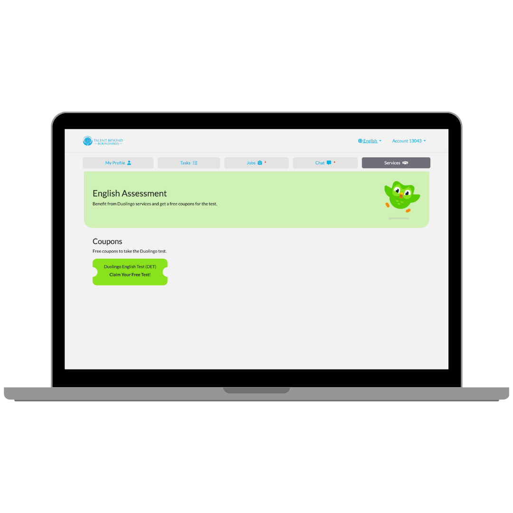
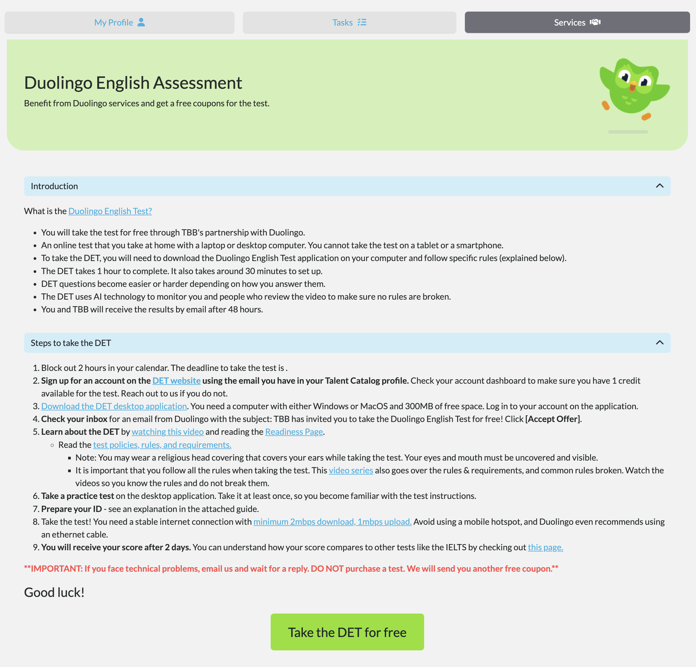

The Talent Catalog is happy to announce a partnership with Duolingo, allowing selected candidates to access free coupons to take the Duolingo English Test (DET). 
The DET is a modern English proficiency assessment available online, taking approximately 1 hour and results being returned in 2 days. 
Working with Duolingo's API we are able to manage the coupons and track the results directly through the Talent Catalog.

## Admin Portal
Through the Talent Catalog admin portal, admins can:

### Upload coupons provided by Duolingo to the TC

    

### Assign coupons to a list of candidates or a candidate individually

    
    

### Monitor if/when the candidate has redeemed the coupon and completed the test
When coupons are assigned to a candidate tasks are created to assist with monitoring of a candidate's progress. 
When a coupon is first assigned they are also assigned a 'Claim the Duolingo Coupon' task. Once they have claimed this coupon by 
clicking the 'Claim Coupon' button on the candidate portal (see candidate's view below) then that task will be autocompleted 
and the candidate will be assigned another task - 'Take the Duolingo English Test'. These two tasks can be monitored using our existing 
tasks monitor symbol in lists and searches, and it can be viewed in more detail by viewing the Tasks tab on the candidate profile.

    

### View the DET test results
Every day the TC will pull the latest DET results from Duolingo and import those results into the relevant candidates 'Language Exams' 
section under the Intake tabs of their candidate profile. These results are detailed within the exam card and there 
is also a results overview in the accordion header. The results overview is coloured Green, Yellow, Red depending on which result category they fall in.

    

## Candidate Portal
Through the Talent Catalog candidate portal, candidate's can:

### Access the Duolingo DET test via the services tab

    
    

### Redeem Duolingo's free DET coupon

    
    

### Connect to the free DET test and complete within the set timeframe

    

// todo add a screenshot of the Duolingo checkout page once a candidate clicks on the take DET for Free button and claims their code.
