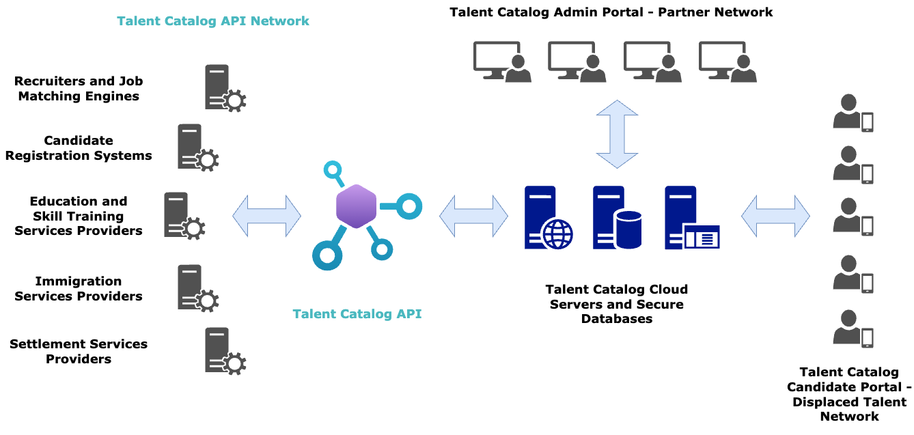

# Introducing the Talent Catalog API
Welcome to the Talent Catalog API—our first OpenAPI release on the Talent Catalog platform. This
first version of the TC API focuses on connecting recruiters and refugee service providers with 
candidates.

  

## Access to Anonymised Candidate Profiles
The TC API provides API users with secure, anonymised access to the Talent Catalog database. 

Recruiters can search and filter anonymised candidate profiles and use these to propose job matches. 
While service providers can match candidates with targeted support services such as skills training 
pathways and specialist immigration services.

## Candidate Registration
The TC API also allows for the registration of candidates directly through the API. This means
that candidates can be registered in the TC database without needing to go through the Candidate
Portal. This is particularly useful for service providers who may have their own registration
processes in place.

## Interoperability
API users can continue to use their own existing systems and processes to match anonymised 
candidates to jobs and services. When a match is found they can alert the Talent Catalog about this 
job or service opportunity through the API. They do not need to use the Admin Portal or Candidate 
Portal, instead they connect directly to the Talent Catalog servers from their own systems.

API users benefit from secure access to anonymised TC candidate data, while Talent Catalog 
candidates benefits from increased access to jobs and refugee services.   

## Explore the API for Yourself

  

Discover the potential of the TC API for yourself by visiting our 
[Interactive API Documentation](https://talent-catalog-api.redocly.app/openapi). Here, you can try 
the API for free using mock data, explore our detailed endpoint documentation, and interact with our 
API in a hands-on environment.

Ready to integrate real data? [Contact us](mailto:api@talentcatalog.net) to register for your secure 
API key.
