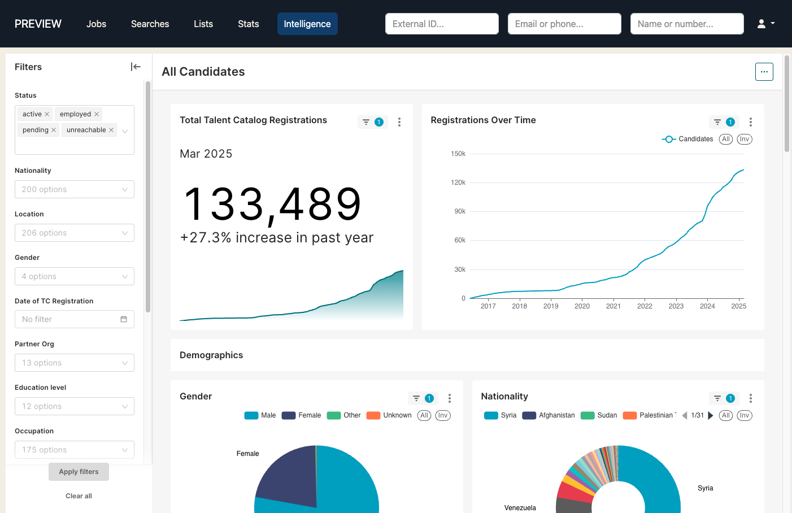

## Introducing TC Intelligence
Preset is a cutting-edge, industry-leading Business Intelligence platform used by the likes of Microsoft,
airbnb and Tesla. 

TC Intelligence brings that power to bear on real-time TC data, supplying 
users with a powerful toolkit for advanced data exploration and presentation-ready visualisations.

  

The first dashboard in this offering enables analysis of the full candidate database, with 
interactive filters capable of quickly isolating segments in response to your most obscure query. 

Further dashboards are already on the way: TC Intelligence is not only a step forward in terms of 
quality — it also offers a short lead time independent of the usual release cycle. Users are 
encouraged to come forward with feedback and ideas to drive its continued improvement and expansion.

  
  

    Tree chart visualisation showing the occupations breakdown of female Syrian candidates aged 25-34
  

