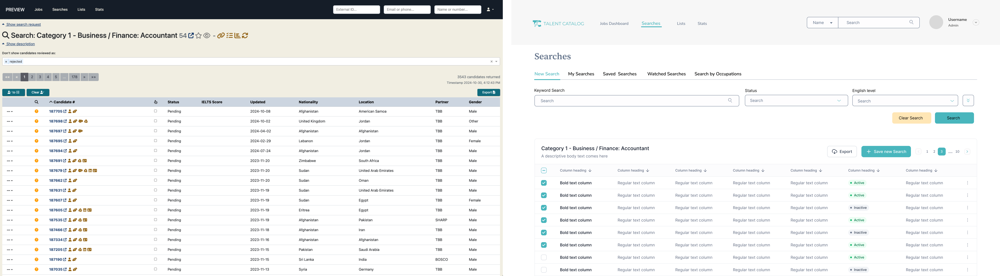

The Talent Catalog is in the process of getting a UI/UX upgrade, see below for what is planned over the next few releases and what is already in place!

## TC Logo
Initially created just to support Talent Beyond Boundaries, the Talent Catalog has scaled up to now be a source of talent for 
numerous other partners, employers and third-party services. As a result the TC needs to be a standalone entity which 
services all parties without being tied to Talent Beyond Boundaries, part of that involved creating its own unique TC branding.
Please meet the new TC logo, a logo which we feel signifies the many pathways and people (partners, employers, service providers)
that lead to a unified goal of employment for refugees.

  

## User Interface - Phase 1
We will be tackling the redesign in two phases - phase 1 will be incorporating the new TC brand across the existing TC 
user experience. You may have noticed we've incorporated a taste of the new UI in the release notes, colours and fonts 
specifically. We have been hearing the team feedback that the current UI is dated, so our goal is to modernise the 
interface and in line with other web apps.

## User Experience - Phase 2
While working on the UI we will also be working on improving the user experience of the Talent Catalog. 
We have started looking at the search screen and full source view. These are very initial prototypes, and we will be gathering feedback from our users to guide this process.
Once we've introduced the new TC branding across the portals, we will start rolling out the UX redesigns.

# Search Screen Ideas

  

