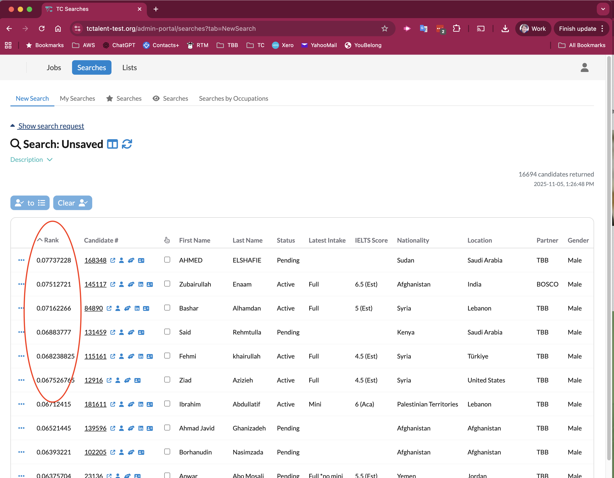
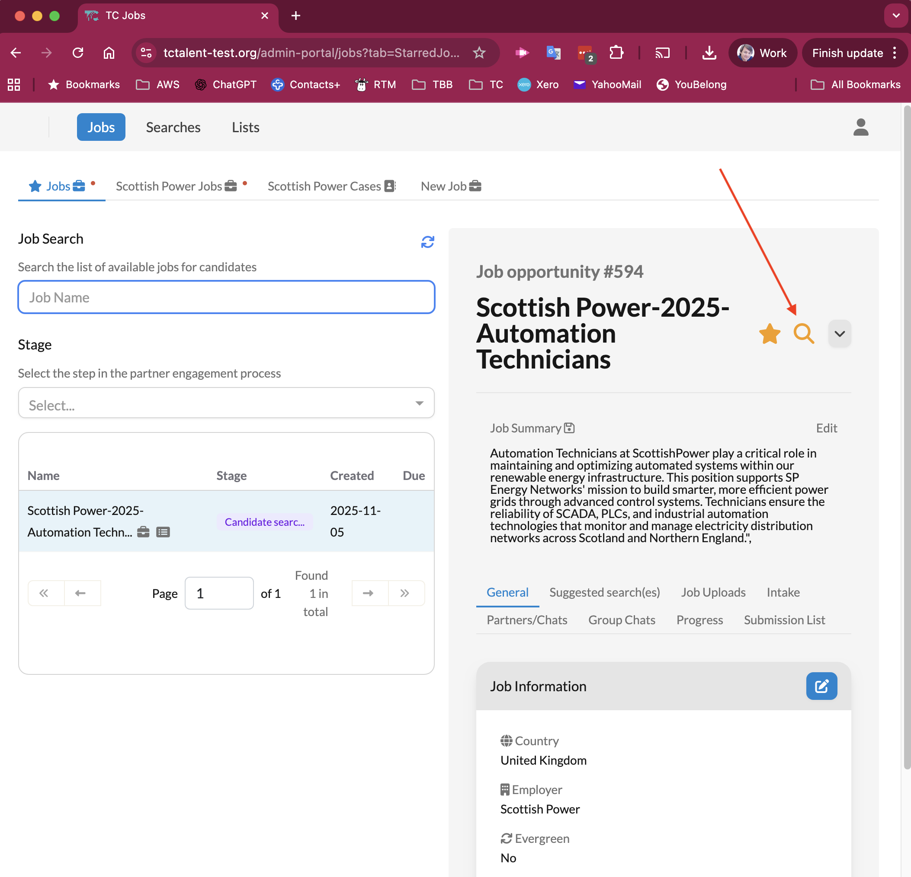
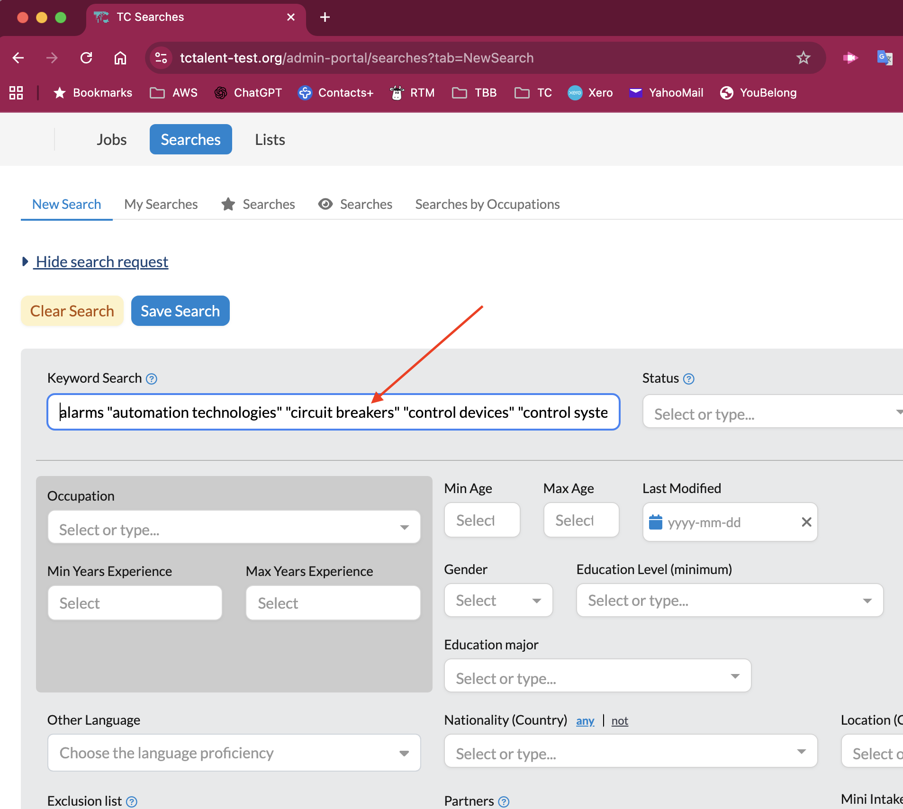
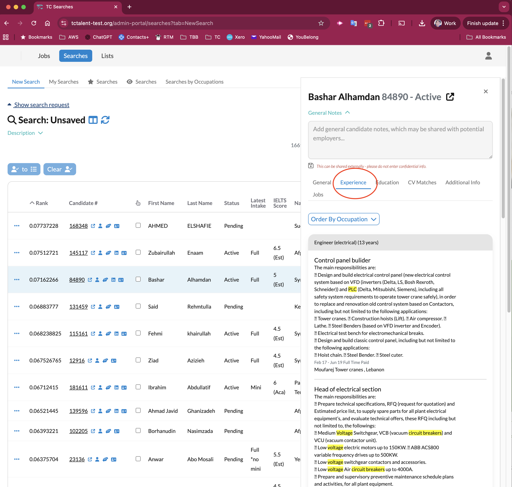

# Smarter Search and Matching

This release delivers a set of powerful improvements to the Talent Catalog’s matching engine, 
helping users find the most relevant candidates faster and more accurately.

Search results are now sorted by closeness of match, keyword matches are highlighted directly in 
candidate CVs, and users can now generate searches directly from a job posting — with relevant 
skills automatically extracted and used to find matching candidates.

Behind the scenes, we've transitioned to using **PostgreSQL’s full-text search** to handle keyword 
matching, replacing the need for a separate Elasticsearch service. This simplifies system 
architecture, improves data consistency, and reduces operating costs.

Together, these enhancements make matching more intuitive, responsive, and scalable — setting the 
foundation for future capabilities like automated candidate outreach and intelligent job 
recommendations.

## Prioritised Matching

Results of a search that contains keywords logic is now sorted by closeness of match.

    

## Generate a Search Directly from a Job Description

Click on the search icon for any job...

    

The TC will scan all text related to the job - uploaded job description, job summary, job intake etc 
extracting skills from the text.

We have a database of around 30,000 skills extracted from the [ESCO](https://esco.ec.europa.eu/en/about-esco/what-esco) 
and [O*NET](https://www.onetcenter.org/taxonomy.html) collections.

The extracted skills are automatically added to a New Search which searches for candidates with those skills.

    

You can add or remove skills if you wish. You can also modify the Keyword search as usual to 
construct boolean expressions - for example requiring this skill AND that skill.

## Global Skills Standards and AI-Powered Extraction

This release also marks the introduction of a new, structured skills framework based on two leading 
global standards:

- [ESCO](https://esco.ec.europa.eu/en/about-esco/what-esco) (European Skills, Competences, 
Qualifications and Occupations)
- [O*NET](https://www.onetcenter.org/taxonomy.html) (Occupational Information Network, USA)

    
    

Together, these sources contribute over **30,000 standardised skills** used across industries and 
professions, now integrated into the Talent Catalog.

An **AI-powered extraction service** has been introduced to automatically identify and apply 
relevant skills from job descriptions. This in turn drives AI-generated candidate searches that are 
based on consistent, structured skill data — improving search relevance and will assist in 
skills comparability across job types.

> 💡 In future releases, we’ll expand both the **skills base** and the use of AI — including support 
> for skill extraction from candidate-submitted experience, and smarter prompts to help candidates 
> describe their skills more effectively.

## Highlight Search Keyword Matches in Uploaded CVs

Keyword search matches are now not only shown highlighted in the entered Experience and Education 
data...

    

... but keyword matches are also shown in any uploaded Cvs

    

## Improved Text Search Infrastructure

This release introduces the use of **PostgreSQL’s full-text search extensions** to power keyword 
search logic within the Talent Catalog.  

Postgres now handles text indexing and relevance scoring which can be used for more efficient 
candidate profiles and uploaded CVs searches.

Previously, text search was handled through **Elasticsearch**. By consolidating this capability 
into Postgres, we can:

- Simplify the system architecture by removing a separate Elasticsearch service
- Reduce maintenance overhead and streamline data consistency
- Save approximately **US $2,500 annually** in licensing and hosting costs

This change is an important step toward **fully retiring Elasticsearch** in a future release, 
and handling all core search capabilities natively within Postgres instead.
