## Introducing Our New UI: Cleaner, Sharper, and More Scalable
The Talent Catalog just got a major visual refresh. 🚀
Our new interface brings a fresh look and a stronger foundation for what’s coming next.
Every color, icon, and layout choice has been carefully designed for a clean, modern and harmonious 
user experience.

The Talent Catalog’s redesign isn’t just about looks — it’s about building a scalable, maintainable,
and user-centered foundation for the future.

We’re excited to hear your impressions as you explore the new interface!

## What’s New in This Phase
- **New color palette** aligned with the TC brand
- **Reusable TC components** for buttons, inputs, tables, modals, and more
- **Unified typography and spacing system** for improved readability
- **Improved code maintainability** one change now updates across all pages
- **Consistent user experience** across all admin portal pages

## From Visuals to Functionality
While Phase 1 sets the foundation with consistent visuals and shared components, Phase 2 will focus 
on functional improvements. We’ll be gathering feedback after this rollout of Phase 1 to ensure the 
next UI update reflects our user's needs and experiences, your insights will play a major role in 
helping us get there.

## Behind the Redesign
Behind the new look is a process full of intention, this redesign was a true **team effort**.

Our team worked extensively in Figma because it makes design a team sport.
Everyone could see, comment, and contribute. We held multiple design workshops to explore visual 
directions and usability improvements.

Every decision from colors and typography to spacing and hierarchy, was made with purpose, ensuring 
that the new UI feels cohesive, accessible, and aligned with modern web design standards. Each UI 
element has a clear role, and the final implementation stays true to the design vision.

Here are a few screenshots from our workshop sessions and voting system:

    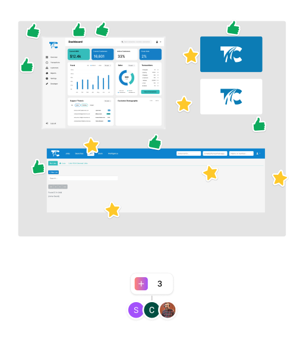

Ideation workshops:

    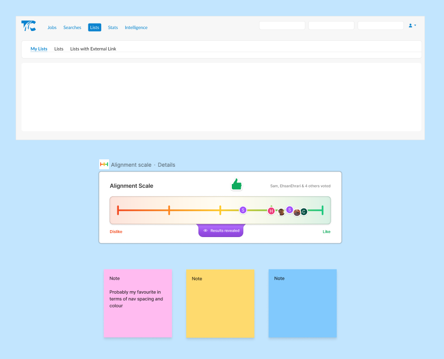

Figma design files:

    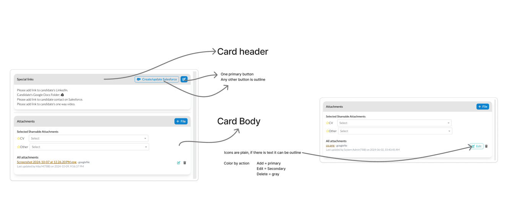

    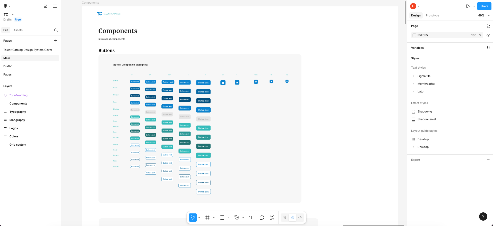

## From Figma to Code
Once the designs were finalized in Figma, we brought them to life in code by creating reusable 
Angular components that match the visual system one-to-one.

By introducing shared components and centralized styling, we’ve built a system where design and code 
stay in sync. This consistency makes it easier to maintain and update the interface, a single change 
to a component or variable now applies across the entire platform.

The result is a cleaner codebase, faster development cycles, and a UI that’s easier to scale as the 
product grows.

To wrap it all up, here’s a look at the transformation:

Lists - before and after:

    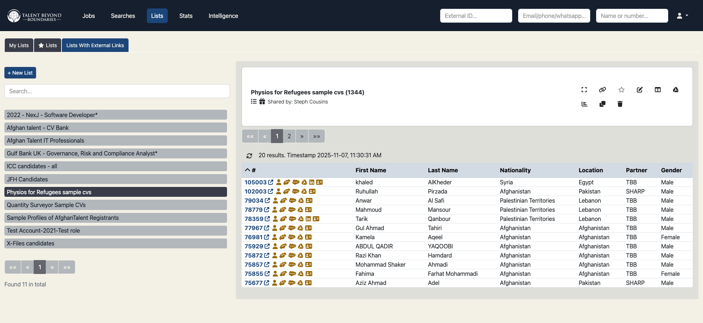

    

Cases tab - before and after:

    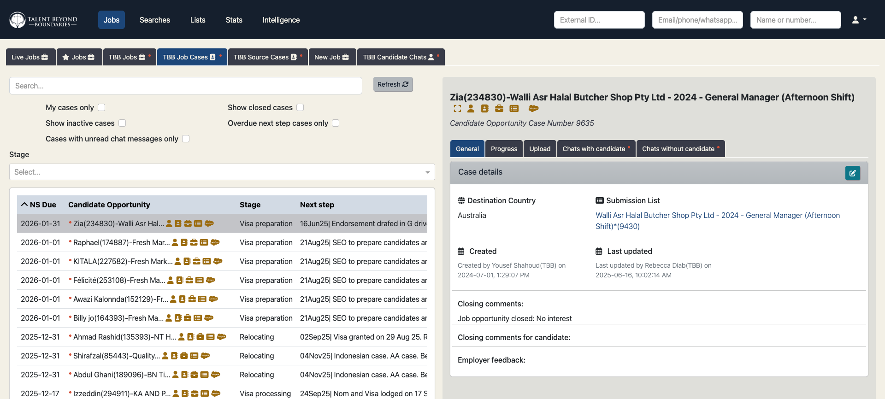

    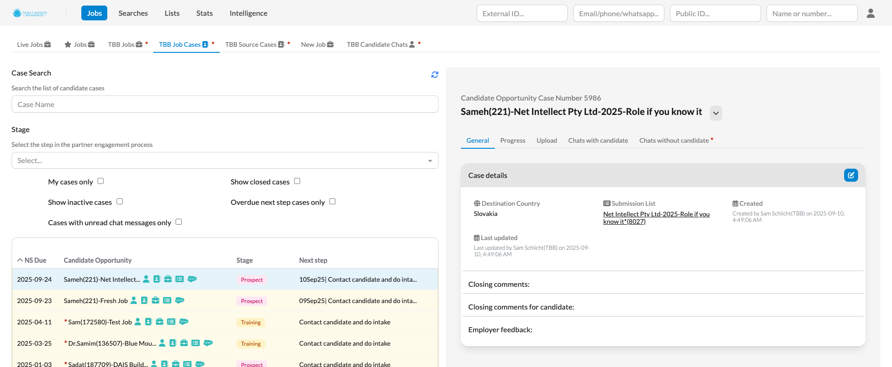

Jobs tab - before and after:

    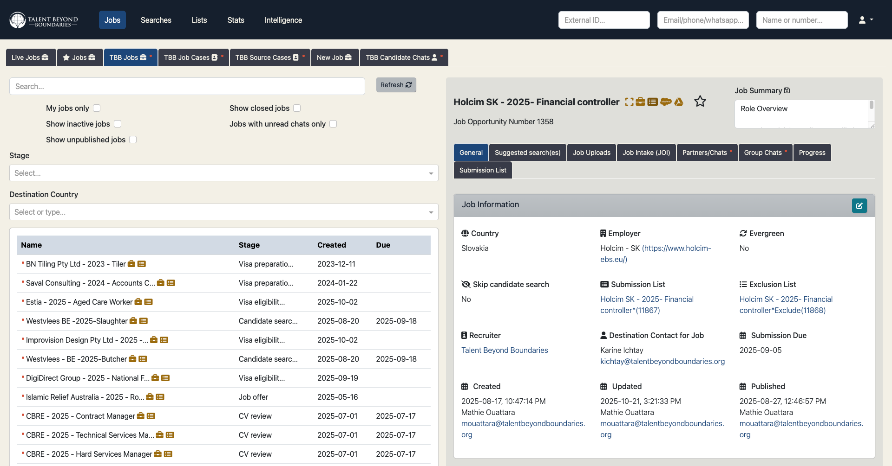

    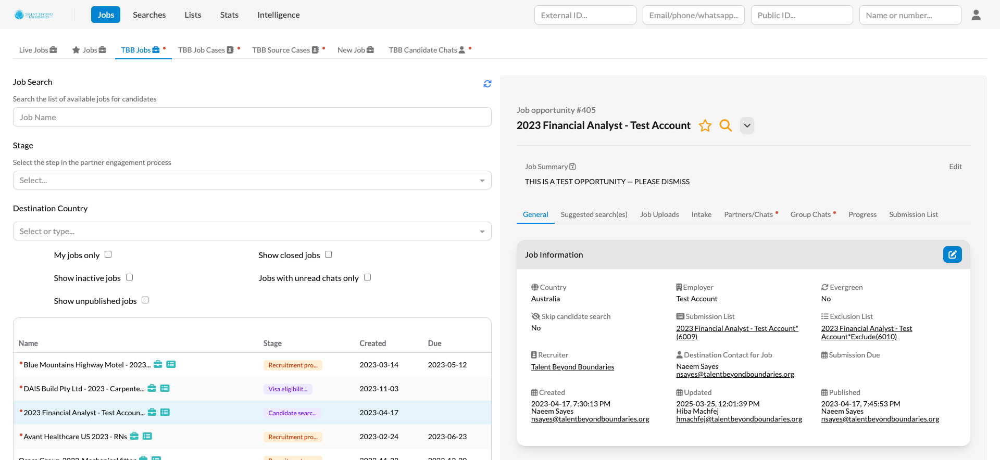

Candidate profile - before and after:

    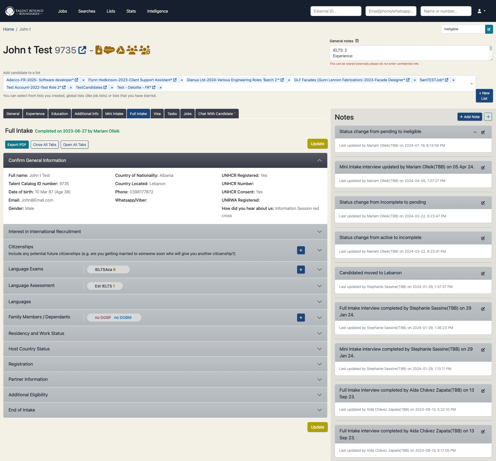

    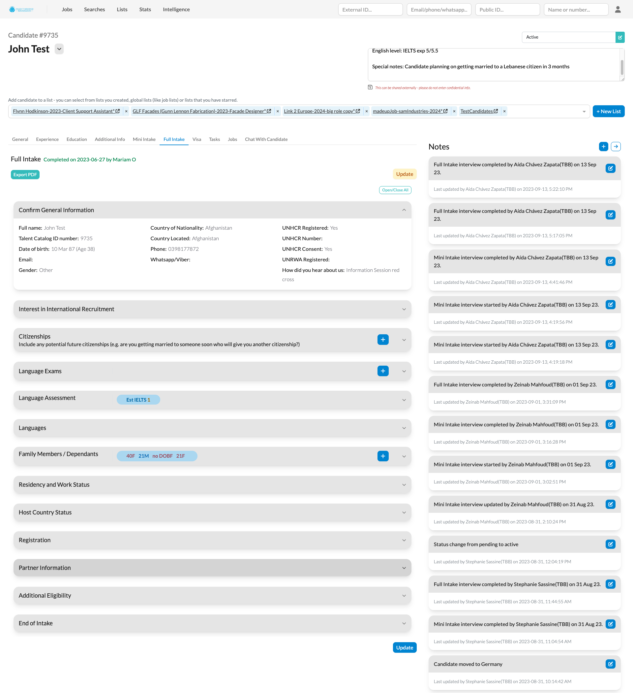

