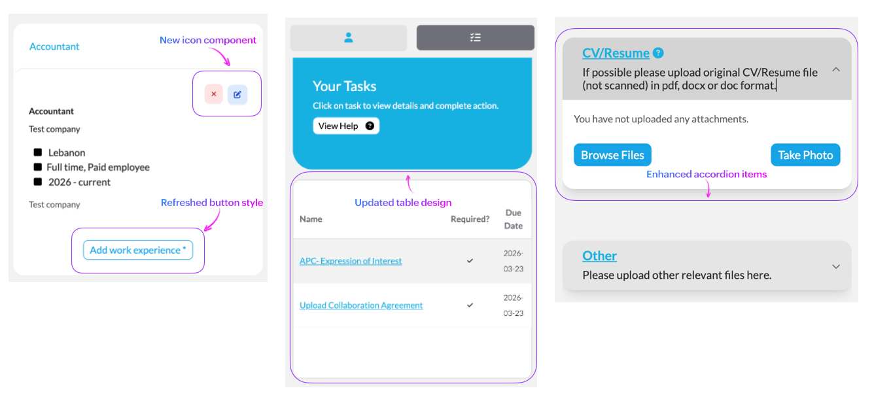

# Candidate Portal updated with a new shared component library 🧩✨
The Talent Catalog redesign continues to evolve 🚀

In this release, we bring the new component design system to the Candidate Portal — a step that moves us closer to a more unified, scalable, and user-friendly experience across the entire platform.

---

### A More Consistent Candidate Experience 🔄

With this update, the Candidate Portal now aligns with the same design system introduced in the Admin Portal in release 2.4.0.

This means a more consistent look and feel across the platform, where components behave the same way and follow the same patterns. The experience becomes more predictable, easier to navigate, and more cohesive overall.

---

### A Cleaner Look, A Clearer Experience 🎨

The updated interface introduces a cleaner and more modern visual direction.

Layouts feel more structured, spacing is more intentional, and typography is easier to read. These changes might feel subtle at first, but together they create a smoother and more comfortable experience when moving through the platform.

The goal is simple: reduce friction and make it easier for users to focus on what matters.

---

### One System, Not Many Pieces 🧱

Behind the scenes, this upgrade replaces many custom and one-off UI elements with shared TC components.

Instead of building UI separately for different parts of the platform, we now rely on a unified system. This not only improves consistency, but also makes the platform easier to maintain and evolve over time.

A small change in one place can now improve multiple pages at once.

---

### Built for What’s Next 🔮

This upgrade is an important step forward, but it’s also a foundation for what’s coming next.

It prepares the Candidate Portal for future improvements, including ongoing UX redesign efforts and the upcoming mobile experience. It also allows us to move faster, test ideas more easily, and respond to user feedback with greater confidence.

---

### Stability Along the Way 🛠️

To support this transition, we’ve added unit tests across all updated components.

This helps ensure that the upgrade remains stable, reduces the risk of unexpected issues, and gives us confidence as we continue to build on top of this new foundation.

---

### Shared component library examples 👀💅

Here’s a look at how the new components in the Candidate Portal look:

  

---

This is more than a visual update.

It’s a step toward a more connected, maintainable, and user-centered Talent Catalog — one that can continue to grow and adapt alongside its users.

This update includes the rollout of the new TC component system across key areas of the Candidate Portal:
- Upgrade the candidate-portal to the new TC components:
- Registration Part 1 (Account, Contact)
- Registration Part 2 (Personal, Occupation, Work Experience)
- Registration Part 3 (Education, Language, Exam, Certifications)
- Registration Part 4 (Destinations, Additional, Upload, Submit)
- Profile Tab
- Tasks Tab
- Jobs (Candidate Opportunities), Chats, and Chatbot
- Services Tab (Duolingo, LinkedIn)
- Auth Components
- Home Page
