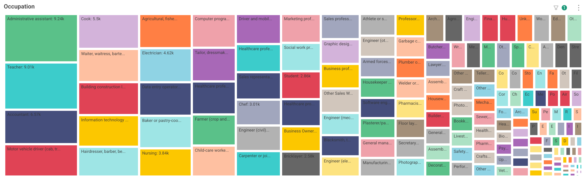

# LinkedIn Candidate Assistance Service: Free Premium Upgrades for TC Candidates

    

LinkedIn is the latest partner to join the TC's expanding roster of Candidate Assistance Services!

Eligible candidates can now self-serve their free 1-year Premium membership upgrade via the 
Candidate Portal Services tab, simply by providing or verifying their LinkedIn profile URL.

LinkedIn Premium includes access to the following benefits:
- 📝 AI writing and search tools
- 🎓 LinkedIn Learning courses
- 📥 InMail credits for expanding networks

## 🗒️ List Support

    

The LinkedIn service leverages TC Lists to empower non-developer project admins to assign 
eligibility for the offer, as well as respond to and resolve candidate issues with minimal 
correspondence.

Combined with real-time monitoring of offer uptake, admins have the visibility and control to 
deliver on LinkedIn's ambitious target to deliver up to 10,000 demographically-targeted upgrades in 
four months.

## 📊 Real-Time Low-Touch Reporting

    

Self-assignment of a LinkedIn coupon automatically makes the database connection between the 
candidate and offer. Thereby admins can leverage the power of 
<a href="../v230/tc_intelligence" class="card">TC Intelligence</a> to produce in-depth 
statistical analysis of redeeming candidates, including their demographic breakdown and TC outcomes 
— essential for project reporting to data-driven partners such as LinkedIn.

## 💪 The Power of Frameworks
Under the hood of the LinkedIn service sits the 
<a href="../v240/casi_framework" class="card">Candidate Assistance Services Interface (CASI)</a>.

Put simply, it provides everything a new candidate service needs: data storage, access 
management, user interface, to name a few — leaving developers merely to plug in 
their particular requirements and be up and running in a matter of hours.

With each new project the interface expands, supporting sustainable delivery of high-impact, 
low-overhead candidate support from a growing ecosystem of TC partners. 