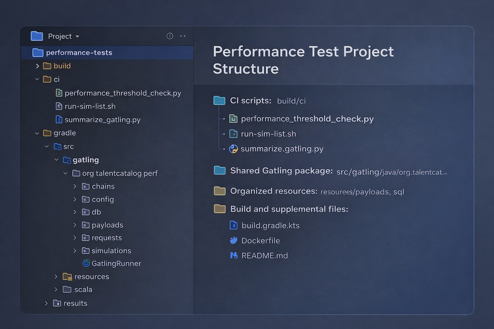
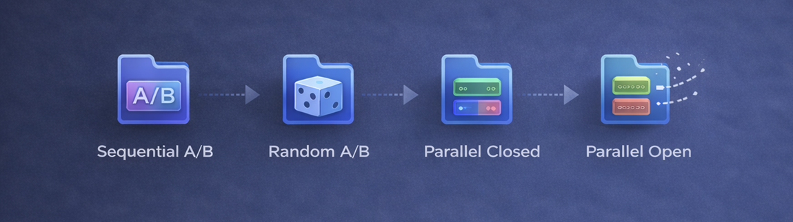
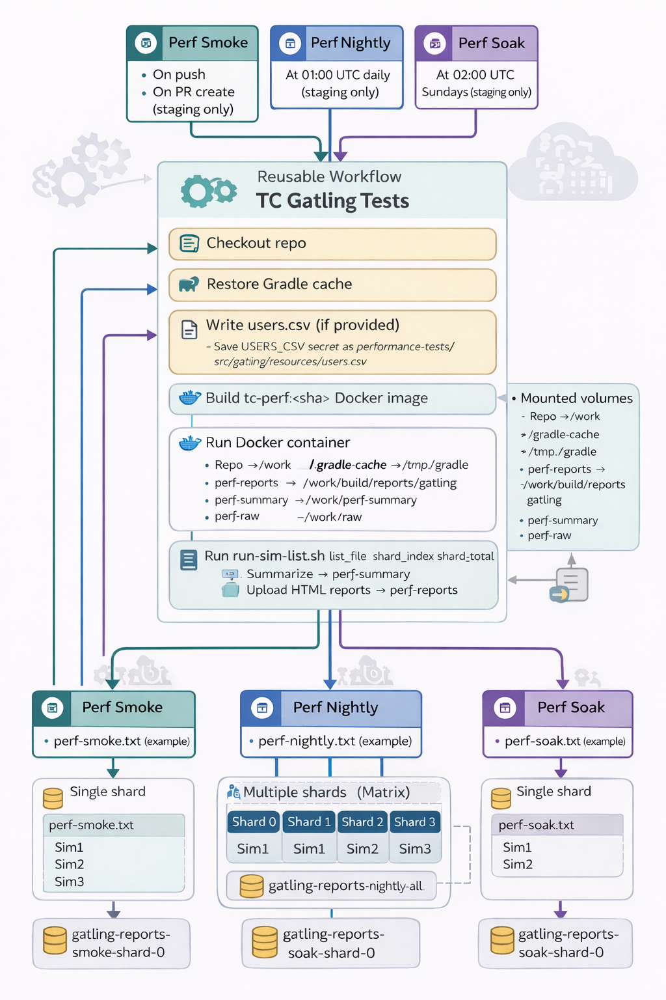

# Performance Improvements
 
Candidates have a lot of data associated with them, stored on the TC database in many separate 
"tables". There is one "root" table that stores the candidate's basic information such as name,
email, phone number, gender, country of birth, etc.
But there are around 20 other associated tables containing candidate skills, languages, 
opportunities, experiences, notes, qualifications, etc.
Fetching the data about a candidate involves accessing all those tables and then packaging 
up the data so that it can be sent to your screen for display.
     
Our original programming used standard database techniques to deliver that data to you, but
as the size and complexity of the database has grown, we saw the need to use some tricks to speed
up the whole process.

**⚡ Muli-level caching for faster data retrieval**

This release has introduced more sophisticated "caching". Caching means that frequently requested 
data can be stored in memory instead of fetching it from the database every time. 

As mentioned earlier, a candidate's data is spread across many tables in the database.
We have gained another performance boost by lumping all that data into a single object, which is 
itself stored in a separate cache. If the candidate's data hasn't changed since the last time we 
accessed it, we can just fetch that single object from the cache, rather than needing to gather 
the data from all the separate tables again.

This release is significant not only for giving us an immediate performance boost, but also 
because it means that our performance should now remain stable as the database grows.

**⚡ Smarter data loading for faster page rendering**

In addition to the multi-level caching improvements, we have also streamlined how much data is sent 
to individual pages within TC. In places where a screen contains multiple tabs, such as the Jobs tab 
or the two intake tabs, data is now loaded only for the tab being viewed, rather than bulk loading 
data for every tab up front. 

We have also reduced unnecessary data transfer on screens that only need summary information. For 
example, candidate list views no longer load every available piece of data for each candidate in the 
list. Instead, only the summary fields needed for the list are fetched initially, with full 
candidate details loaded only when a specific record is opened.

This reduces the overall size of the initial payload that must be prepared before the screen can 
render, helping pages load faster and making the interface feel more responsive. We will continue to
build on these improvements in future releases.

## ⚡ Improved candidate data loading

We’ve made a fundamental change to how candidate details are fetched, for faster search results and
list displays. In many cases, users should see **candidate searches and list views load 3 to 4 times
faster**.

## ⚡ Faster Jobs tab

We’ve introduced performance improvements to the Jobs tab, helping pages load more quickly and
making it easier to quickly hop between jobs tabs. Users should see the **jobs page and individual
job/case tabs now load 4 to 5 times faster**.

## ⚡ Quicker list views and candidate profiles

We’ve optimized both candidate list views and individual candidate profile pages to improve
responsiveness and reduce load times when viewing candidate information. Users should see 
**individual candidate profiles load 4 to 5 times faster.**

# ⚙ Performance Test Engineering Improvements

## 🧪 Expanded Performance Testing Coverage

    

To support these performance improvements, we’ve significantly expanded Talent Catalog’s automated
performance testing coverage.

The performance test suite now covers both HTTP-based and DB-based performance testing, giving the
team better visibility into how core workflows behave under load and making it easier to isolate
bottlenecks when regressions occur.

Coverage now includes key workflows such as candidate search, saved-list paged search, health-check
validation, and database-focused candidate search testing.

## 🔄 Multiple Load Models for Better Comparison

    

The new simulation coverage supports several different workload models so performance can be tested
in ways that better reflect real usage.

This includes:
- sequential A/B comparisons for side-by-side checks of old and new implementations
- random A/B simulations for mixed traffic patterns
- parallel closed simulations for fixed-concurrency testing
- parallel open simulations for arrival-rate based load testing

## 🌙 Automated Smoke, Nightly and Soak Runs

    

We’ve also improved the automation around performance testing, with dedicated smoke, nightly and
soak workflows added to CI.

These workflows make it easier to run lightweight checks during development, schedule broader
nightly coverage, and run longer soak-style tests where needed.

## 📊 Better Reporting and Threshold Checks

Performance testing now includes improved support for summarising Gatling results and applying
threshold checks automatically.

This means test runs can now produce clearer summaries for review, while also supporting automatic
checks around failed request rates and latency thresholds.

## 💪 Stronger Foundations for Future Performance Work

Under the hood, the performance testing module has been reorganised to provide a clearer structure
for shared configuration, payloads, requests, scenarios, simulations, SQL resources and helper
scripts.

This creates a stronger foundation for future performance work by making the suite easier to extend,
easier to run consistently in CI, and easier for developers to build on as new workflows are added
to Talent Catalog.