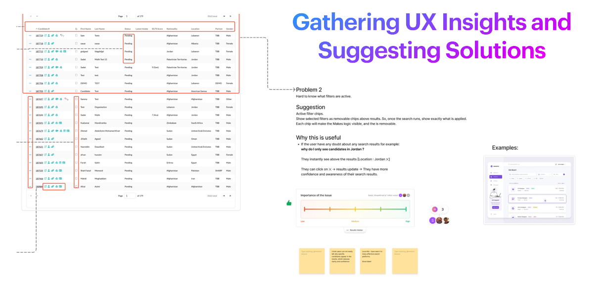
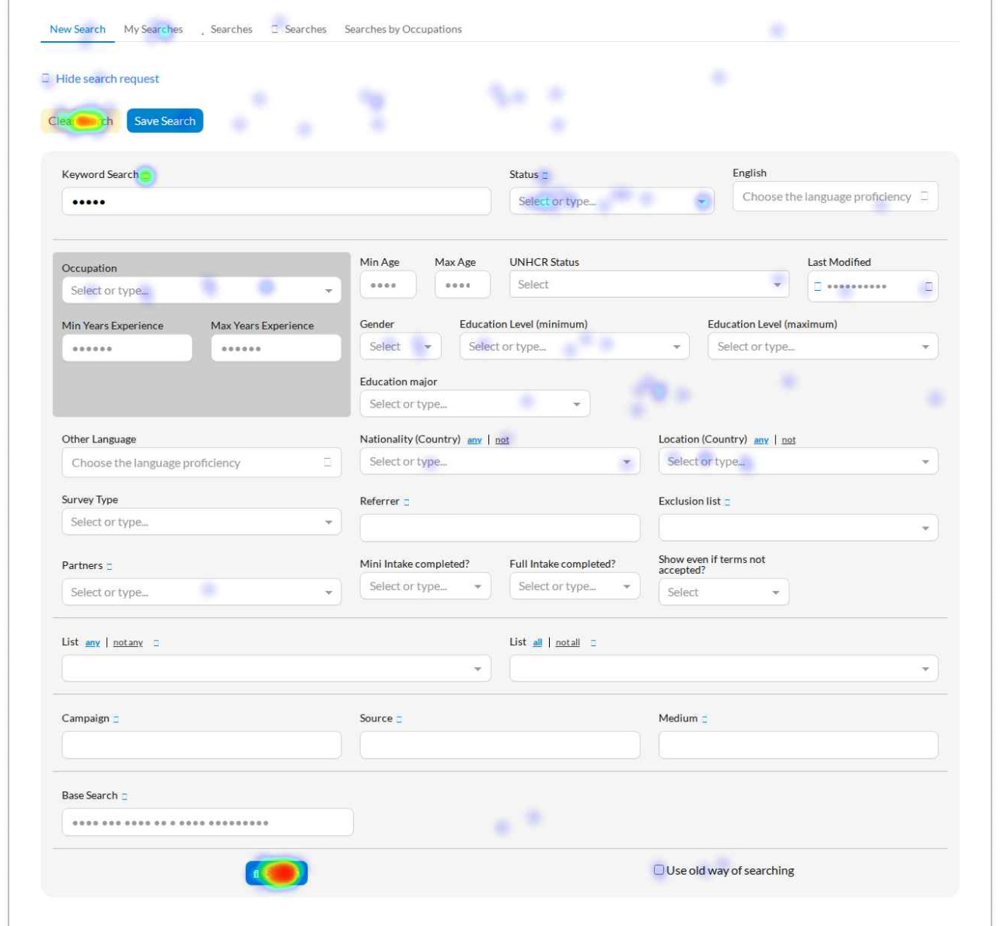

# 🎯 Targeted UX insights for the search redesign
As part of the Talent Catalog redesign, we began by focusing on the search screen as a key area to better understand user behaviour and identify opportunities for improvement.

---

### 🔍 Starting with the Search Experience

The search screen plays a central role in how users interact with the platform, making it a natural starting point for gathering targeted UX insights.

By reviewing the current experience, we were able to identify areas where users might face confusion, friction, or inefficiencies. This helped us define a clear direction for exploring potential improvements.

---

### 🤝 Gathering Insights Through Collaboration

To support this process, we organised structured voting sessions to gather input from the team.

Using Figma as a collaborative workspace, we shared ideas, explored different approaches, and collected feedback in a visual and interactive way. This allowed everyone to contribute, compare solutions, and highlight the most important areas for improvement.

The voting sessions also gave us a way to capture quantitative signals, helping us better understand which ideas had the strongest support and should be prioritised.

  

---

### 📊 Combining Feedback with Real User Behaviour

Alongside internal input, we also analysed user behaviour through heatmaps.

This gave us visibility into how users actually navigate the search experience, where they focus their attention, and where they might struggle. These insights helped validate assumptions and uncover patterns that are not always visible through discussion alone.

  💡 <strong>Expanding Microsoft Clarity to the Candidate Portal</strong> 
  After successfully introducing Microsoft Clarity in the Admin Portal, we’ve now extended it to the Candidate Portal. This allows us to analyse heatmaps to better understand user behaviour and guide future design improvements on the candidate portal as well.

  

---

### 🚀 Turning Insights into Action

By combining team feedback, voting results, and behavioural data, we were able to take a more informed approach to design decisions.

This process allowed us to prioritise future UX improvements with greater confidence, ensuring that upcoming changes are grounded in both user needs and real data.

---
