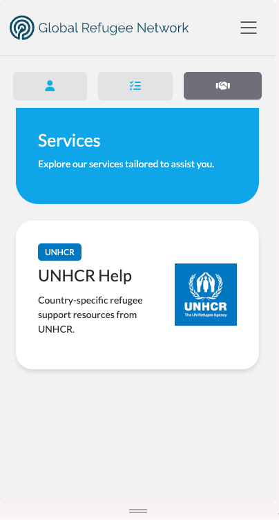
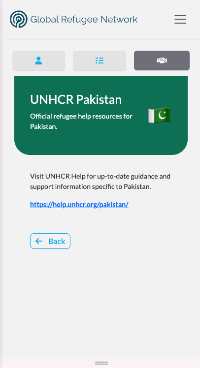
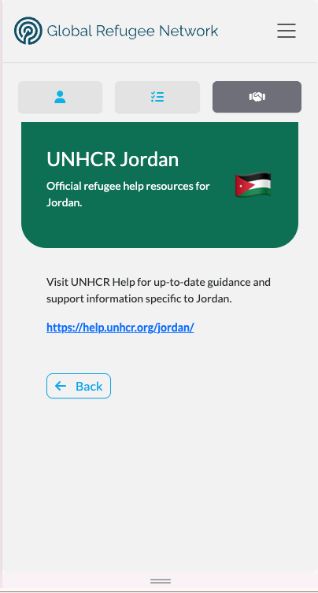
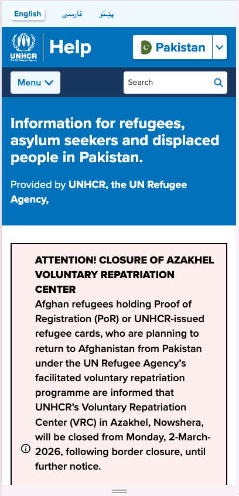

# UNHCR CASI Help Service: Country-Specific Refugee Support

    

The UNHCR Help service is the latest addition to the TC's 
<a href="../v240/casi_framework">Candidate Assistance Services Interface (CASI)</a>, delivering 
country-specific refugee support resources directly within the Candidate Portal.

Built in partnership with 
<a href="https://www.unhcr.org/" target="_blank">UNHCR Pakistan</a>, the service automatically 
signposts eligible registrants to the 
<a href="https://help.unhcr.org/" target="_blank">UNHCR Help</a> pages relevant to their 
current country of residence — starting with Pakistan.

## 🌍 Country-Driven Service Routing

    

The UNHCR Help service is country-aware. A candidate's current location determines whether the 
service appears and what content is shown. For example, a GRN registrant based in Pakistan 
automatically sees Pakistan-specific UNHCR help resources, including a direct link to 
<a href="https://help.unhcr.org/pakistan/" target="_blank">help.unhcr.org/pakistan</a>.

If UNHCR has not yet supplied content for a given country, the service card simply does not 
appear — there is no empty state for the candidate to encounter.

## 🔄 Same Framework, Different Content

    

The same service adapts seamlessly across countries. Here, a registrant in Jordan sees 
Jordan-specific resources and a link to 
<a href="https://help.unhcr.org/jordan/" target="_blank">help.unhcr.org/jordan</a>. 

This model/view approach means that adding UNHCR help coverage for a new country is purely a 
data operation — seed the country-specific link and the service lights up for all registrants 
there, with no code changes required.

## 🔗 Direct Access to UNHCR Help

    

Clicking the help link takes the registrant directly to their country-specific page on 
UNHCR's own hosted help platform — providing authoritative, up-to-date information for 
refugees, asylum seekers, and displaced people. The content and help links can be refined by 
UNHCR at any time without requiring changes to the Talent Catalog.

## 💪 Powered by CASI

The UNHCR Help service is built on the
<a href="../v240/casi_framework">Candidate Assistance Services Interface (CASI)</a> — the same
framework behind the LinkedIn, Duolingo, and Reference services. CASI provides the data storage,
eligibility checks, and user interface scaffolding, leaving each new service to plug in its own
requirements.

Unlike the other CASI services — which assign unique, per-candidate inventory items from a CSV 
import — the UNHCR Help service provides **shared, always-available content**. There is no CSV to 
import and no inventory to deplete; every eligible registrant in a given country receives the same 
links.

This required a new addition to the CASI framework: a **shared resource allocator** that returns
country-specific URLs without consuming inventory. The country-specific links are seeded as
static rows in the database, and the allocator looks up the resource matching the candidate's
country.

For a deeper look at how CASI works under the hood, see the 
<a href="https://github.com/Talent-Catalog/talentcatalog/blob/staging/server/src/main/java/org/tctalent/server/casi/README.md" target="_blank">CASI Developer Guide</a>.

## 🚀 What's Next

- **Localisation:** UNHCR Help content will be available in Urdu and Pashto for Pakistan-based 
registrants
- **Expansion:** As UNHCR supplies content for additional countries, the service will 
automatically activate for registrants there — no code deployment needed
- **Open to TC:** The service is currently gated to GRN registrants but can be easily opened to 
TC candidates
