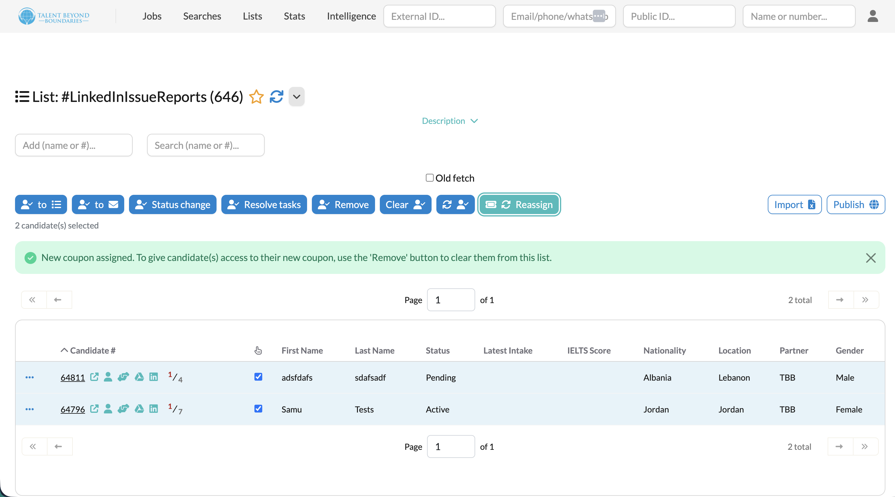
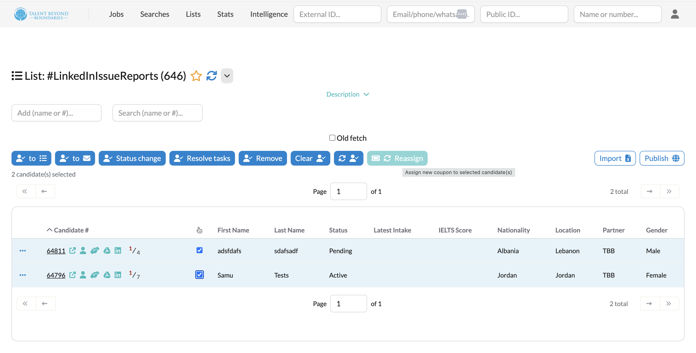

# CASI Service Lists

CASI now includes a service list subsystem for managing Saved Lists used by Candidate Assistance Services.

---

### Service-managed saved lists

Each Candidate Assistance Service can declare the Saved Lists it needs, the role each list plays, and which admin actions are allowed for candidates in those lists.

On startup, Talent Catalog creates or updates the required service lists idempotently, helping avoid hardcoded list IDs across environments.

---

### LinkedIn service support

The LinkedIn service now declares its own service lists instead of relying on manually created Saved Lists with hardcoded IDs.

This includes lists for issue reports, assignment failures, and numbered eligibility lists used by the service.

---

### Admin actions from saved lists

When a Saved List is connected to a CASI service list, admins can see permitted service actions directly in the standard Saved List UI.

For this release, service list actions support reassignment workflows. After a successful action, admins are prompted to remove reassigned candidates from the list.

  
  

